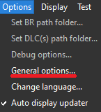
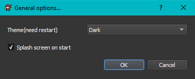
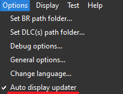
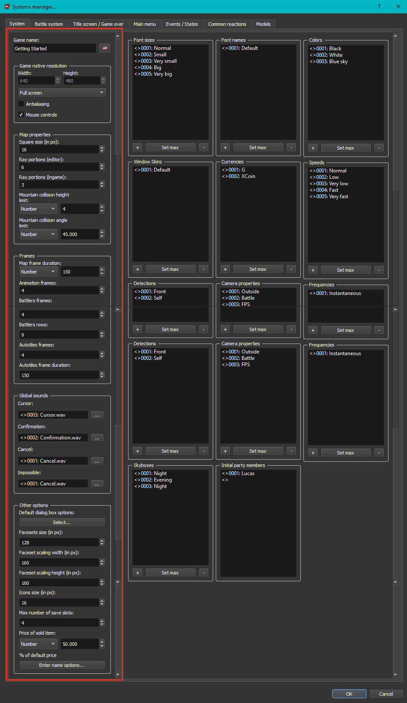
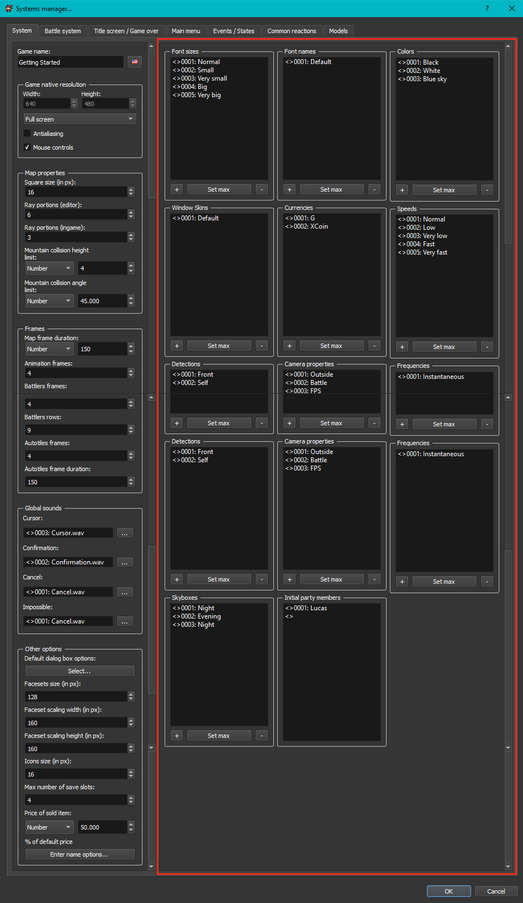
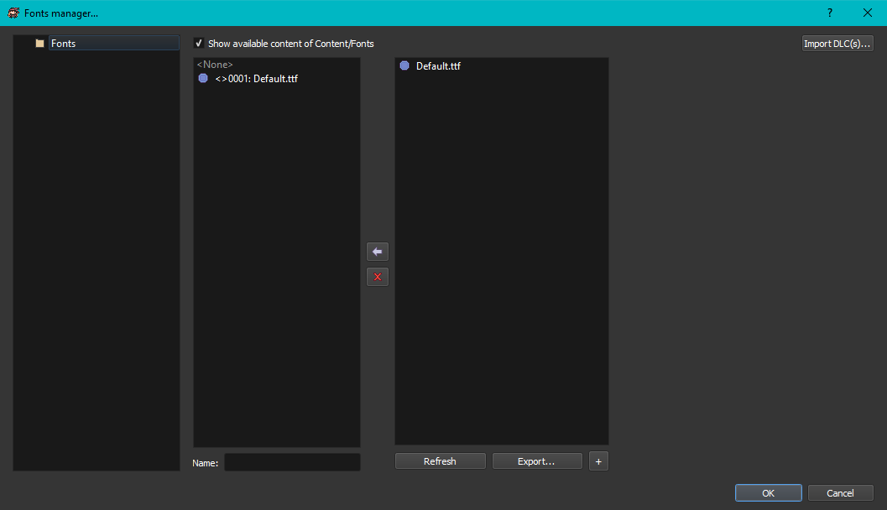
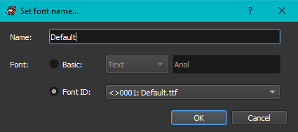
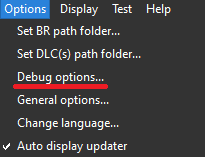
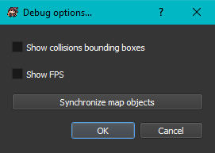
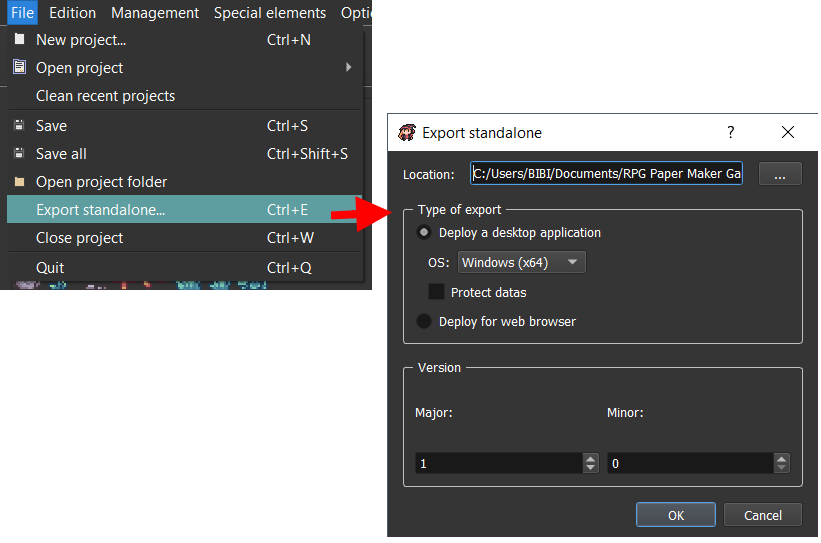

# Getting started

<figure><figcaption>
A.K.A "RPM"
</figcaption></figure>

Welcome to the official RPG Paper Maker documentation page! Here you will find all that you need to become a pro Paper Maker!

## How do I get this amazing program?

### Installation 

You can find the installer by clicking the orange DOWNLOAD button on the home page, or from the [download](http://rpg-paper-maker.com/index.php/downloads#content) link along the top of the official website. Choose between the free and commercial options, then your OS.&#x20;

The installer will allow you to choose the version you want to download. It's recommended you use the latest version, but all versions are always available. Once the files are downloaded and installed you can launch right into the program.

#### Windows 

Run `RPG Paper Maker installer.exe` and follow the instructions. &#x20;

#### Linux 

Extract the file. Check out the `README` instructions in the root of the folder (the last instruction is`./run.sh`).&#x20;

#### MacOSX 

Extract the file. Run `RPG Paper Maker.app.`

## The program is open...now what?

There are a few options that apply to the editor itself so let's look at those first.

### Change theme 

There are two different themes: `Dark` and `White`.&#x20;

If you want to change it, go to `Options > General options...`.

&#x20;      &#x20;

<figure><figcaption></figcaption></figure>

<figure><figcaption></figcaption></figure>

There is also an option to hide the splash screen while the program is loading if you don't want it remain on top of other programs.&#x20;

### Change language 

You can change the engine language in `Options > Change language...`:

### Enable / Disable Updater 

This option will check for new updates to RPG Paper Maker on startup. Go to `Options > Auto display updater`. You may want to disable this if you choose to work in an older version.

&#x20;

<figure><figcaption></figcaption></figure>

## I'm ready to create!

### Create a new project 

You can create a new project by clicking here on the main toolbar:

You can also use `CTRL+N` or go to `File > New project...`.

Here you can choose the `Project name` , which is the name of your game and is used as a label on the game window. Enable  `auto-generate` if you want to generate a folder name based on that project name. Otherwise enter it manually in the `Directory name`field. Then choose the `location` of this project folder. By default, it will be on a freshly created `RPG Paper Maker Games` folder in the user's Documents folder.&#x20;

### Open an existing project 

You can open an existing project by clicking here on the main toolbar:

You can also use `CTRL+O` or go to `File > Open project > Browse...`.&#x20;

Recent projects can also be opened on the first screen (or go to `File > Open project`).

## What should I do first?

Before you jump into making maps and working on gameplay there are settings you should get in order first. They will determine how some functions work later on, so it's pretty important.&#x20;

### Update keyboard controls 

Here you can customize all controls used in the editor and the game. &#x20;

Click the KEYBOARD icon in the main toolbar:

The ENGINE CONTROLS are what you use in the editor. Right now you can only change the directions, which moves the cursor(allowing you to look around the maps you are making).

The GAME CONTROLS are the what the player will have available to press in game. If you plan on using a key you first have to add it to this list, then it becomes available to use in your code. All controls in this list are available in the main menu under SETTINGS for the player to customize, if you choose to allow it. &#x20;

The MENU CONTROLS link actions that are used by the player for window based menus to existing GAME CONTROLS. You might change these if you want the player to move around and control menus at the same time.&#x20;

The default controls are set up like your standard RPG game, but you can name them anything you want. If you were making a spaceship game you might name keys "acceleration" or "shields". What happens when these keys are pressed is determined by your game objects, mainly the hero. The entire system is customizable.&#x20;

You can add as many keys as you want to the GAME CONTROLS. To make a new one right click anywhere on the list, or double click below the bottom entry. You can add new ones now and decide what they are used for later. Or maybe just come back each time you think of a new key to add.

* `Abbreviation`: Name used for JavaScript use (for advanced programmmers).
* `Description`: Will be displayed in game at the keyboard settings menu.
* `Shortcut`: Choose the keyboard key here. To set a new key press `Change...`. You can have more than one key per action. They are separated with a `|` symbol. You can also use the `+` symbol for key combinations.&#x20;
  * `Remove last`: Remove the last shortcut (from the right).
  * `Remove all`: Remove all shortcuts.

### Change general game settings 

A lot of options are available in the `Systems manager.` The many tabs along the top contain important game elements but for now let's focus on the first tab, System.&#x20;

You may not need to change all of these options but many of them need to match the resource files you will use. This engine doesn't use fixed resource file sizes. You determine that by the changing the following options.&#x20;

Click the SYSTEMS icon on the main toolbar. It will display the last tab you were working on.&#x20;

<figure><figcaption></figcaption></figure>

This will be a brief explanation of the options along the left side. Some will be explained in more detail further ahead in the documentation.&#x20;

* `Game name`: Set the name of your game.
* `Game native resolution`: Set width / height resolution of the game when in window mode (this doesn't apply to Fullscreen mode). You can choose between Window or Fullscreen display. &#x20;
* `Antialiasing`: If checked, antialiasing will be applied in game.
* `Mouse controls`: If checked, mouse controls will be applied (windows choices, events...)
* **Map properties**:
  * `Square size (in px)`: this is the size (in pixels) of one tile in your maps. Your other graphics should match this size, with larger sprites being multiples of the base size. (16, 32, 48, etc).
  * `Ray portions (editor)`: The map is separated into several portions (16x16 squares). You can change here the number of portions to display.
  * `Ray portions (ingame)`: Same but for ingame.
  * `Mountain collision height limit (in px)`: this determines how high a mountain type block has to be before it blocks the player's movement. Anything lower will be treated like a step and you walk over it.&#x20;
  * `Mountain collision angle limit (in degree)`: this determines how steep a slope the player can walk up. Too steep and you can't walk up or down.&#x20;
*   **Frames**:

    *   `Map frame duration`: Time in milliseconds for a frame to pass on a map.&#x20;

        \*some of the below lists need verification/expansion\*

        * This affects: object sprites, battle animations called outside of battle, etc.&#x20;
        * Doesn't affect: autotiles, battle?.&#x20;
    * `Animation frames`: determines the number of frames in 1 cycle of an animation.&#x20;
      * This affects: object sprites, etc.&#x20;
      * Doesn't affect: battlers, autotiles.&#x20;
    * `Battlers frames`: determines the number of frames in 1 cycle of a battler animation.
    * `Battlers rows`: The number of rows available in a battler graphic file.
    *   `Autotiles frames`: determines the number of frames in 1 cycle of a

        &#x20;animated autotile.
    * `Autotiles frame duration`: Time in milliseconds for a frame of an animated autotile.

    \
    &#x20;     \*Adding frames means you have to increase the width of your graphic files. \
    &#x20;     \*Adding rows means you have to increase the height of your graphic files. \

* `Global sounds`:
  * `Cursor`: Sound to play when the cursor moves.
  * `Confirmation`: Sound to play when confirming a menu choice.
  * `Cancel`: Sound to play when canceling something.
  * `Impossible`: Sound to play when a choice is impossible.
* `Other options`:
  * `Window skin`: The default window skin used for various window UI elements.&#x20;
  * `Faceset scaling width/height (in px)`: The faceset stretched width/height when using a 640x480 screen resolution. This exists in order to have HD facesets for bigger screen resolutions.
  * `Icons size (in px)`: The size of the icons used in messages and item names. You can include many icons in one resource file and this determines the uniform size for each individual icon.&#x20;
  * `Max number of save slots`: Change the max number of save slots available to the player.
  * `Price of sold item`: Set how much of the original value you get back when selling an item. This can be a variable.&#x20;

Most of these options will be set once and never changed. Doing so could mean you have to adjust all your resource files to match. You will want to set some standards early to avoid wasting time converting dozens of files if you decide to change these numbers halfway through development.&#x20;

Some settings could be determined by your resources, too. If you have a 64x64 character and can't make it any smaller, that becomes your baseline for other things.&#x20;

Now let's look at the right side of the System tab.

Each of these lists works the same way. Right click for options of the highlighted item or double click an existing item to edit it.&#x20;

You can add as many items as you want but you first have to make room. Use the +, -, and SET MAX buttons at the bottom of each list to change it's total size. Then edit the new empty item to make something new. The values you can set differ from list to list.&#x20;

<figure><figcaption></figcaption></figure>

### Font sizes 

When writing some messages you are given a dropdown menu of choices for font size. This list is where you determine what choices are available.&#x20;

Choose whatever name you want. You may want to label them to match the number used like "10", instead of descriptors like "Small".&#x20;

Size is in pixels. It can be a number or a variable.&#x20;

### Font names

This is where you choose what fonts will be available to use in the game.&#x20;

The first step is to place the font files in your project - "project folder/.../content/font".&#x20;

Next click on the FONTS icon in the main toolbar.

<figure><figcaption></figcaption></figure>

Make sure the box is checked up above or you won't see your new fonts on the right side. From here simply double click a file on the right side to put it in the middle. Only the files in the middle can be seen by the editor.&#x20;

Changing the name here seems to rename the actual file. You will have a chance to give it a label later on. Hit OK when finished.&#x20;

Now go back to SYSTEMS and our FONT NAMES list. Edit a new entry.

<figure><figcaption></figcaption></figure>

Here is where you give it a label that you will see when picking fonts to use from a list.

Most of the time you will use the FONT ID setting and choose one from that dropdown list. Here you will find the files we moved from the right side to the middle earlier.&#x20;

Choosing the BASIC setting gives you 2 options. Text and Variable.&#x20;

* Text allows you to name a font, perhaps even referencing the users pre-existing OS fonts (as Arial isn't in the above list).
* Variable allows you choose a variable, which can later be changed to contain different words in order to set it to that font more easily. This allows for all kinds of gameplay ideas, like having a different font in each town or when your HP is low.&#x20;

### Colors 

These are required for commands that need to be given a color to use, such as flash screen and fonts. You may want to enter the base rainbow of colors in advance. You can always come back later to fine tune the RGB values to match the palette of your other graphics or maybe because it clashes with your window skin.&#x20;

### Window skins

Creating a custom window skin is a bit complex so you'll want to stick with the default for now. It's something that will be explained in detail later. You can make basic changes or recolor the default skin for a simple new look.&#x20;

### Currencies

The currencies you use will depend on your gameplay. This is for later.&#x20;

### Speeds

Objects have an option for their default speed. When choosing that speed you will see the items listed here. It's used in other commands like Move Object.&#x20;

I found it helpful to label the speeds with numbers instead of descriptions like "fast". It's a good idea to create many values here that you might use; 0.1, 0.2, 0.3, 1.5, 2.0, 2.5, etc. This keeps the list organized and you won't have to keep coming back here in the future to add more.&#x20;

You can also label some speeds "Hero" or "Bullet". Then only assign those speeds to those objects. This becomes useful when you use a variable for the speed. By changing a variable you can adjust only the Hero's speed without needing to use a Move Object command. It's easier to code fun gameplay elements, like walking speed being based on the hero's Agility stat.

### Detections

This is for later. It's used for the built in hit detection system.&#x20;

### Camera Properties

This is for later. It's used to create different default camera angles.

### Frequencies

This determines how often certain things happen. As of now I only know it can be used for object movement. It determines how long to wait after each action. If an object was set to move east, east, east - the frequency is how long it waits between each step.&#x20;

If you look at the default "Instantaneous" you will see that the number is 0. It will wait 0 seconds after taking 1 step, to create fluid movement. You can add a few numbers here like with speeds, for fine tuning object movement later on. 0.1, 0.2, etc.

### Skyboxes

This is for later. It's used to create a cube of walls, floor, and ceiling that is used as the backdrop to your maps. You will need to create custom resources to make a skybox, but that is part of the mapping process later.&#x20;

### Initial Party Members

This is for later, when you actually have heroes to add.

## A hidden feature

Most of the other tabs here are self explanatory. You will end up working in them later as you flesh out your game. They will be explained in more details in other sections. However there is one other important hidden feature here to understand early on.&#x20;

It's on the MODEL tab:

A model is like an object you might find on a map, except this is global and outside of any map. Any map object can use a model instead of having it's own code. It's a template for objects.

The first model in this list is what determines the default values when you create a new object on a map. So you can tailor this model to however you want your new objects to start out.&#x20;

I find it helpful to disable the check boxes for "Block hero when reaction" and "Pixel Offset". Most of my objects won't want that enabled by default, but the actual look of this model will depend on your needs.

DO NOT use this model for any other purpose(unless you have a good plan). If you made this into a treasure chest, then every new object would start out as a treasure chest.

## My game is made now

### Test your game 

Now that you set the foundation for your project it's time to make something. Once you get some maps and objects strung together you can test your project by clicking here on the main toolbar or pressing P.

You can edit your project while the test window is open. Any changes won't take effect until you restart the test, but you can fix bugs as you find them without interrupting the test game.&#x20;

It's worth mentioning that you have some options available for test play accessed from the menu.&#x20;

<figure><figcaption></figcaption></figure>

<figure><figcaption></figcaption></figure>

Showing the bounding boxes will help you visualize hit detection and collisions in general, but it's a great tool for debugging issues. This can cause lag on low end computers.&#x20;

You can show the frames per second(FPS) rate.&#x20;

The "Synchronize map objects" buttons is used to resolve a specific bug. This will be explained later in the mapping section.&#x20;

### Deploy your game 

There are 2 ways to do this. You can zip/rar the project folder and send that out. It doesn't need to be opened in the editor to play, simply run game.exe. However, RPM will need to be installed on that computer.&#x20;

Or you can use the built in export function. It can't be opened in the editor anymore, but it won't require any extra installation. It creates a new folder which you would then have to zip/rar.

You can find it in the menu, under `File > Export standalone...`.

* `Location`: The location of the standalone folder that you want to create. The default name of this folder will be `GameName+{OS}+{version}`.
* `Type of export`: Choose export options here.
  * `Deploy a desktop application`: Choose here to deploy your game as a desktop application (choose the `OS` from the dropdown menu: Windows, Linux, or Mac).
  * `Protect data`: Enable this if you want to encrypt the files so they can't be accessed outside of the game. (This may cause the game not to load. Always test your standalone game)
  * `Deploy for web browser`: Choose here to deploy your game as a web application. This will generate a folder with an `index.html` file on the root that you can easily export to your website.
* `Version`: Make up a version number. These numbers are automatically used in name o fthe resulting folder. Having 1 for `major` and 0 for `minor` will create a 1.0 version.

Your folder would turn out like this: Getting-Started-WINDOWS-x64-v1.0 (but feel free to rename it). Now you can send your masterpiece out into the world.&#x20;

