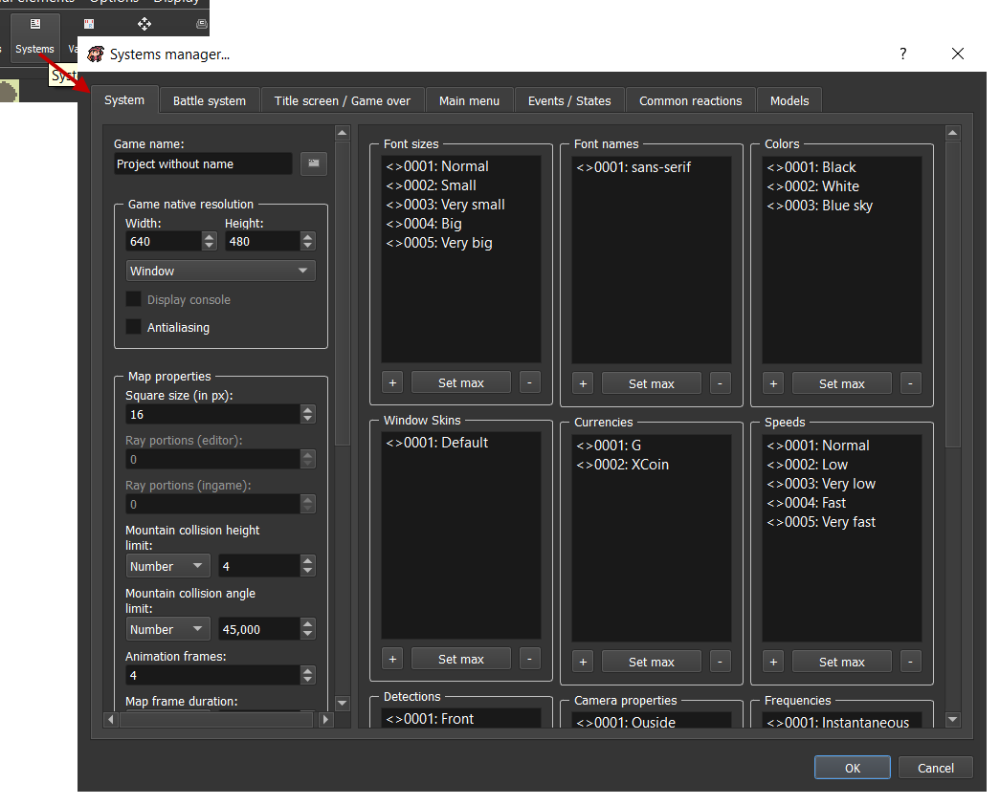

# Pour commencer

Bienvenue sur la documentation de RPG Paper Maker ! Vous trouverez ici tout ce dont vous aurez besoin pour devenir un pro de Paper Maker !

## Installation 

Allez sur [la section téléchargement](http://rpg-paper-maker.com/index.php/downloads#content) du site officiel et téléchargez l'installateur suivant votre système d'exploitation.

### Windows 

Démarrez `RPG Paper Maker installer.exe`. Cela installera le programme sur votre ordinateur, puis lancez `RPG Paper Maker.exe`. Il vous sera demandé de télécharger la dernière version de RPG Paper Maker. Puis, attendez que le téléchargement se termine.

### Linux 

Extraire le fichier. Consultez les instructions du `README` à la racine du dossier. Après avoir exécuté la dernière instruction \(`./run.sh`\), Il vous sera demandé de télécharger la dernière version de RPG Paper Maker. Puis, attendez que le téléchargement se termine.

### MacOSX 

Extraire le fichier. Après avoir lancé `RPG Paper Maker.app`, Il vous sera demandé de télécharger la dernière version de RPG Paper Maker. Puis, attendez que le téléchargement se termine.

## Changer de thème 

Il y a actuellement 2 thèmes différents : `Sombre` and `Clair`. Si vous souhaitez changer, allez dans `Options > General options...`.

## Créer un nouveau projet

Vous pouvez créer un nouveau projet en cliquant ici sur la barre d'outils principale :

Vous pouvez également utiliser `CTRL+N` ou aller dans `File > New project...`.

Vous pouvez choisir `Project name` qui correspond au nom du jeu. Cela génèrera automatiquement un dossier \(vous pouvez désactiver l'option `auto-generate` si vous souhaitez personnaliser le nom du dossier\). Enfin, choisissez la`location` du dossier de votre projet. Par défaut, cela se créera dans un nouveau dossier `RPG Paper Maker Games`.

## Ouvrir un projet existant

Vous pouvez ouvrir un projet existant en cliquant ici sur la barre d'outils principale :

Vous pouvez également utiliser `CTRL+O` ou aller dans `File > Open project > Browse...`. Les projets récents peuvent également être ouverts dans la première fenêtre \(ou dans `File > Open project`\).

## Changer les paramètres principaux du jeu

De nombreuses options sont disponibles dans `Systems manager`. Cliquez ici sur la barre principale d'outils, puis allez dans l'onglet `System` :

* `Game name`: Changez le nom de votre jeu
* `Game native resolution`: Change la largeur / hauteur de votre résolution et choisi également si vous souhaitez un mode d'affichage en plein écran ou fenêtré. 
* `Antialiasing`: Si coché, l'anti-crénelage sera activé en jeu
* **Propriétés de la carte**:
  * `Square size (in px)`: Choisissez ici la taille \(en pixel\) des carrés sur vos cartes. Vous devrez adapter vos textures après tout changements
  * `Ray portions (editor)`: _\(Non disponible actuellement\)_ La carte est séparée en plusieurs portions \(carrés de 16x16\). Vous pouvez changer ici le nombre de portions à afficher dans l'éditeur
  * `Ray portions (ingame)`: _\(Non disponible actuellement\)_ Idem, mais en jeu
  * `Mountain collision height limit (in px)`: Le niveau de hauteur considérée comme bloquante pour le héro, afin qu'il ne puisse que parcourir des blocs de niveau inférieur à cette valeur.
  * `Mountain collision angle limit (in degree)`: L'angle considéré comme bloquant pour le héro afin qu'il ne puisse traverser que des montagnes d'une valeur d'angle inférieure.
* **Cadence d'image**:
  * `Map frame duration`: Durée en millisecondes d'une image sur la carte \(personnages\)
  * `Animation frames`: Nombre d'images sur une animation \(marcher, attendre, etc.\)
  * `Battlers frames`: Le nombres d'images pour les animations de combattants
  * `Battlers columns`: Le nombre de colonnes dans un modèle d'animation de combattant
* `Global sounds`:
  * `Cursor`: Son à jouer lorsque la souris bouge dans une fenêtre de choix
  * `Confirmation`: Son à jouer si la souris confirme dans une fenêtre de choix
  * `Cancel`: Son à jouer si vous annulez quelque chose avec la souris
  * `Impossible`: Son à jouer quand un choix est impossible dans une fenêtre de choix
* `Other options`:
  * `Window skin`: L'apparence par défaut des fenêtres utilisées pour l'interface utilisateur
  * `Max number of save slots`: _\(Non disponible actuellement\)_ Change le maximum d'emplacement de sauvegardes disponibles pour le joueur
  * `Price of sold item`: Change en pourcentage la valeur du prix initial d'un objet quand vous souhaitez le vendre dans une boutique

## Changer la langue

You can change the engine language in `Options > Change language...`:

## Mettre à jour les contrôles du clavier

Vous pouvez changer les contrôles du clavier et du moteur de jeu dans le gestionnaire du clavier en clqiaunt sur la barre d'outils principale :

Pour le moteur de jeu :

* `CursorUp`, `CursorDown`, `CursorLeft`, `CursorRight`: Les directions du curseur dans l'éditeur de carte.

Pour le jeu:

* `UpHero`, `DownHero`, `LeftHero`, `RightHero`: Les directions du héro sur la carte.
* `UpMenu`, `DownMenu`, `LeftMenu`, `RightMenu`: Les directions dans le menu.
* `LeftCamera`, `RightCamera`: Tourne la caméra.
* `Action`: Action du héro sur la carte.
* `Cancel`: Annulation dans les menus.
* `Main menu`: Ouvrir / Fermer le menu principal.

Selectionnez les menus de système de contrôles correspondants : `Action`, `Cancel`, `Up`, `Down`, `Left`, `Right`. Vous pouvez ajouter autant de touches qu'il est possible d'avoir.

À l'ajout / moddification de touche :

* `Abbreviation`: Nom donné pour l'utilisation Javascript \(Pour les programmeurs\).
* `Description`: Sera affiché en jeu pour le menu de paramètres clavier.
* `Shortcut`: Changement de raccourcis. Appuyez sur le raccourcis correspondant grâce au bouton `Change...` . Vous pouvez avoir plusieurs raccourcis pour une même action \(séparés par le symbole `|` \) et également plusieurs touches pour un même raccourci \(séparés par le symbole `+` \).
  * `Remove last`: Retire le dernier raccourcis \(sur la droite\).
  * `Remove all`: Enlève tous les raccourcis entrés.

## Mettre a jour les couleurs générales

Allez dans `Systems manager > System` puis regardez le cadre `Colors`:

## Mettre à jour les noms de police générale et leur taille

Allez dans `Systems manager > System` puis regardez le cadre `Font size` ainsi que `Font name` :

## Changer le nom du jeu

Allez dans `Systems manager > System` puis regardez le cadre `Game name` :

Cela affectera le titre de la fenêtre lorsque vous lancerez le jeu.

## Changer la résolution d'écran du jeu

Allez dans `Systems manager > System` puis regardez le cadre `Game native resolution` :

* `Width`: La largeur native de votre fenêtre de jeu.
* `Height`: La hauteur native de votre fenêtre de jeu.
* `Window`: Choisir le mode fenêtré.
* `Full screen`: Choisir le mode plein écran. Notez que `Width` et `Height` n'auront aucun effet avec cette option.

## Testez votre jeu

Vous pouvez tester votre projet actuellement ouvert en cliquant ici sur la barre principale :

## Déployez votre jeu

Si vous souhaitez publier votre jeu \(partager votre jeu sans que vos joueurs nécessitent d'avoir RPG Paper Maker d'installé\) vous devez aller dans `File > Export standalone...`.

* `Location`: La localisation du dossier autonome que vous souhaitez créer. Le nom du dossier sera `yourGameName{OS}`.
* `Type of export`: Choisissez les options d'exportation ici.
  * `Deploy a desktop application`: Choisissez ici de déployer votre jeu comme application de bureau \(choisissez les options de système d'exploitation `OS` : Windows, Linux, or Mac\).
  * `Deploy for web browser`: _\(Non disponible actuellement\)_ Choisissez ici de déployer votre jeu comme application web. Ceci génèrera un fichier de page`index.html` et d'autres fichiers.
* `Version`: Choisissez la version de votre jeu. Avoir 1 comme `major` et 0 comme `minor` créera une version 1.0.

## Activer / désactiver le programme de mise à jour

Allez dans `Help > Auto display updater` pour activer ou désactiver l'auto vérification du programme de mise à jour qui vérifiera si une nouvelle mise à jour est disponible ou non.

