# Getting started

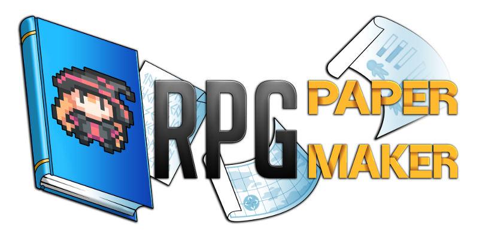

Welcome to RPG Paper Maker documentation! You will find here all that you need to be a pro Paper Maker!

## Installation 

Go to the [download section](http://rpg-paper-maker.com/index.php/downloads#content) from the official website and download the installer according to your system. 

### Windows 

Run `RPG Paper Maker installer.exe`. This will install the program on your computer and run `RPG Paper Maker.exe`. 

### Linux 

Extract the file. Check out the `README` instructions in the root of the folder \(the last instruction is`./run.sh`\). 

### MacOSX 

Extract the file. Run `RPG Paper Maker.app.`

The installer will allow you to choose a version for downloading. Recommend you choose the latest version of RPG Paper Maker. The program will run when this process is complete.

## Change theme 

There are two different themes: `Dark` and `White`. 

If you want to change it, go to `Options > General options...`.

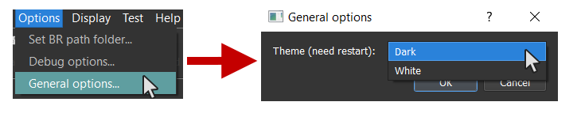

## Create a new project 

You can create a new project by clicking here on the main toolbar:

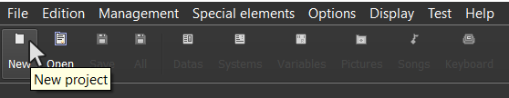

You can also use `CTRL+N` or go to `File > New project...`.

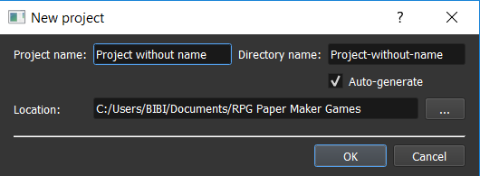

Here you can choose the `Project name` , which is the name of your game and is used as a label. Enable  `auto-generate` if you want to generate a folder name based on that project name. Otherwise enter it manually. Then choose the `location` of this project folder. By default, it will be on a freshly created `RPG Paper Maker Games` folder. 

## Open an existing project 

You can open an existing project by clicking here on the main toolbar:

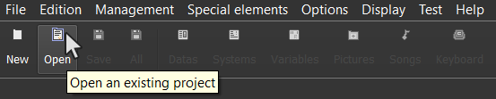

You can also use `CTRL+O` or go to `File > Open project > Browse...`. 

Recent projects can also be opened on the first screen \(or go to `File > Open project`\).

## Change general game settings 

A lot of options are available in the `Systems manager.` It's a good idea to set some of these values right away, especially resolution and sprite size. 

Click here on the main toolbar and go to the `System` tab:

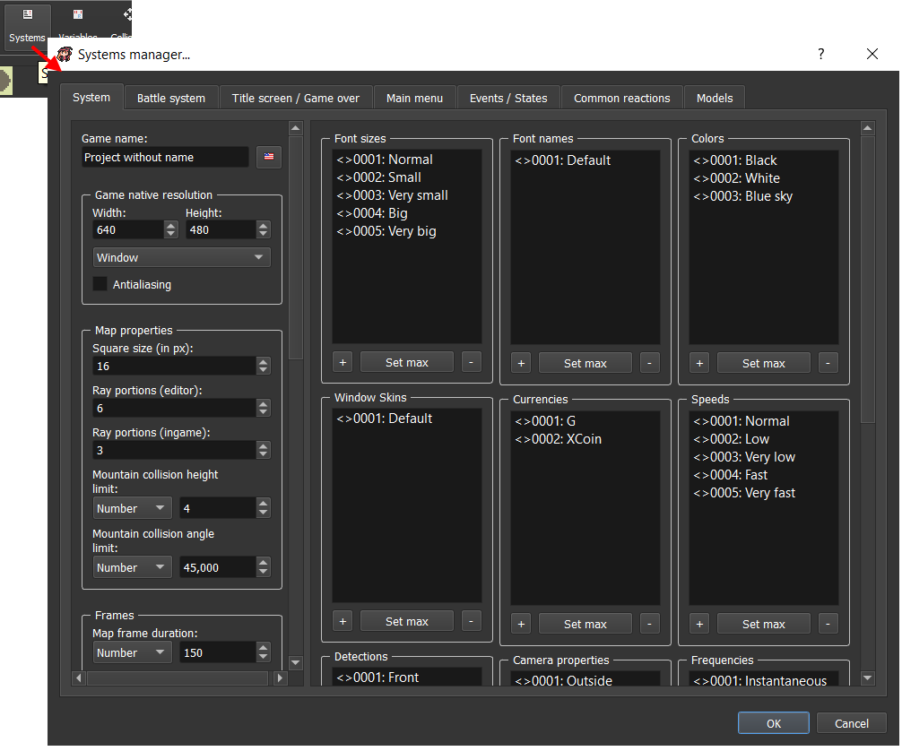

* `Game name`: Change the name of your game.
* `Game native resolution`: Set width / height resolution of the game when in window mode. You can choose between Window or Fullscreen display.  
* `Antialiasing`: If checked, antialiasing will be applied in game.
* **Map properties**:
  * `Square size (in px)`: this is the size \(in pixels\) of one tile in your maps. Your other graphics should match this size, with larger sprites being multiples of the base size. \(16, 32, 48, etc\)
  * `Ray portions (editor)`: The map is separated into several portions \(16x16 squares\). You can change here the number of portions to display.
  * `Ray portions (ingame)`: Same but for ingame.
  * `Mountain collision height limit (in px)`: this determines how high a mountain type block has to be before it blocks the player's movement. Anything lower will be treated like a step and you walk over it. 
  * `Mountain collision angle limit (in degree)`: this determines how steep a slope the player can walk up. Too steep and you can't walk up or down. 
* **Frames**:

  * `Map frame duration`: Time in milliseconds for a frame to pass on a map. 

    \*some of the below lists need verification/expansion\*

    * This affects: object sprites, battle animations called outside of battle, etc. 
    * Doesn't affect: autotiles, battle?. 

  * `Animation frames`: determines the number of frames in 1 cycle of an animation. 
    * This affects: object sprites, etc. 
    * Doesn't affect: battlers, autotiles. 
  * `Battlers frames`: determines the number of frames in 1 cycle of a battler animation.
  * `Battlers rows`: The number of rows available in a battler graphic file.
  * `Autotiles frames`: determines the number of frames in 1 cycle of a

     animated autotile.

  * `Autotiles frame duration`: Time in milliseconds for a frame of an animated autotile.

  
        \*Adding frames means you have to increase the width of your graphic files.   
        \*Adding rows means you have to increase the height of your graphic files.   

* `Global sounds`:
  * `Cursor`: Sound to play when the cursor moves.
  * `Confirmation`: Sound to play when confirming a menu choice.
  * `Cancel`: Sound to play when canceling something.
  * `Impossible`: Sound to play when a choice is impossible.
* `Other options`:
  * `Window skin`: The default window skin used for various window UI elements. 
  * `Max number of save slots`: Change the max number of save slots available to the player.
  * `Price of sold item`: Set how much of the original value you get back when selling an item. This can be a variable. 

## Change language 

You can change the engine language in `Options > Change language...`:

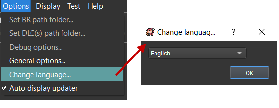

## Update keyboard controls 

You can change the engine and game keyboard controls in the keyboard manager by clicking on the main toolbar:

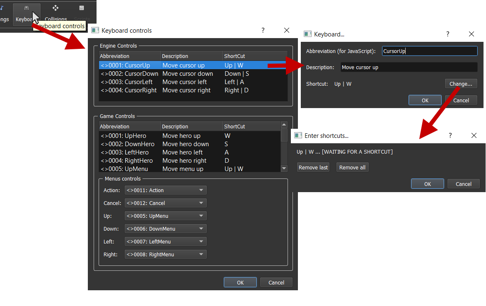

For engine:

* `CursorUp`, `CursorDown`, `CursorLeft`, `CursorRight`: The cursor directions in map editor.

For Game:

* `UpHero`, `DownHero`, `LeftHero`, `RightHero`: The hero directions in map.
* `UpMenu`, `DownMenu`, `LeftMenu`, `RightMenu`: The directions in menus.
* `LeftCamera`, `RightCamera`: Turn the camera.
* `Action`: Hero action in map.
* `Cancel`: Cancel in menus.
* `Main menu`: Open / Close main menu.

Select the corresponding system menus controls: `Action`, `Cancel`, `Up`, `Down`, `Left`, `Right`. You can add as many keys as you want.

When adding / editing a key:

* `Abbreviation`: Name used for JavaScript use \(for programmmers\).
* `Description`: Will be displayed in-game in the keyboard settings menu.
* `Shortcut`: Choose the keyboard key here. To set a new key press `Change...`. You can have more than one key per action. They are separated with a `|` symbol. You can also use the `+` symbol for key combinations. 
  * `Remove last`: Remove the last shortcut \(from the right\).
  * `Remove all`: Remove all shortcuts.

## Update general colors 

These are required for other events that need to be given a color to use, such as tint screen and fonts. You may want to enter the base rainbow of colors to match your other graphics' palette. 

Go to the `Systems manager > System` to find the `Colors` box:

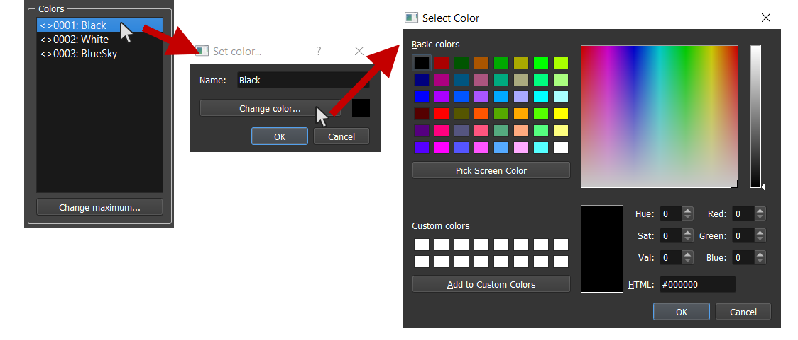

## Update general font sizes and font names 

When writing text messages you are given a dropdown menu of choices. This menu is where you determine what choices are available for some of them.

Size is in pixels and is a single number. 

Font names is where you choose the font file and name. Remember to include them in /"project folder"/content/font. 

Go to the `Systems manager > System` to locate the `Font size` and `Font name` boxes:

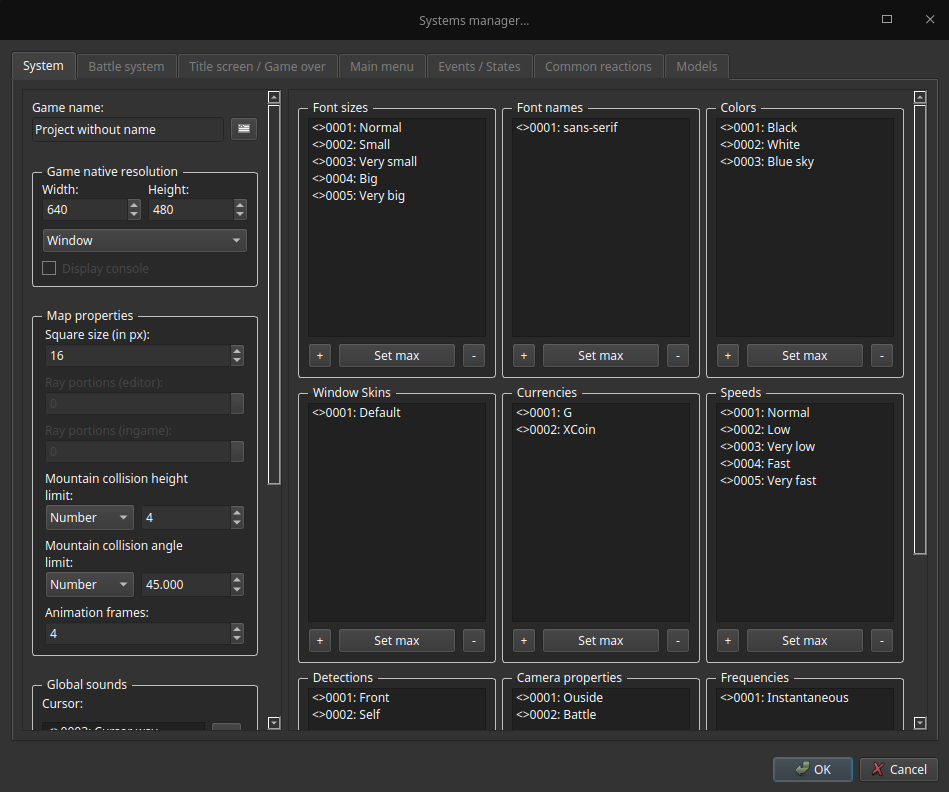

## Change game name 

Go to the `Systems manager > System` to find the `Game name` box:

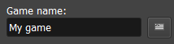

This will affect the window title when you are launching the game.

## Change game screen resolution 

Go to the `Systems manager > System`to view the `Game native resolution` box:

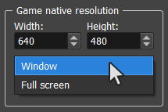

* `Width`: The native width of your game window.
* `Height`: The native height of your game window.
* `Window`: Choose a window mode.
* `Full screen`: choose full screen mode. Note that `Width` and `Height` have no effect with this option.

## Test your game 

You can test your project by clicking here on the main toolbar:

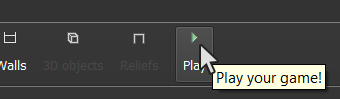

## Deploy your game 

If you want to publish your game \(share your game without any need for players to have RPG Paper Maker installed\) you go to `File > Export standalone...`.

* `Location`: The location of the standalone folder that you want to create. The name of this folder will be `yourGameName{OS}`.
* `Type of export`: Choose export options here.
  * `Deploy a desktop application`: Choose here to deploy your game as a desktop application \(choose the `OS` in options: Windows, Linux, or Mac\).
  * `Protect data`: Enable this if you want to encrypt the files so they can't be accessed outside of the game. \*\*May not work\*\*
  * `Deploy for web browser`: _\(not available yet\)_ Choose here to deploy your game as a web application. This will generate an `index.html` page and other files.
* `Version`: Choose you game version. Having 1 for `major` and 0 for `minor` will create a 1.0 version.

## Enable / Disable Updater 

Go to`Help > Auto display updater` to enable or disable the updater that will check if a new version is available or not.

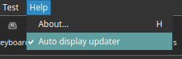

