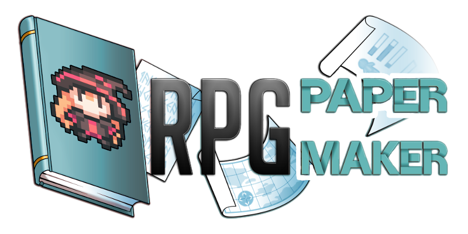
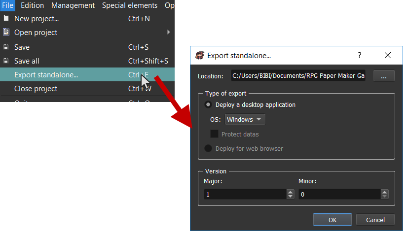

# Початок роботи

Вітаємо в документації RPG Paper Maker! Тут міститься все необхідне, щоб стати професіоналом з RPG Paper Maker!

## Встановлення 

Перейдіть в [розділ Download](http://rpg-paper-maker.com/index.php/downloads#content) на офіційному сайті та завантажте пакет установки для вашої системи. 

### Windows 

Запустіть `RPG Paper Maker installer.exe`. Це встановить програму на вашому комп'ютері, після чого запустіть `RPG Paper Maker.exe`. 

### Linux 

Розпакуйте файл. Виконайте інструкції з файла `README` в кореневій директорії \(останньою інструкцією буде запуск `./run.sh`\). 

### MacOSX 

Розпакуйте файл. Запустіть `RPG Paper Maker.app.`

Програма встановлення дозволяє вибрати, яку версію завантажити. Рекомендується вибирати найновішу версію RPG Paper Maker. Програму буде запущено після завершення встановлення.

## Зміни теми 

Доступні дві різних теми: `Темна` та `Біла`. 

Щоб змінити тему, використовуйте пункт меню`Налаштування > Загальні налаштування...`.

## Створення нового проєкту 

Новий проєкт можна створити першою кнопкою на основній панелі інструментів:

Крім того, можна використовувати `CTRL+N` або пункт меню `Файл > Новий проєкт...`.

Тут можна вибрати, якою буде `Назва проєкту` , тобто назва вашої гри, яка буде використовуватися як її заголовок. Пункт  `Автоматично` дозволяє назвати директорію на диску на основі назви проєкту. Її також можна ввести вручну. Пункт `Місцезнаходження` вказує, де зберігатимуться директорії з проєктами. Якщо не міняти настройки, це буде новостворена директорія `RPG Paper Maker Games`. 

## Відкриття проєкту, створеного раніше 

Можна відкрити існуючий проєкт, натиснувши на другу кнопку на основній панелі інструментів:

Також можна використовувати `CTRL+O` або `Файл > Відкрити проєкт > Огляд...`. 

Недавні проєкти також можна відкрити з початковом екрані \(а `Файл > Відкрити проєкт`\).

## Зміна загальних налаштувань гри 

Багато налаштувань доступно у вікні `Керування системами.` Варто встановити деякі з цих налаштувань на початку роботи, особливо розмір екрана та розміри спрайтів. 

Натисніть тут на основній панелі інструментів та перейдіть до сторінки  `Система` :

* `Назва гри`: Вказує назву гри.
* `Базовий розмір графіки гри`: Вказує висоту та ширну гри в віконному режимі. Також можна перемкнутися поміж режимами Вікно та Повний екран.  
* `Antialiasing`: Якщо вибрати цю опцію, в грі буде використовуватися згладжування графіки.
* Властивості карти:
  * `Розмір клітини (в пікселях)`: це розмір \(в пікселях\) одної клітини вашох карти. Інша графіка мусить відповідати цьому значенню: спрайти більшого розміру мусять бути кратними основному розміру \(16, 32, 48 тощо\).
  * `Порції променя (в редакторі)`: Карта розбивається на декілька порцій \(по 16×16 квадратів\). Тут можна змінити кількість показуваних порцій.
  * `Порції променя (в грі)`: Те саме, але всередині гри.
  * `Ліміт висоти зіткнення для гір` \(в пікселях\): це налаштування визначає, наскільки високими мають бути гори для того, щоб вони блокували пересування гравця. Менші значення будуть вважатися сходинками, по яким можна пройти. 
  * `Ліміт куту зіткнення для гір` \(в градусах\): це значення визначає, наскільки пологим має бути схил, щоб гравець міг по ньому пройти. Якщо схил занадто крутий, по ньому неможливо піднятися або спуститися. 
* **Кадри**:

  * `Тривалість кадри карту`: Час в мілісекундах, за який перемальовується один кадр на карті. 

    \*деякі пункти нижче треба перевірити/розширити\*

    * Це впливає на: спрайти об'єктів, бойові анімації по-за межами битв тощо.
    * Це не вливає на: автотайли, битву \(?\). 

  * `Кадри анімації`: визначає кількість кадрів у одному циклі анімації. 
    * Це впливає на: спрайти об'єктів, тощо. 
    * Це не впливає на: анімацію бійців, автотайли. 
  * `Кадри бійців`: визначає кількість кадрів в одному циклі анімації бійця.
  * `Рядки бійців`: Кількість рядків, доступна в файлі графіки бійця.
  * `Кадри автотайлів`: визначає кількість кадрів у одному циклі анімованого автотайла.
  * `Тривалість кадра автотайла`: Час в мілісекундах на один кадр анімованого автотайла.

  
        \*Якщо ви збільшуєте кількість кадрів, вам необхідно буде збільшити ширину графічних файлів.   
        \*Якщо ви збільшуєте кількість рядків, вам необхідно буде збільшити висоту графічного файлу.   

* `Глобальні звуки`:
  * `Курсор`: Звук, який буде програватися при пересуванні курсору.
  * `Підтверждення`: Звук, який буде програватися при виборі пункту меню.
  * `Скасувати`: Звук, який буде програватися при скасуванні будь-чого.
  * `Неможливо`: Звук, який буде програватися, коли вибраний варіант неможливий.
* `Інші опції`:
  * `Стандартні налашування діалогового вікна`: Стандартне оформлення вікна, яке буде використовуватися для різних елементів вікон у графічному інтерфейсі. 
  * `Максимальна кількість записаних ігор`: Міняє максимальну кількість місць для запису гри, доступних гравцям/гравчиням.
  * `Ціна продажу речі`: Вказує, який процент оригінальної ціни можна отримати, продаючи річ. Це значення можна читати зі змінної.
  * `Опції введення імені`:  Встановлює літери, які можна використовувати для введення імен під час гри.

## Зміна мови 

Мову рушія можна змінити пунктом меню `Налаштування > Змінити мову...`:

## Оновлення керівних клавіш 

Можна змінити керівні клавіші редактора або гри, використовуючи пункт меню `Керування > Керівні клавіші` або настиснувши на кнопку `Клавіші` на основній панелі інструментів:

Для редактора:

* `CursorUp`, `CursorDown`, `CursorLeft`, `CursorRight`: Рух карти в редакторі в різних напрямках.

Для гри:

* `UpHero`, `DownHero`, `LeftHero`, `RightHero`: Рух героя в різних напрямках.
* `UpMenu`, `DownMenu`, `LeftMenu`, `RightMenu`: Пересування в різних напрямках у меню.
* `LeftCamera`, `RightCamera`: Пересування камери.
* `Action`: Дія героя на карті.
* `Cancel`: Скасування в меню.
* `Main menu`: Відкриття/закриття основного меню.

Виберіть відповідні клавіші для керування меню: `Action`, `Cancel`, `Up`, `Down`, `Left`, `Right`. Можна додати скільки завгодно клавіш.

Під час додавання/редагування клавіші:

* `Скорочення (для JavaScript)`: Назва, яка використовується в коді на JavaScript \(для програмісток та програмістів\).
* `Опис`: Буде показуватися під час гри в меню клавіатурних налаштувань.
* `Клавіші`: Тут встановлюються клавіші. Щоб додати нову клавішу, натисність на кнопку `Змінити...`. Ви також можете встановити декілька клавіш для однієї діш. Вони будуть показуватися, розділені символом `|`. Також можна використовувати комбінації клавіш: вони позначаються символом `+`. 
  * `Видалити останню`: Видаляє останню \(найправішу\) клавішу.
  * `Видалити всі`: Видаляє всі клавіші.

## Редагування загальних кольорів 

Кольори потрібні для подій, які приймають колір, наприклад, для забарвлення екрана або зміни шрифта. Ви можете встановити основну кольорову палітру, щоб вона сполучалася з палітрою вашої графіки. 

Перейдіть у `Керування системами > Система` і налаштуйте кольори в полі `Кольори`:

## Оновлення загальних кеглів та назв шрифтів 

Під час написання текстових повідомлень у вас буде випадаючий список доступних варіантів. Описане тут поле використовується для того, щоб вказати доступні варіанти.

Кегль — це розмір шрифту в пікселях, він задається як одне число. 

У полі `Назви шрифтів` можна або вказати назву базового шрифту, або назву файла зі шрифтом. Не забудьте додати свій файл у директорію /"директорія проєкта"/зміст/шрифт. 

Перейдіть в `Керування системами > Система` і змініть списки `Кеглі шрифтів` та `Назви шрифтів`:

## Зміна назви гри 

Перейдіть у `Керування системами > Система` і використовуйте поле `Назва гри`:

Від цього поля залежить заголовок при запуску гри.

## Зміна роздільної здатності ігрового екрана 

Перейдіть у `Керування системами > Система`, в розділ  `Базовий розмір графіки гри`:

* `Ширина`: Базова ширина ігрового вікна.
* `Висота`: Базова висота ігрового вікна.
* `Вікно`: Встановлює віконний режим.
* `Повний екран`: встановлює повноекранний режим. Зверніть увагу, що у цьому режимі поля `Ширина` та `Висота` ігноруються.

## Тестовий запуск гри 

Перевірити роботу своєї гри можна, натиснувши на кнопку `Запуск` на основній панелі:

## Експорт гри для публікації 

Якщо ви хочете опублікувати свою гру \(поділитися нею з тими, в кого не встановлений редактор RPG Paper Maker\), відкрийте пункт `Файл > Експорт як самостійного...`.

* `Місцезнаходження`: Місце, в якому буде створено директорію з самостійним проєктом. Директорію буде названо  `назваВашоїГри{ОС}`.
* `Тип ексорту`: Тут вказуються налаштування експорту.
  * `Експорт для настільних систем`: Цей пункт дозволяє опублікувати гру для настільних комп'ютерів \(в полі `ОС` виберіть операційну систему: Windows, Linux, or Mac\).
  * `Зашифрувати дані`: Виберіть цей пункт, якщо ви хочете зашифрувати файли, щоб вони не були недоступні по-за грою. \*\*Може не спрацювати\*\*
  * `Експорт для веббраузера`: _\(поки що недоступний\)_ Виберіть цей пункт, щоб експортувати вашу гру як вебдодаток. Тоді буде створено сторінку `index.html` та інші потрібні файли.
* `Версія`: Вкажіть версію гру. Якщо ввести 1 в полі `Основна` та 0 в полі `Другорядна`, буде створено версію 1.0.

## Увімкнути/вимкнути автоматичне оновлення 

Перейдіть в пункт меню `Допомога > Автоматично показувати вікно оновлення`, щоб дозволити або заборонити автоматичну перевірку наявності нових версій.

