# Action Battle System

/!\ Be aware that this tutorial will be updated constantly with new coming updates for having the best representation of the engine possibilities. Currently there are only basic possibilities so this won't look really attractive in the first place (no animations etc.).

Also, be aware that you will need to have a look on the [Objects & Events tutorial](../basics/objects-and-events) before reading this.

## What is an Action Battle System?

An Action Battle System is the type of battle used for Action-RPG or simple Action games. One example is **Zelda** series, except for Zelda 2 which is a platformer, which is using a battle system with sword attack, bombs, arrows, etc.

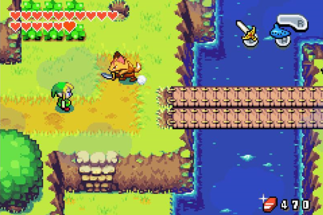

*Example: TLOZ: Minish Cap*

## How to create my hero and enemies characteristics

We will start with one basic characteristic: HP (health points). There is actually not the command to be able to set statistics values, but there is another way to do: use properties. Go to `Systems manager > Models` and select `Hero` model. You can add a property `HP` this way:

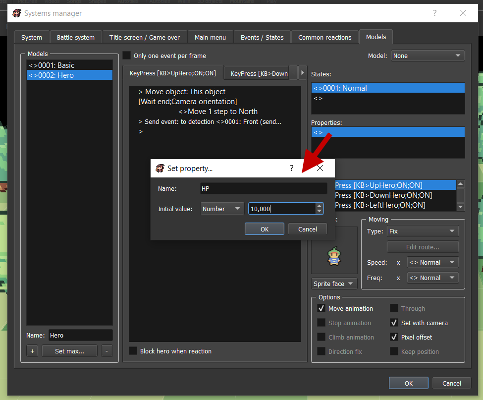

You can do the same things with enemies in your maps:

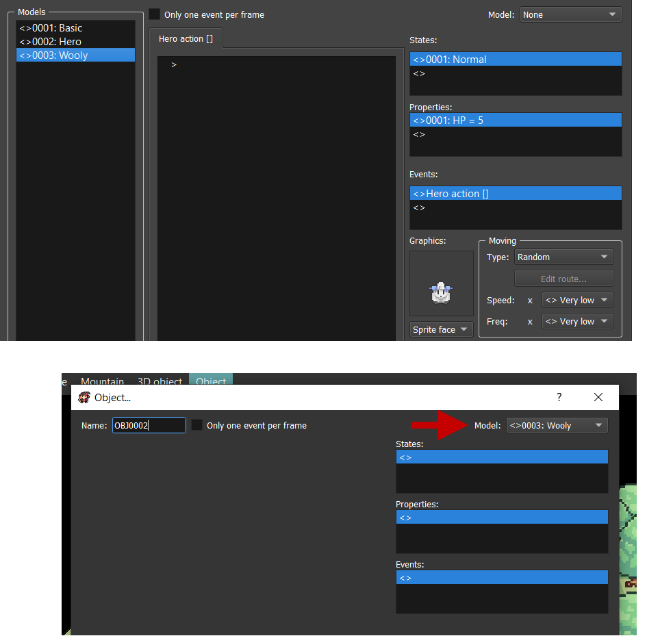

NOTE: We strongly recommend to use models here!

## How to create sword attacks

Now, let's say that the Action key will use your sword. We need three things:

* Create an event sword attack that will be sent to nearby enemies. Go to `Systems manager > Events / States` and add a new event named `Sword attack` with a parameter `Power` that can be anything as default value. This parameter will be useful to change attack swords power.

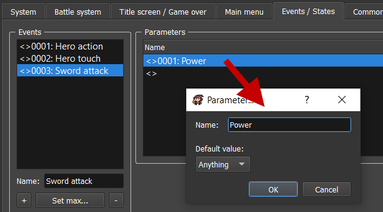

* Create a dead state so the enemy won't be displayed after he got 0 HP. Go to `Systems manager > Events / States` and simply add a new state named `Dead`.

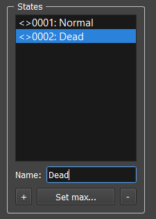

* Create a detection for sword that will indicate the area where your sword attack will be effective. Go to `Systems manager > System` and add a new detection named `Sword` that is like that:

Now, go back to your `Hero` model. The event Action keypress is already used for sending Hero action event, but we can use it to send sword event too. Let's do a reaction to this so the Hero will send the event Sword attack with power 5 to enemies that are in the detection sword area:

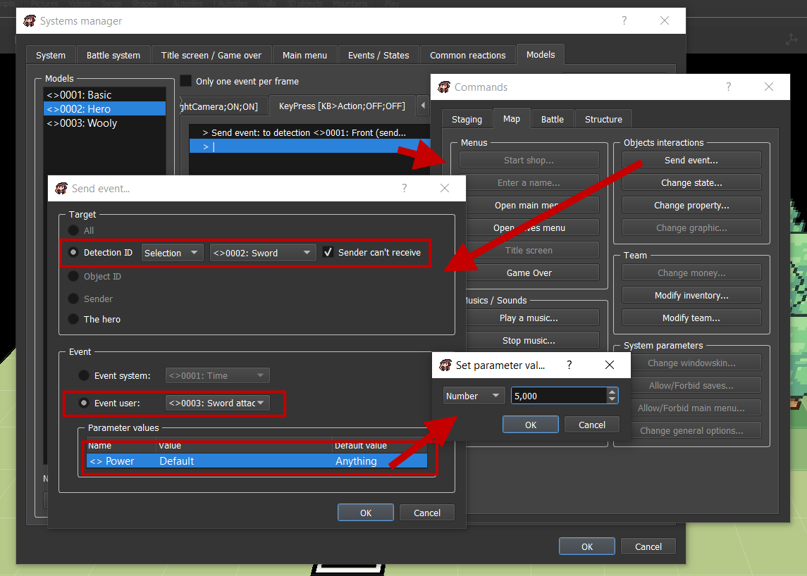

Done. Now, the enemy should be able to react to sword attack if we want to have something to happen. Let's make him react to sword attack event with any power value by losing HP and dying if HP is lesser than or equal to 0:

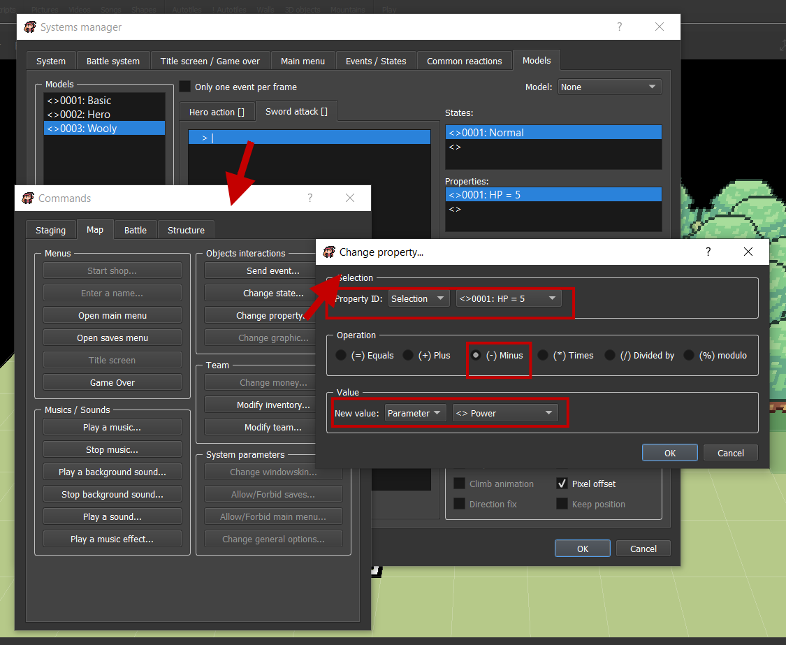

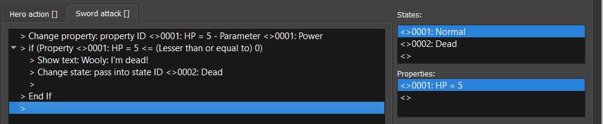

The dead state is simply an empty object without graphics, but it could have been a dead asset too. So there it is, you have your sword attack!

## How to create loots left by enemies in map

What you can do instead of having the enemies instantly dead is replacing them by loots that they could have dropped! Just add a state loot that will react to hero touch and replace dead state by loot state:

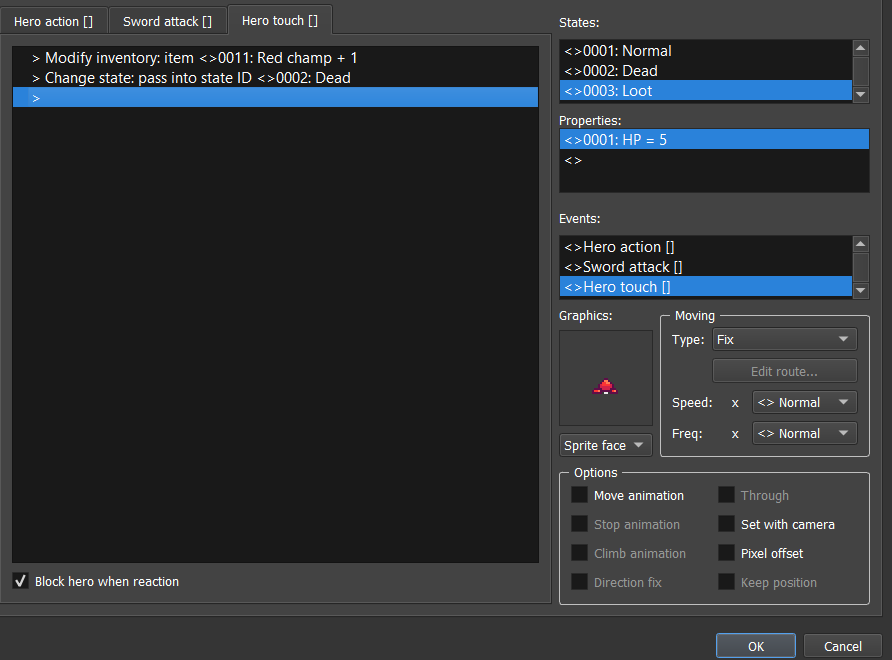

You can even add random effect with 80% of chance to having a loot for example:

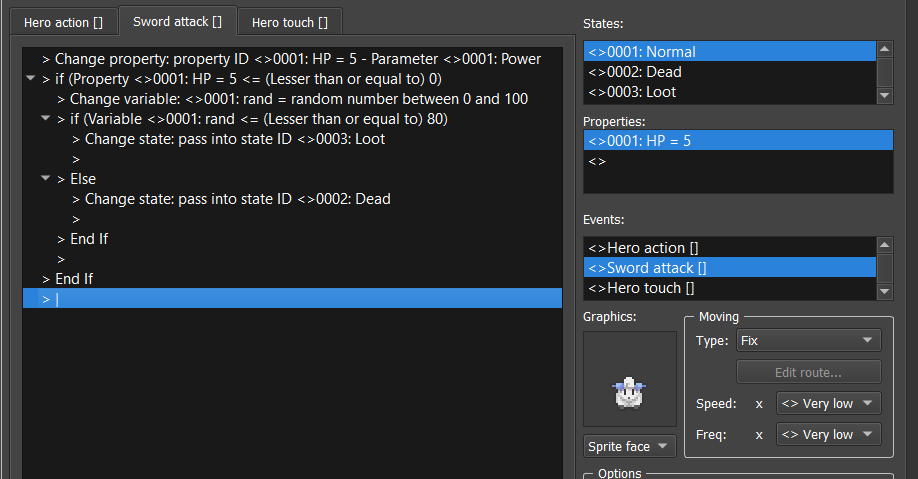

Result:

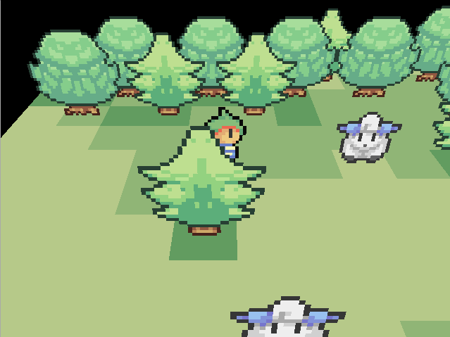

## How to create projectiles (bullets, arrows)

*Not available now (requires create / delete objects in map command)*

## How to create bombs

*Not available now (requires create / delete objects in map command)*

## How to create an AI

*Not available now (requires more move command(pathfinding))*

## How to create an intrusion system

*Not available now (requires send detection to a specific object command for better use)*