# Event commands overview

Now that you are a pro for objects and event, let's see all the event commands that are possible to use.

## Show text

Displays a text in a dialog box with the current dialog box options.

* `Interlocutor`: This will display a text inside a small box on top of the text box for indicating the interlocutor's name. If empty, this will not show the box.
* `Faceset`: The faceset to display inside the dialog box on the left.
* `Message`:
	*  : Apply bold effect on the selected text.
	*  : Apply italic effect on the selected text.
	*  : Apply left align effect on the selected text.
	*  : Apply center align effect on the selected text.
	* 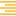 : Apply right align effect on the selected text.
	* `Font size`: Apply the selected font size on the selected text.
	* `Font name`: Apply the selected font name on the selected text.
	* `Text color`: Apply the selected text color on the selected text.
	* `Back color`: Apply the selected back color on the selected text.
	* `Outline color`: Apply the selected outline color on the selected text.
	* `Variable`: Display the value of the current selected variable.
	* `Parameter`: Display the value of the current selected parameter.
	* `Property`: Display the value of the current selected property.
	* `Hero name`: Display the name of the selected hero instance ID.
	* `Icon`: Display the selected icon.

Render in game:

## Display a choice

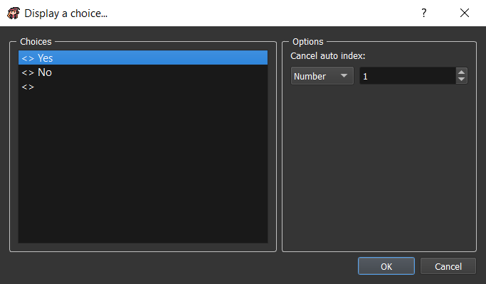

* `Choices`: The list of choices texts.
* `Options`:
	* `Cancel auto index`: The choice index to select when pressing cancel button.

Using adter show text command:

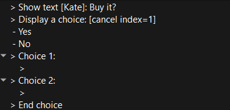

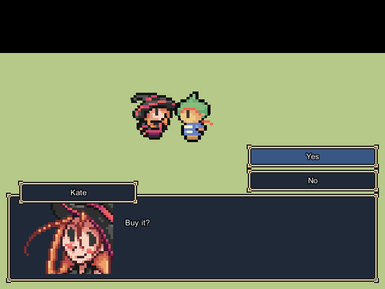

Using without show text command before:

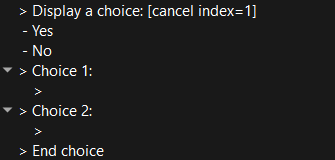

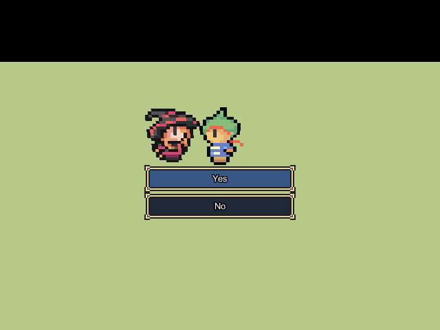

## Input number

*Not available yet.*

## Set dialog box options

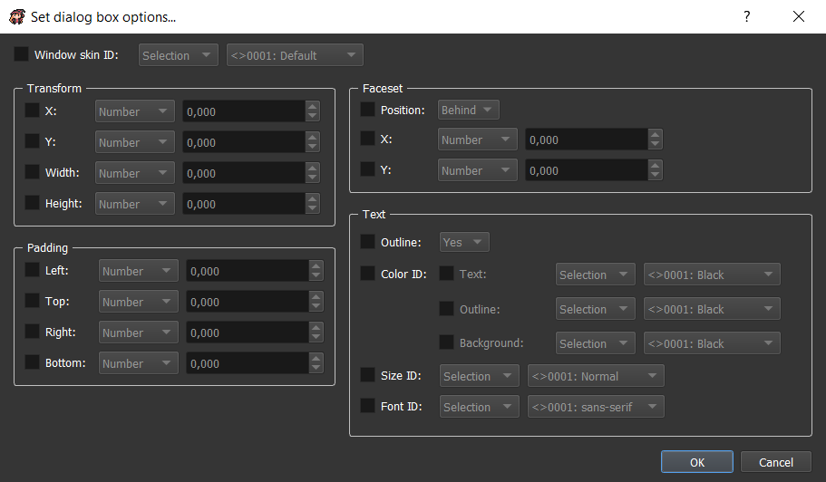

Set all the dialog box options.

* `Window skin ID`: The window skind ID to display.
* `Transform`:
	* `X`: The x position of the window.
	* `Y`: The y position of the window.
	* `Width`: The width of the window.
	* `Height`: The height of the window.
* `Padding`:
	* `Left`: The left padding of the window.
	* `Top`: The top padding of the window.
	* `Right`: The right padding of the window.
	* `Bottom`: The bottom padding of the window.
* `Faceset`:
	* `Position`: The position of the faceset. You can choose if it's behind or above the window.
	* `X`: The additional x position of the faceset.
	* `Y`: The additional y position of the faceset.
* `Text`:
	* `Outline`: Select if texts should have outlines.
	* `Color ID`:
		* `Text`: The color ID to use for texts.
		* `Outline`: The color ID to use for outlines.
		* `Background`: The color ID to use for backgrounds.
	* `Size ID`: The size ID to use for texts.
	* `Font ID`: The font ID to use for texts.

## Change screen tone

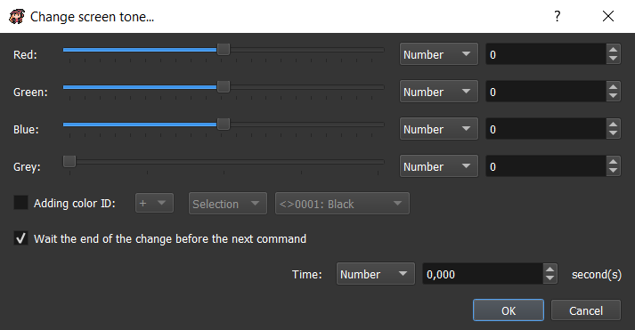

Change the screen tone (dominant color). The RGB color (0, 0, 0) changes nothing on the screen tone.

* `Red`: The red dominant color.
* `Green`: The green dominant color.
* `Blue`: The blue dominant color.
* `Grey`: The grey dominant color (saturation). If grey = 0, then no changes. If grey = 100, then the screen will only have grey colors.
* `Adding color ID`: You can combine the previous color with an existing color.
* `Wait the end of the change before the next command`: If checked, the command will end only after `Time` number.
* `Time`: Time to wait for changing the screen tone.

## Shake screen

*Not available yet.*

## Flash screen

*Not available yet.*

## Change meteo

*Not available yet.*

## Change map properties

*Not available yet.*

## Wait

Wait during a specific time.

* `Time`: Time to wait in seconds.

## Change chronometer

*Not available yet.*

## Teleport object

This will teleport an object on an existing map with a new position.

* `Object ID`: The object ID to teleport.
* **Position**:
	* `Select...`: Choose map and position thanks to a map previewer.
	* `ID map`, `X`, `Y`, `Y plus`, `Z`: Choose map ID an position to go manually.
	* `Object (ID)`: Choose an object to teleport on.
* **Options**: *Not available yet.*

## Move object

This will move an object in the current map with a specific route. You can also temporary change some properties linked to the object state.

* `Object ID`: The object ID to move.
* `Ignore if impossible`: If checked, the moves that can't be executed (example: a wall blocking the route) would be ignored. If not checked, this will try the impossible move as long as it become possible (example: use for NPCs moving).
* `Wait the end of moves`: If checked, the command would end only when all the moves are executed. If not, the command would end immediately (moves executed in parallel).
* `With camera orientation`: If checked, the direction moves (north, south, west, east) would take account of the camera orientation. If not, the direction moves would not take account of the camera orientation.
* **Step / square moves**:
	* `Square`: Change all the direction moves unit to square.
	* `Step`: Change all the direction moves unit to step.
	* `1 to North / South / West / East / North-West / North-East / South-West / South-East`: Move the object to 1 square / step in the selected direction.
	* `1 to random`: Move the object to 1 square / step in a random direction.
	* `1 to the hero`: Move the object to 1 square / step in the hero direction.
	* `1 opposite to the hero`: Move the object to 1 square / step in the opposite of the hero direction.
	* `1 in front`: Move the object to 1 square / step in front.
	* `1 back`: Move the object to 1 square / step back.
* **Change direction**: *Not available yet.*
* **Change object properties**: *Not available yet.*

## Display an animation

*Not available yet.*

## Move camera

Check out the camera guide [here](control-the-camera.md).

## Reset camera

*Not available yet.*

## Create object in map

*Not available yet.*

## Remove object from map

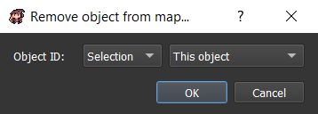

Remove an object from the map. This removing is effective as long as you don't change map or load the game in saves.

* `Object ID`: The object ID to remove in the map.

## Display a picture

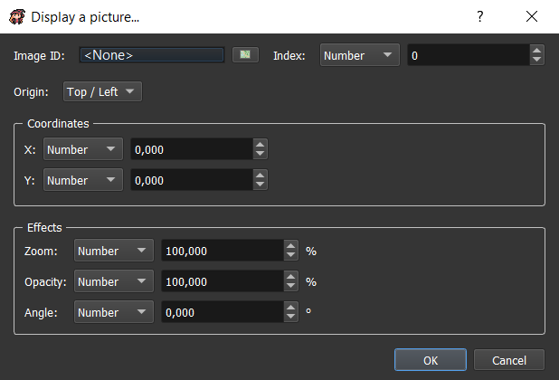

Display a picture on top of the screen.

* `Image ID`: The image ID to display.
* `Index`: The index of the image to display. You can display several images in the same time if they have different index. The more the index is high, the more the image is displayed on top. If two images have the same index, then the ancient image will be removed.
* `Origin`:
	* `Top / Left`: The origin position will be (0, 0) (= top left of the screen).
	* `Center`: The origin position will be the center of the screen.
* `Coordinates`:
	* `X`: The x position according to the origin.
	* `Y`: The y position according to the origin.
* `Effects`:
	* `Zoom`: The % zooming of the image.
	* `Opacity`: The % opacity of the image.
	* `Angle`: The ° angle of the image.

## Set / Move / Turn a picture

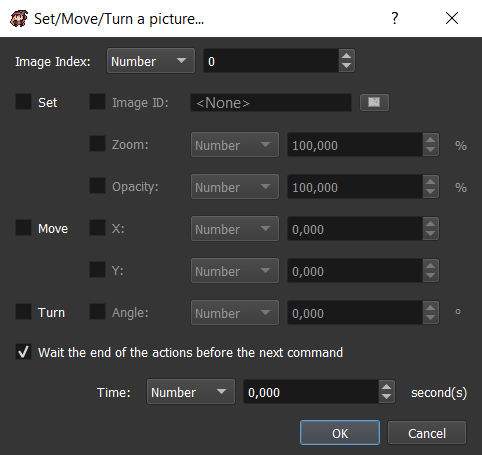

Set / Move / Turn a picture that is already displayed on top of the screen.

* `Image index`: Select the index of the image to set / move / turn.
* `Set`: 
	* `Image ID`: Change the image ID to display.
	* `Zoom`: Change the % zooming of the image.
	* `Opacity`: Change the % zooming of the image.
* `Move`:
	* `X`: Change the x position according to the origin.
	* `Y`: CHange the y position according to the origin.
* `Turn`: 
	* `Angle`: Change the ° angle of the image.
* `Wait the end of the actions before the next command`: If checked, the command will end only after `Time` number.
* `Time`: Time to wait for updating the picture.

## Remove a picture

Remove a picture that is displayed on top of the screen.

* `Image index`: Select the index of the image to remove.

## Play a video

*Not available yet.*

## Start shop

*Not available yet.*

## Enter a name

*Not available yet.*

## Open main menu

This will open the main menu.

Render in game:

## Open saves menu

This will open the saves menu.

Render in game:

## Title screen

Go to the title screen.

## Game over

This will go to the game over screen.

*/!\ Today, there is no game over screen, it's only closing the game window.*

## Play a music

This will play a music on the current map.

* `Select song by ID`: Instead of using the left list, you can select by ID values.
* **Options**:
	* `Volume`: The music volume (in %).
	* `Start`: The beginning time of the music in seconds.
	* `End`: The end time of the music in seconds.

## Stop music

This will stop the music played in the current map.

* `Disappear with time`: Number of seconds for music played for disappearing.

## Play a background sound

This will play a background sound on top of the current music.

Check out the play music command [here](event-commands-overview/#play-a-music) that is similar.

## Stop background sound

This will stop the background sound played in the current map.

Check out the stop music command [here](event-commands-overview/#stop-music) that is similar.

## Play a sound

This will play a sound on top of all the songs.

Check out the play music command [here](event-commands-overview/#play-a-music) that is similar.

## Play a music effect

This will play a music by pausing the current played music. When the music effect is finished the previously played music is unpaused.

Check out the play music command [here](event-commands-overview/#play-a-music) that is similar.

## Change battle music

*Not available yet.*

## Change victory music

*Not available yet.*

## Send event

This will send an event to the selected target.

* **Target**:
	* `All`: *Not available yet.*
	* `Detection`: Send the event to a specific detection.
		* `Sender can't receive`: The detection is not applied to the sender.
	* `Object`: Send the event to a specific object.
* **Event**:
	* `Event system`: Select a system event (events sent by the game system itself).
	* `Event user`: Select a user event (custom events sent by the map objects).
	* `Parameters values`: Select the event parameters values. You can keep the default value.

## Change state

This will change the state of the current object. An object can have several states at the same time.

* **Selection**:
	* `State's ID`: The new state ID.
* **Operation**:
	* `Replace`: Remove all the current states of the object and add the new state.
	* `Add`: Only add the new state.
	* `Remove`: Remove the object state having this ID.

## Change property

This will change a property value of the current object.

* **Selection**:
	* `property ID`: The property ID to change.
* **Operation**: The operation to use according to the current property value.
* **Value**:
	* `New value`: The new value to apply to the property with the corresponding operation.

## Change graphic

*Not available yet.*

## Change money

*Not available yet.*

## Modify inventory

This will update inventory containing. You can for example add items to it.

* **Selection**:
	* `Item`: An item to select.
	* `Weapon`: A weapon to select.
	* `Armor`: An armor to select.
* **Operation**: The operation to use according to the current number of the selection in the inventory.
* **Number**: The value to use for updating the selection number.

## Modify team

This will update team organization.

* `Create new instance with level ... in team / reserve / hidden of`: Create a new instance of a hero or monster in team, reserve, or hidden.
	* `Stock instance ID in`: Choose a variable where you want to stock the instance ID. This can be useful to move or remove characters in team.
* `Move / Remove the character with ID ... in team / reserve / hidden`: *Not available yet.*

## Allow / Forbid saves

* `Allow`: If checked, the saves menu will be allowed.

## Allow / Forbid main menu

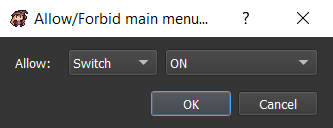

* `Allow`: If checked, the main menu will be allowed.

## Change general options

*Not available yet.*

## Start a battle

This will start a battle with your team against a troop (group of monsters).

* **Troop's ID**:
	* `ID`: Fix troop ID.
	* `Random (in map property)`: Random ID indicated in map property window.
* **Battle map**:
	* `ID`: Fix battle map ID.
	* `Select...`: Choose battle map and position thanks to a map previewer.
	* `ID map`, `X`, `Y`, `Y plus`, `Z`: Choose battle map ID and position to go manually.
* **Options**:
	* `Allow escape`: If checked, it would be possible to use battle command `Escape` in this battle.
	* `Defeat causes Game Over`: If checked, losing in this battle will automatically direct to game over. If not checked, there will be two commands container : one for the winning state, and the second for the losing state.
* **Transition**:
	* `Start / End`: Start / End type of transition:
		* `None`: Immediate transition.
		* `Fade in / out`: Transition on a color.
		* `Zoom in / out`: Transition by zooming in / out.

## Display / Hide enemy

*Not available yet.*

## Force an action

*Not available yet.*

## End battle

*Not available yet.*

## Change battle music

*Not available yet.*

## Change victory music

*Not available yet.*

## Change a statistic

*Not available yet.*

## Change experience curve

*Not available yet.*

## Change status

*Not available yet.*

## Change a skill

*Not available yet.*

## Change name

*Not available yet.*

## Change class

*Not available yet.*

## Change equipment

*Not available yet.*

## Condition

Create a container for commands that will be executed only if the indicated condition is true.

* `Add "else" when conditions do not apply`: Create another container for commands that will be executed only if the indicated condition is false.

* **Variables / Param / Prop**:

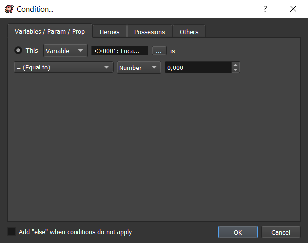

* `This`: Compare a variable or a parameter or a property with any other type of value.

* **Heroes**:

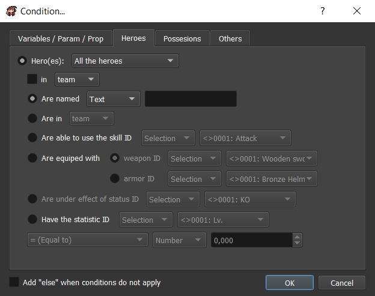

* `Hero(es)`: Select `all the heroes` or `none of the heroes` or `at least one hero` or `the hero with instance ID`.
 in `team` or `reserve` or `hidden`.
 	* `Are named`: Check if the selection have this name.
  	* `Are in`: Check if the selection is in the `team` or `reserve` or `hidden`.
   	* `Are able to use the skill ID`: Check if the selection is able to use the selected skill ID.
   	* `Are equiped with`:
   		* `weapon ID`: Check if the selection is equiped with the selected weapon ID.
   		* `armor ID`: Check if the selection is equiped with the selected armor ID.
  	* `Are under effect of status ID`: *Not available yet.*
  	* `Have the statistic ID`: Compare a selected statistic of the selection with any other type of value.

* **Possessions**:

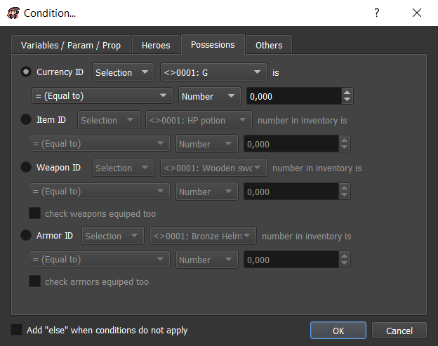

* `Currency ID`: Compare a selected currency number with any other type of value.
* `Item ID`: Compare a selected item number in inventory with any other type of value.
* `Weapon ID`: Compare a selected weapon number in inventory with any other type of value.
	* `Check weapons equiped too`: If checked, the equiped weapons will be included in the number of weapons.
* `Armor ID`: Compare a selected armor number in inventory with any other type of value.
	* `Check armors equiped too`: If checked, the equiped armors will be included in the number of armors.

* **Others**:

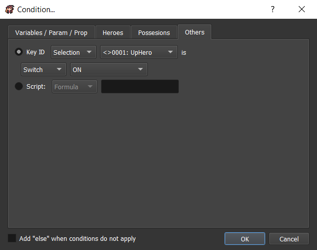

* `Key ID`: Check if selected key is ON or OFF.
* `Script`: Check according to the script return value (for programmers).

## Loop

Create a container for commands that will be executed on a loop.

## Break loop

If inside a loop container, this will go out of the loop and go to the next command after the loop.

## Label

*Not available yet.*

## Jump to label

*Not available yet.*

## Stop the reaction

Stop the current reaction.

## Comment

*Not available yet.*

## Call a common reaction

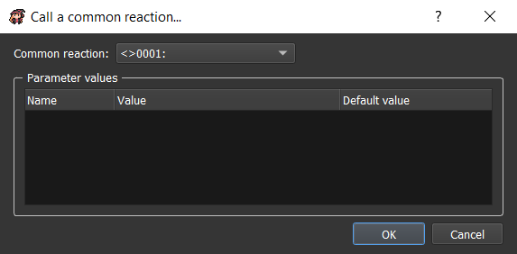

This will call a common reaction with the corresponding parameters.

* `Common reaction`: The common reaction to call.
* **Parameters values**: The parameters to apply with the common reaction.

## Change variables

This will change one or several variable(s) value.

* **Selection**:
	* `One variable`: The unique variable to change.
	* `Range`: The range of variables IDs to change.
* **Operation**: The operation to use according to the current variable(s) value.
* **Value**:
	* `Number`: A simple number.
	* `Random`: A random number between two selected values.
	* `Message`: A simple message.
	* `Switch`: A simple switch.
	* `Number of ... in inventory`: *Not available yet.*
	* `Total currency ... with ID`: *Not available yet.*
	* `An ... with instance ID ... statistic ID`: *Not available yet.*
	* `An object in the map ... characteristic`: The selected object characteristic:
		* `X square position`: The x square position of the selected object.
		* `Y square position`: The y square position of the selected object.
		* `Z square position`: The z square position of the selected object.
		* `X square position`: The x pixel position of the selected object.
		* `Y square position`: The y pixel position of the selected object.
		* `Z square position`: The z pixel position of the selected object.
		* `Orientation`: The orientation of the selected object.
	* `Other characteristics`: *Not available yet.*

## Script

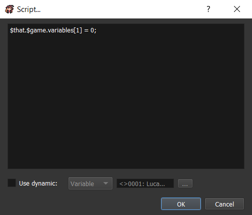

Execute a script code (for advanced programmers).

* `Use dynamic`: Non-static code (in variable, or parameter, or property).