# Event commands overview

Now that you are a pro for objects and event, let's see all the event commands that are possible to use.

## Show text

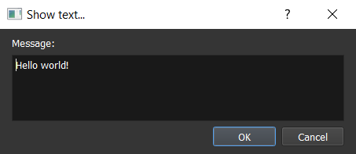

Displays a text with the current dialog box options.

* `Message`: message to display on screen.

Render in game:

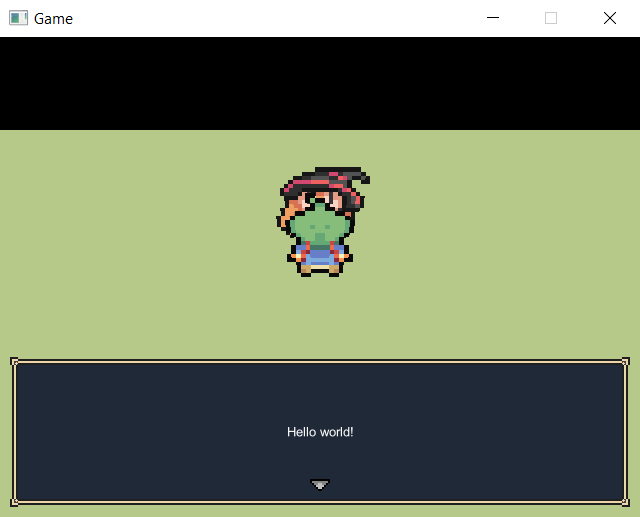

## Display a choice

*Not available yet.*

## Input number

*Not available yet.*

## Set dialog box options

*Not available yet.*

## Change screen tone

*Not available yet.*

## Shake screen

*Not available yet.*

## Flash screen

*Not available yet.*

## Change meteo

*Not available yet.*

## Change map properties

*Not available yet.*

## Wait

Wait during a specific time.

* `Time`: Time to wait in seconds.

## Change chronometer

*Not available yet.*

## Teleport object

This will teleport an object on an existing map with a new position.

* `Object ID`: The object ID to teleport.
* **Position**:
	* `Select...`: Choose map and position thanks to a map previewer.
	* `ID map`, `X`, `Y`, `Y plus`, `Z`: Choose map ID an position to go manually.
	* `Object (ID)`: Choose an object to teleport on.
* **Options**: *Not available yet.*

## Move object

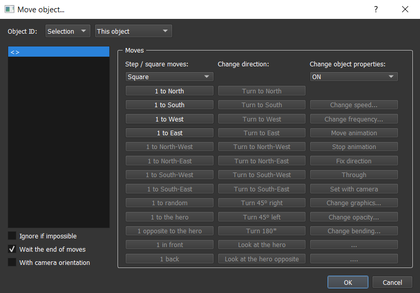

This will move an object in the current map with a specific route. You can also temporary change some properties linked to the object state.

* `Object ID`: The object ID to move.
* `Ignore if impossible`: If checked, the moves that can't be executed (example: a wall blocking the route) would be ignored. If not checked, this will try the impossible move as long as it become possible (example: use for NPCs moving).
* `Wait the end of moves`: If checked, the command would end only when all the moves are executed. If not, the command would end immediately (moves executed in parallel).
* `With camera orientation`: If checked, the direction moves (north, south, west, east) would take account of the camera orientation. If not, the direction moves would not take account of the camera orientation.
* **Step / square moves**:
	* `Square`: Change all the direction moves unit to square.
	* `Step`: Change all the direction moves unit to step.
	* `1 to North / South / West / East / North-West / North-East / South-West / South-East`: Move the object to 1 square / step in the selected direction.
	* `1 to random`: *(not available yet)* Move the object to 1 square / step in a random direction.
	* `1 to the hero`: *(not available yet)* Move the object to 1 square / step in the hero direction.
	* `1 opposite to the hero`: *(not available yet)* Move the object to 1 square / step in the opposite of the hero direction.
	* `1 in front`: *(not available yet)* Move the object to 1 square / step in front.
	* `1 back`: *(not available yet)* Move the object to 1 square / step back.
* **Change direction**: *Not available yet.*
* **Change object properties**: *Not available yet.*

## Display an animation

*Not available yet.*

## Move camera

Check out the camera guide [here](control-the-camera.md).

## Reset camera

*Not available yet.*

## Create object in map

*Not available yet.*

## Remove object from map

*Not available yet.*

## Display a picture

*Not available yet.*

## Set / Move / Turn a picture

*Not available yet.*

## Remove a picture

*Not available yet.*

## Play a video

*Not available yet.*

## Start shop

*Not available yet.*

## Enter a name

*Not available yet.*

## Open main menu

This will open the main menu.

Render in game:

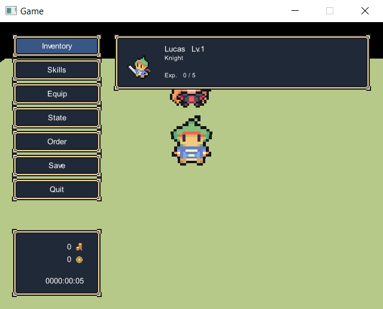

## Open saves menu

This will open the saves menu.

Render in game:

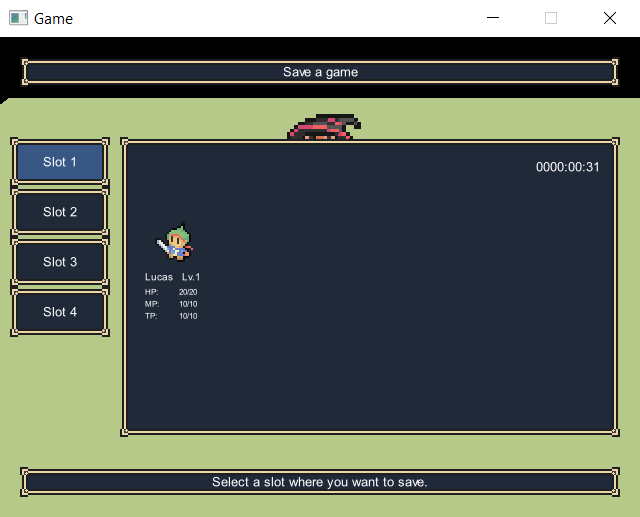

## Title screen

*Not available yet.*

## Game over

This will go to the game over screen.

*/!\ Today, there is no game over screen, it's only closing the game window.*

## Play a music

This will play a music on the current map.

* `Select song by ID`: Instead of using the left list, you can select by ID values.
* **Options**:
	* `Volume`: The music volume (in %).
	* `Start`: The beginning time of the music in seconds.
	* `End`: The end time of the music in seconds.

## Stop music

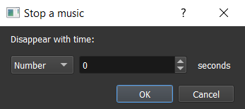

This will stop the music played in the current map.

* `Disappear with time`: Number of seconds for music played for disappearing.

## Play a background sound

This will play a background sound on top of the current music.

Check out the play music command [here](event-commands-overview/#play-a-music) that is similar.

## Stop background sound

This will stop the background sound played in the current map.

Check out the stop music command [here](event-commands-overview/#stop-music) that is similar.

## Play a sound

This will play a sound on top of all the songs.

Check out the play music command [here](event-commands-overview/#play-a-music) that is similar.

## Play a music effect

This will play a music by pausing the current played music. When the music effect is finished the previously played music is unpaused.

Check out the play music command [here](event-commands-overview/#play-a-music) that is similar.

## Change battle music

*Not available yet.*

## Change victory music

*Not available yet.*

## Send event

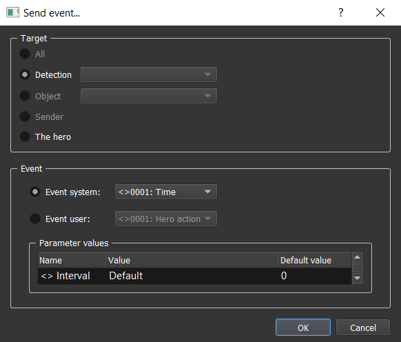

This will send an event to the selected target.

* **Target**:
	* `All`: *Not available yet.*
	* `Detection`: Depends on a detection data. *Actually it just sends an event to objects in front of the object.*
	* `Object`: *Not available yet.*
	* `Sender`: *Not available yet.*
	* `The hero`: Simply send to the defined hero.
* **Event**:
	* `Event system`: Select a system event (events sent by the game system itself).
	* `Event user`: Select a user event (custom events sent by the map objects).
	* `Parameters values`: Select the event parameters values. You can keep the default value.

## Change state

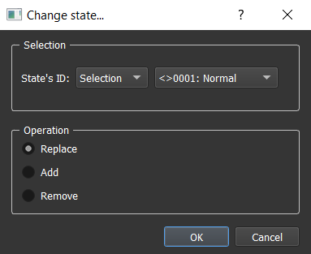

This will change the state of the current object. An object can have several states at the same time.

* **Selection**:
	* `State's ID`: The new state ID.
* **Operation**:
	* `Replace`: Remove all the current states of the object and add the new state.
	* `Add`: Only add the new state.
	* `Remove`: Remove the object state having this ID.

## Change property

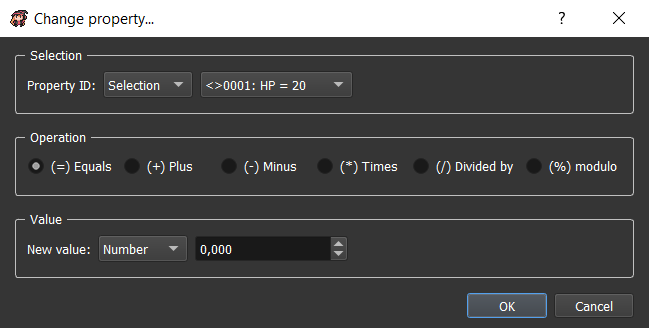

This will change a property value of the current object.

* **Selection**:
	* `property ID`: The property ID to change.
* **Operation**: The operation to use according to the current property value.
* **Value**:
	* `New value`: The new value to apply to the property with the corresponding operation.

## Change graphic

*Not available yet.*

## Change money

*Not available yet.*

## Modify inventory

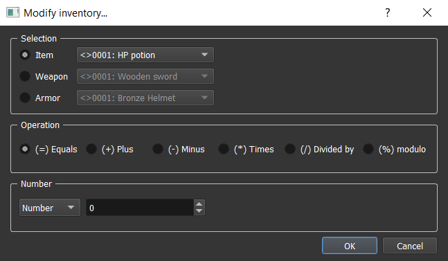

This will update inventory containing. You can for example add items to it.

* **Selection**:
	* `Item`: An item to select.
	* `Weapon`: A weapon to select.
	* `Armor`: An armor to select.
* **Operation**: The operation to use according to the current number of the selection in the inventory.
* **Number**: The value to use for updating the selection number.

## Modify team

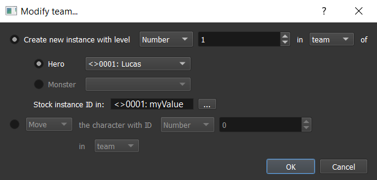

This will update team organization.

* `Create new instance with level ... in team / reserve / hidden of`: Create a new instance of a hero or monster in team, reserve, or hidden.
	* `Stock instance ID in`: Choose a variable where you want to stock the instance ID. This can be useful to move or remove characters in team.
* `Move / Remove the character with ID ... in team / reserve / hidden`: *Not available yet.*

## Change windowskin

*Not available yet.*

## Allow / Forbid saves

*Not available yet.*

## Allow / Forbid main menu

*Not available yet.*

## Change general options

*Not available yet.*

## Start a battle

This will start a battle with your team against a troop (group of monsters).

* **Troop's ID**:
	* `ID`: Fix troop ID.
	* `Random (in map property)`: Random ID indicated in map property window.
* **Battle map**:
	* `ID`: Fix battle map ID.
	* `Select...`: Choose battle map and position thanks to a map previewer.
	* `ID map`, `X`, `Y`, `Y plus`, `Z`: Choose battle map ID and position to go manually.
* **Options**:
	* `Allow escape`: If checked, it would be possible to use battle command `Escape` in this battle.
	* `Defeat causes Game Over`: If checked, losing in this battle will automatically direct to game over. If not checked, there will be two commands container : one for the winning state, and the second for the losing state.
* **Transition**:
	* `Start / End`: Start / End type of transition:
		* `None`: Immediate transition.
		* `Fade in / out`: Transition on a color.
		* `Zoom in / out`: Transition by zooming in / out.

## Display / Hide enemy

*Not available yet.*

## Force an action

*Not available yet.*

## End battle

*Not available yet.*

## Change battle music

*Not available yet.*

## Change victory music

*Not available yet.*

## Change a statistic

*Not available yet.*

## Change experience curve

*Not available yet.*

## Change status

*Not available yet.*

## Change a skill

*Not available yet.*

## Change name

*Not available yet.*

## Change class

*Not available yet.*

## Change equipment

*Not available yet.*

## Condition

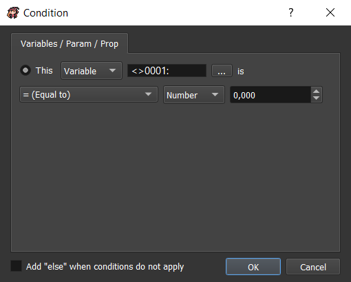

Create a container for commands that will be executed only if the indicated condition is true.

* `Add "else" when conditions do not apply`: Create another container for commands that will be executed only if the indicated condition is false.

* **Variables / Param / Prop**: Compare a variable or a parameter or a property with any other type of value.

## Loop

Create a container for commands that will be executed on a loop.

## Break loop

If inside a loop container, this will go out of the loop and go to the next command after the loop.

## Label

*Not available yet.*

## Jump to label

*Not available yet.*

## Stop the reaction

*Not available yet.*

## Comment

*Not available yet.*

## Call a common reaction

*Not available yet.*

## Change variables

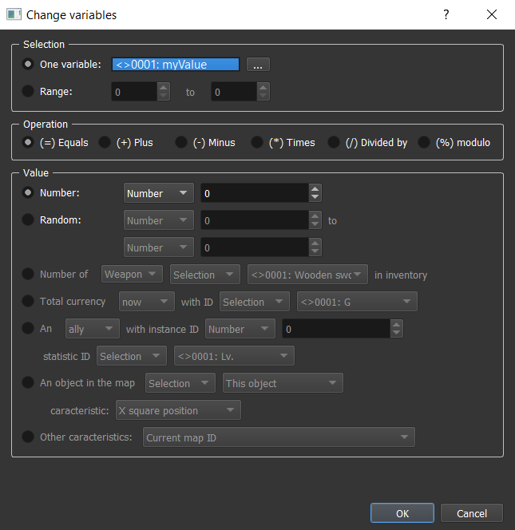

This will change one or several variable(s) value.

* **Selection**:
	* `One variable`: The unique variable to change.
	* `Range`: The range of variables IDs to change.
* **Operation**: The operation to use according to the current variable(s) value.
* **Value**:
	* `Number`: A simple number.
	* `Random`: A random number between two selected values.
	* `Number of ... in inventory`: *Not available yet.*
	* `Total currency ... with ID`: *Not available yet.*
	* `An ... with instance ID ... statistic ID`: *Not available yet.*
	* `An object in the map ... characteristic`: *Not available yet.*
	* `Other characteristics`: *Not available yet.*

## Script

*Not available yet.*