# Map editor basics

After opening a project, you should have this view:

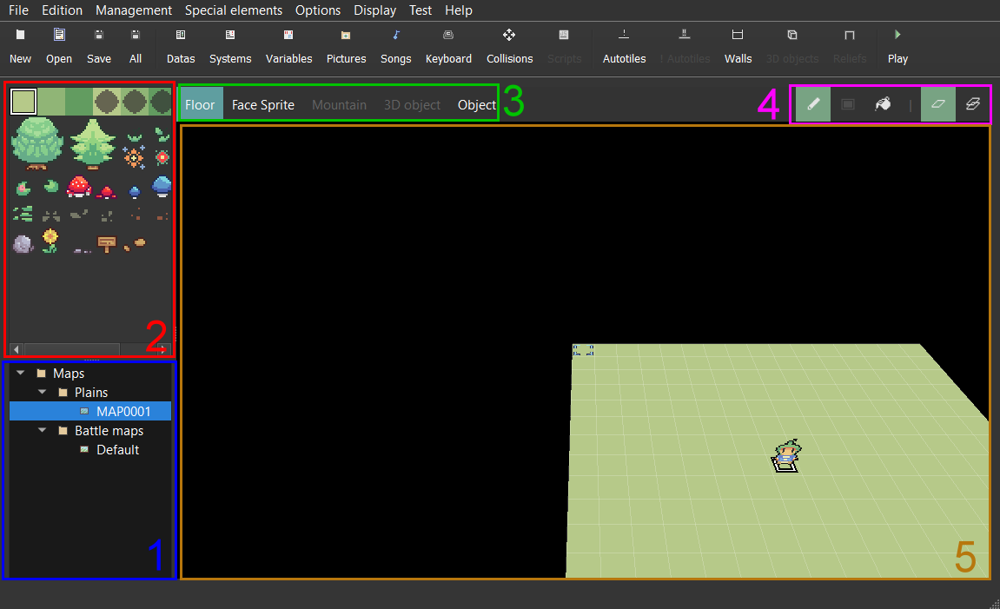

## Manage maps

Take a look at the map selector **(1)**. You can add, edit, remove, copy, and paste folders or maps here. We recommend that you use folders to sort your maps for each zones of your game. By default, there's also a `Battle maps` folder that you can use to put all the maps that you will use for battle backgrounds. It is not required to put these maps into this specific folder. Clicking on a map will load this one on the map editor **(5)**. `Right clicking` will open this context menu:

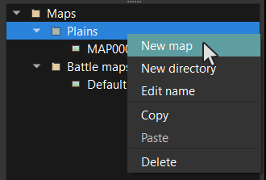

If you want to create / edit a map, you will get this window:

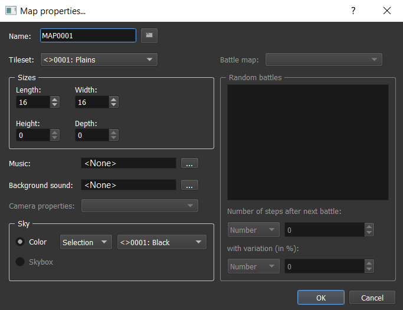

* `Name`: The map name.
* `Tileset`: A tileset represents a lot of information applied on a specific set of textures (collisions, dynamic textures,...). We will see how to configure it in a next chapter.
* `Length`: The map length number of squares (X axe).
* `Width`: The map width number of squares (Z axe).
* `Height`: The map height number of squares (Y axe > 0).
* `Depth`: The map depth number of squares (Y axe < 0).
* `Music`: The music that is played in the background when entering the map.
* `Background sound`: The background that is played in the background with the music. This can be wind, rain, etc.
* `Sky color`: The color used for the sky.

## Move camera

The camera is always looking at the following cursor:

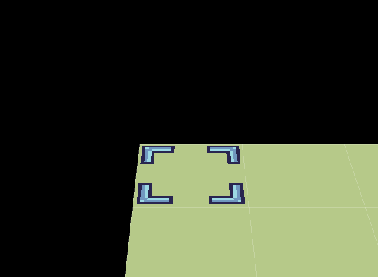

You can move it by pressing `QWSD` on keyboard.

To move the camera position, press the `mouse wheel` and move the mouse in the direction you want:

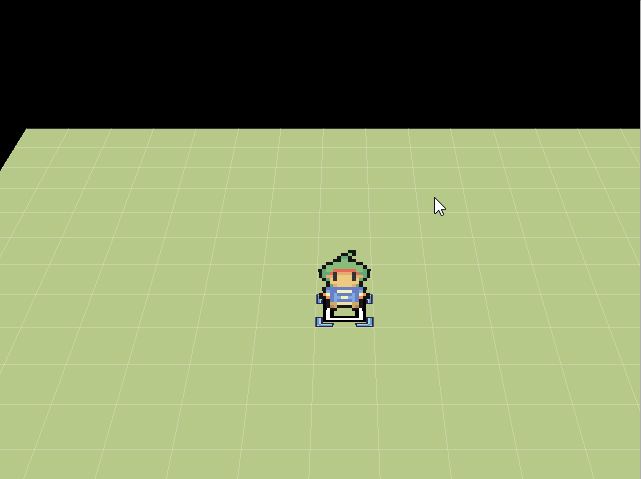

## Place / Remove elements

The map element selection portion **(3)** allows you to select kind of element to place in the map (lands, sprites, objects, reliefs, etc.). You can add or remove something in a specific square by clicking left or right.

For example with a floor:

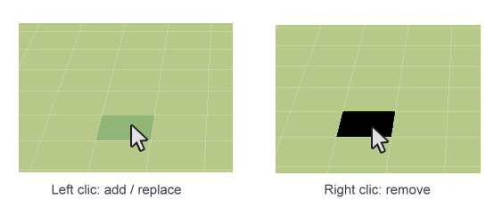

## Undo / Redo

You can go back / after a change in each map. Press `CTRL+Z` for undo and `CTRL+Y` for redo.

## Show / Hide some UI details

* `G`: Show / Hide grid
* `I`: Show / Hide information about the pointed square:

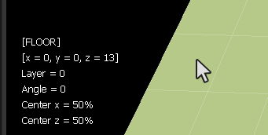

## Change paint mode

Here are the different paint mode **(4)** for drawing your elements in the map:

* `Pencil`: Draw squares one by one.
* `Rectangle`: Draw squares after tracing a rectangle **(not available yet)**.
* `Pin of paint`: Fill squares with the same texture as the one pointed.

## Layers options

You can choose here if you want to be on layer mode or not here:

* `No layer`: Replace the selected square by a new one.
* `Layer`: Add a new square on top of the selected one. There is no limit.

Example of layers used with walls:

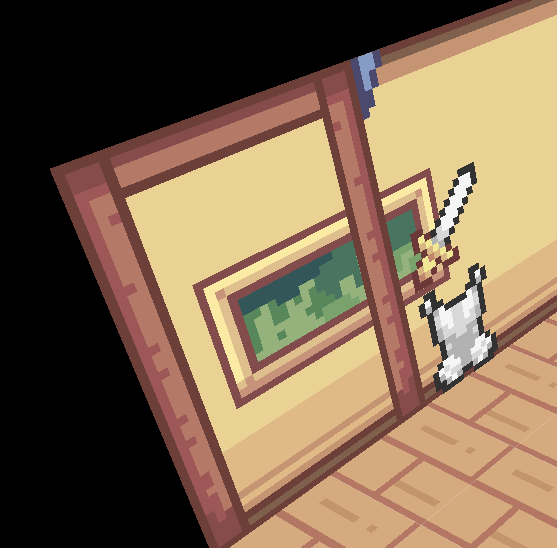

## Lands

Here are the possible lands to place:

## Floors

The texture selector **(2)** allows you to select a rectangle for a texture. After selecting a rectangle, place your mouse on a square of your map to place your floor.

## Autotiles

Autotiles are dynamic floors. This will have borders with automatic changing according to the neighbor squares:

In the texture selector **(2)**, you just have to select a square:

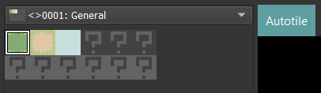

## Animated autotiles

*Not available yet.*

## Sprites

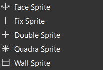

Sprites are vertical planes that can be used to simulate a "paper" world. Here are the different types of sprites:

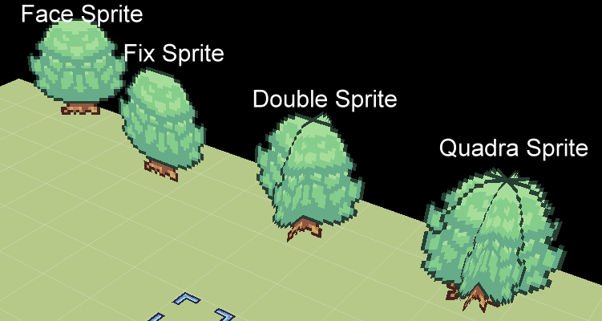

* `Face Sprite`: A sprite that is always facing the camera on the X / Y axe.
* `Fix Sprite`: A flat sprite. 
* `Double Sprite`: Two crossing flat sprites.
* `Quadra Sprite`: four crossing flat sprites.

Another kind of sprites are `Walls Sprite` that are dynamic (such as autotiles).

## Objects

All the previous elements were static (it doesn't move). There are objects in order to add some life on your map. This can be NPCs, chests, etc.

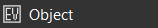

We will see later how to manage it because this is one of the biggest topics of the engine.

## The hero

To define where the game should start, you have to define who is the hero in one of your maps. When you create a new project, the hero is the character at the center of the first map. If you want to change it:

* Create a new object (`Double click` on a square)
* Remove all the states and events from the lists (by using `Del` on keyboard) and choose `Hero` as model in the combo box. You can name it "Hero" if you want. You should have something like this:

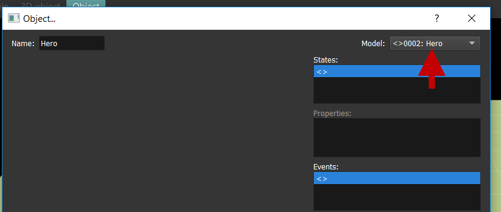

* Click on `OK`. `Right click` on your object, and choose `Define as Hero`.

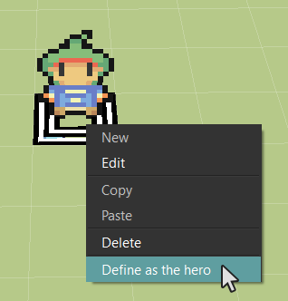

That's it! You will understand later why we are using an object and why this will open a lot of opportunities for customizing your games!