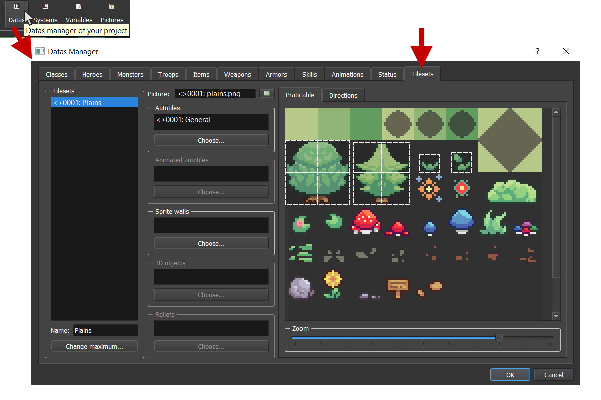
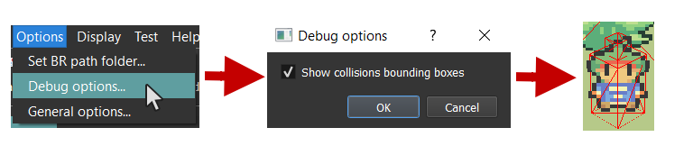
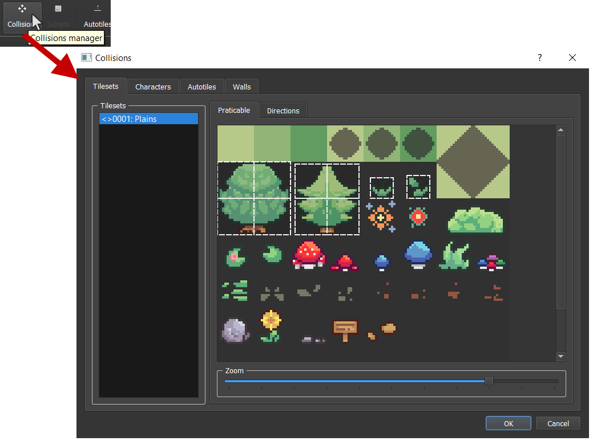
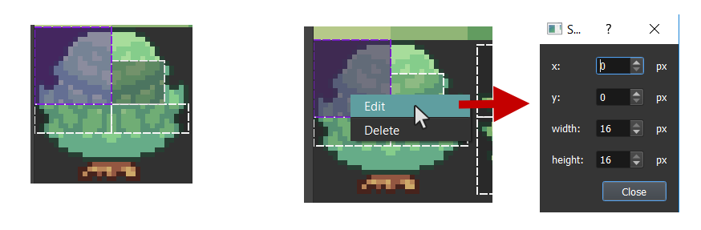
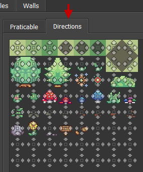
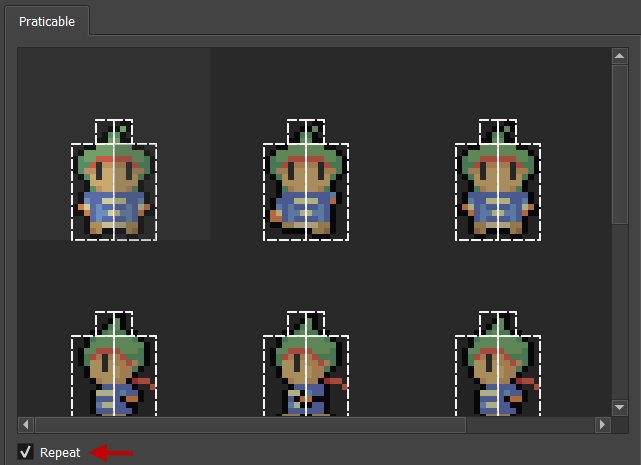
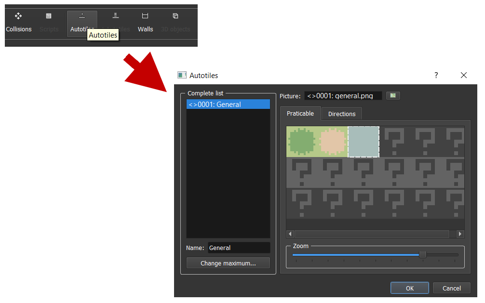
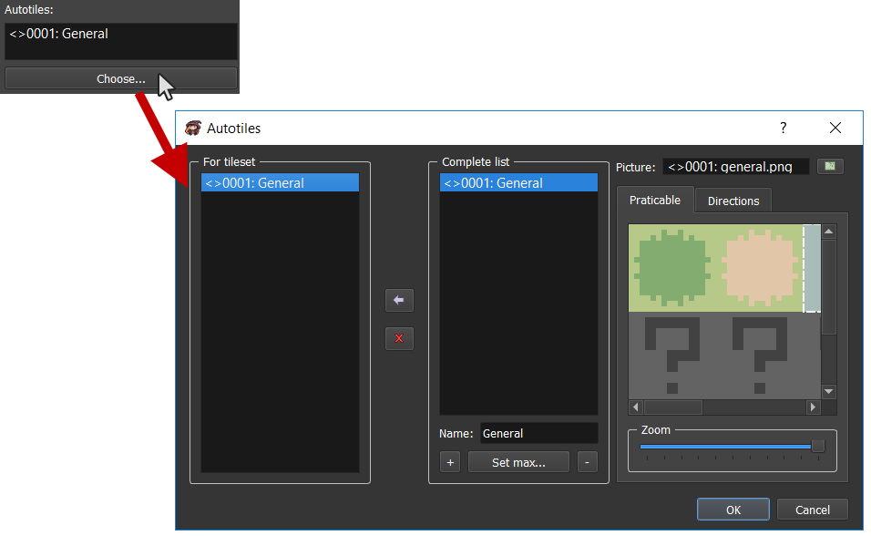
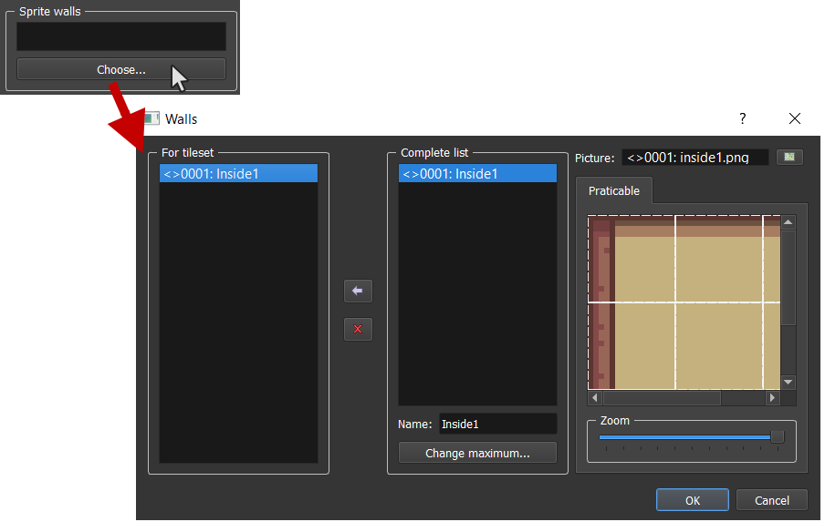

# Tilesets & Collisions

We've previously seen that the map properties had an option `Tileset` selection. We will now see what it is.

## Tilesets

A tileset corresponds to a set of informations linked to the map textures and collisions. Open the datas manager by clicking here on the main toolbar and select the `Tilesets` tab:

If you want to add / remove tileset(s), you can use the `Change maximum...` button. You can change the `Picture` by clicking on the following widget that will open a reduced picture manager (containing only one kind of picture). That picture will correspond to the static textures that you will use for your maps having this tileset.

You can also change special textures (autotiles, walls, etc.) linked to the tileset.

## Collisions

Collisions are important in video games. You need to manage if the moving objects are colliding with other objects or any other map elements.

## Bounding boxes

Bounding box are simple geometries that are used for checking intersections. Each object has a corresponding bounding box, after each move the engine will check if the object bounding box intersect with another bounding box in the map.

There is a way to see the bounding boxes for debugging (if you encounter any strange behavior). Check the following option:

## Simple boxes and Oriented boxes

Depending on which sprite you are using, bounding boxes can be oriented like this:

 
Fix sprites are flat, so they don't need to be oriented. However, face, double, and quadra sprites are voluminous and their bounding box could be a cylinder. A cylinder collision is over killed so we are using oriented boxes that are reasonable to manage collisions with great performances.

## How can I change collisions?

For tileset, you can edit it directly in the picture preview on the `Tilesets` tab of datas manager. Another way is to open the collisions manager merging all the possible collisions. Open the collisions manager by clicking here on the main toolbar:

## Praticable

You can for example change the tileset collision by re-sizing it for each square. This will affect the size of the bounding boxes. You can res-ize it with your `mouse` or `Right click` and click on `Edit` in order to open a window for selecting the rectangle values.

## Directions (only for floors)

You can indicate in which direction there will be a collision.

## Characters

Characters are animated and you can handle different collisions for different frames. But, if you want to have the same collisions for all the frames, check the `Repeat` option.

## Autotiles

You can manage the autotiles list by clicking here on the main toolbar:

You can manage picture and collisions for each autotiles here. Autotiles are dynamic floors. This will have borders with automatic changing according to the neighbor squares. Here is an example of an autotile picture:

Rendering in map:

Don't forget to add your autotiles in the tileset:

## Animated autotiles

*Not available yet.*

## Sprites walls

You can manage the walls the same way you did for autotiles in:

* Collisions manager
* `Tilesets` tab in datas manager:

## 3D objects

*Not available yet.*

## Reliefs

*Not available yet.*