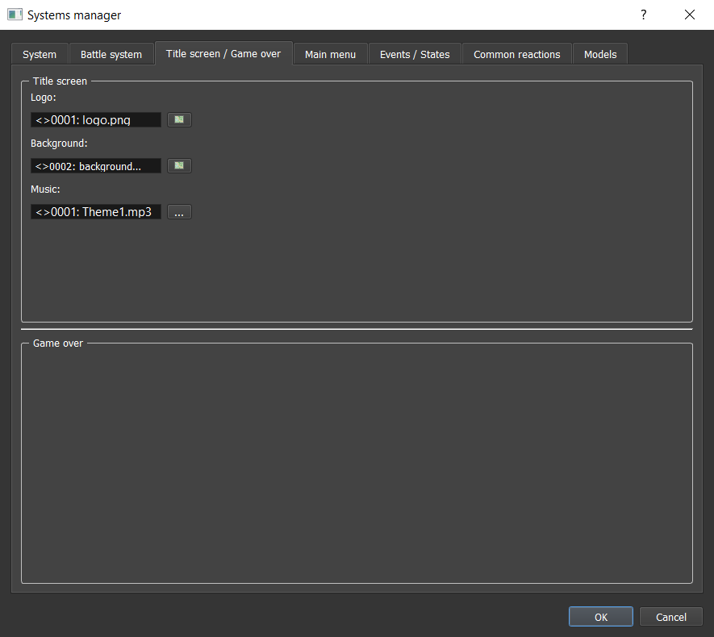
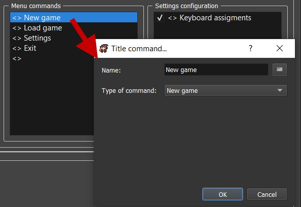
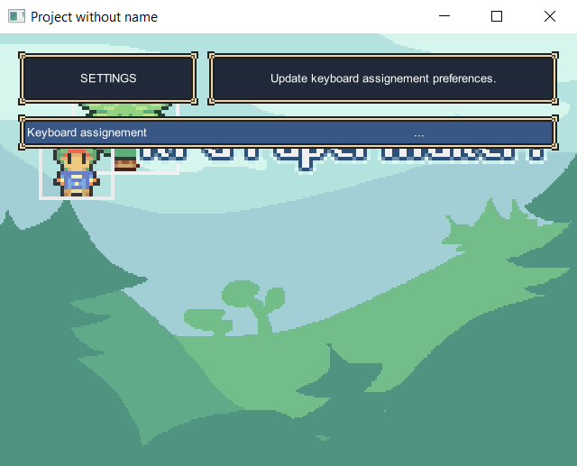
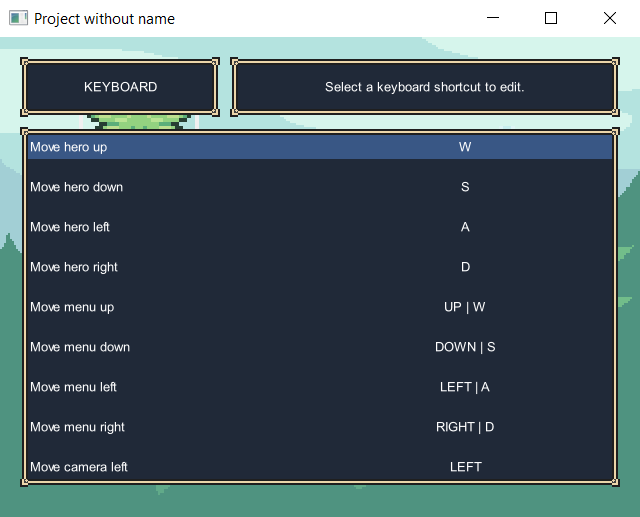

# Title Screen & Game Over

Got to `Systems datas > Title screen / Game over`:

## Title Screen

In the first section, you can edit some of the title screen properties.

### Background

* `Image`: Picture used for title screen background.
* `Video`: Video used for title screen background.

### Menu commands

* `Music`: Music used when player is in title screen.

### Menu commands

Customize here the commands to display in the title screen.

* `Name`: The displayed text ingame.
* `Type of command`: The type of command.
	* `New game`: Run a new game.
	* `Load game`: Open saves menu.
	* `Options`: Open the settings menu.
	* `Exit`: Quit game.
	* `Script`: Excecute custom script that can be entered in the appropriate textarea.

### Settings configuration

* `Settings configuration`: The settings menu can be customized here by reordering and / or displaying some of the options.
	* `Keyboard assignments`: Configuration of the keyboard assignements proposed in the `Keyboard manager`.

	

## Game Over

*Not available yet.*