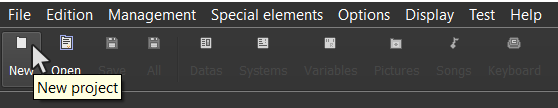
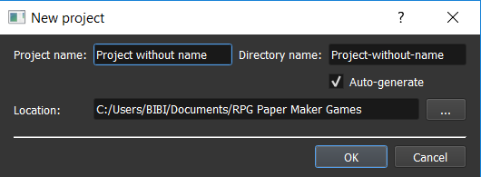
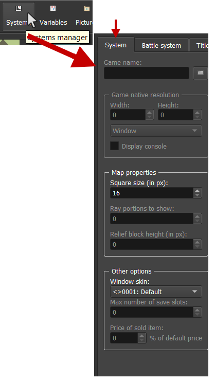
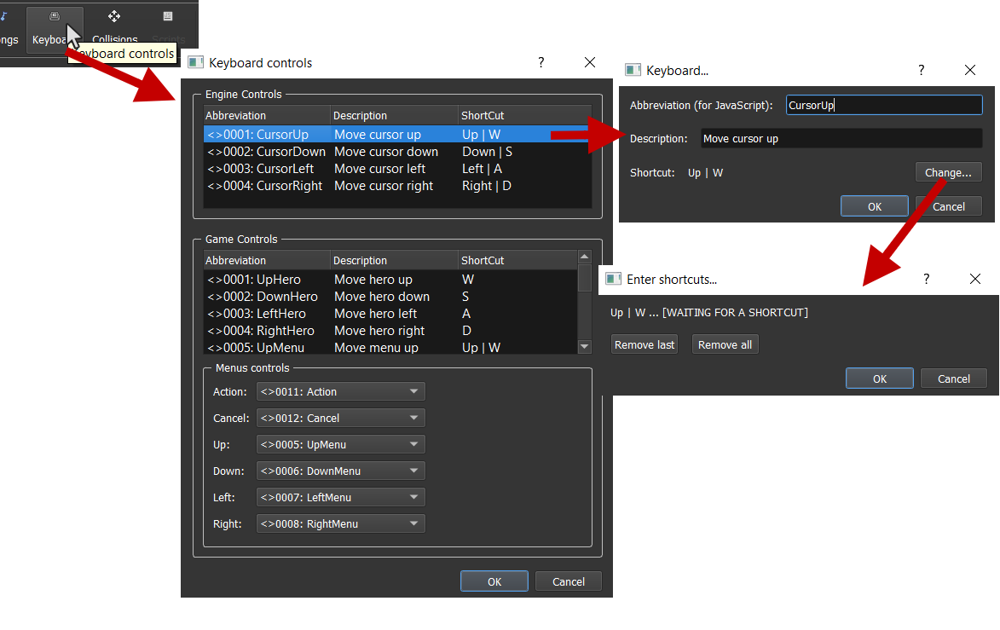
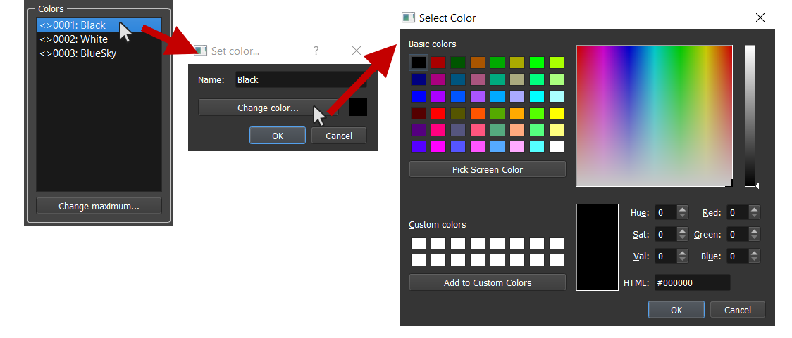
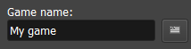
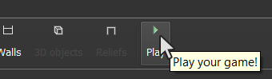
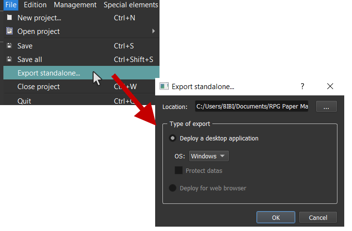

# Getting started

Welcome to this guide! You will find here all what you need to be a pro Paper Maker!

## License

RPG Paper Maker is free for non commercial use. You don't have any fee to pay as long as you don't plan to publish commercial games done with RPG Paper Maker.

RPG Paper Maker is proprietary licensed. See the RPG Paper Maker EULA [here](http://rpg-paper-maker.com/index.php/eula). RPG Paper Maker was previously open source, but the software keeps a lot of these aspects (source code access on github, free for non commercial use...). Feel free to contribute to the github repository [here](https://github.com/RPG-Paper-Maker/RPG-Paper-Maker) if you have any skills in programming, project management, etc. **Be aware that any contribution becomes RPG Paper Maker property, but we guaranty that RPG Paper Maker will always be available for free.**

If you want to support us financially for the free model, check out our [Patreon](https://www.patreon.com/rpgpapermaker/overview)!

## Community and support

If you are experiencing any issue on RPG Paper Maker, feel free to ask for some help in the [website forums](http://rpg-paper-maker.com/index.php/forum). You can also share your creations and propose your wanted [next features](https://feathub.com/RPG-Paper-Maker/RPG-Paper-Maker).

## Installation

Go to the [Download section](http://rpg-paper-maker.com/index.php/downloads#content) from the official website and download the installer according to your system.

### Windows

Run `RPG Paper Maker installer.exe`. This will install the program on your computer and run `RPG Paper Maker.exe`. This will ask you for downloading the latest version of RPG Paper Maker. Wait for the downloading to be finished.

### Linux

Extract the file. Check out the `README` instructions in the root of the folder. After running the last instruction (`./run.sh`), this will ask you for downloading the latest version of RPG Paper Maker. Wait for the downloading to be finished.

### MacOSX

Extract the file. After running `RPG Paper Maker.app`, this will ask you for downloading the latest version of RPG Paper Maker. Wait for the downloading to be finished.

## Change theme

There actually are two different themes: `Dark` and `White`. If you want to change it, go to `Options > General options...`.

## Create a new project

You can create a new project by clicking here on the main toolbar:

You can also use `CTRL+N` or go to `File > New project...`.

You can choose here the `Project name` corresponding to your game's name. This will auto generate a folder name (you can disable the option `auto-generate` if you want to customize your folder name). And finally, choose the `location` of your project folder. By default, it will be on a freshly created `RPG Paper Maker Games` folder.

## Open an existing project

You can open an existing project by clicking here on the main toolbar:

You can also use `CTRL+O` or go to `File > Open project > Browse...`. Recent projects can also be opened on the first screen (or go to `File > Open project`).

## Change general game settings

A lot of options are available in the `Systems manager`. Click here on the main toolbar and go to the `System` tab:

* `Game name`: Change the name of your game.
* `Game native resolution`: Change width / height resolution and also choose if you want a Window or Fullscreen display. `Display console` option is for programing debugging.
* `Square size (in px)`: choose here the size (in pixel) of a square in your maps. You should adapt your textures after any change here.
* `Ray portions (editor)`: *(not available yet)* The map is separated into several portions (16x16 squares). You can change here the number of portions to display.
* `Ray portions (ingame)`: *(not available yet)* Same but for ingame.
* `Mountain collision height limit (in px)`: The height considered for blocking the hero so the hero can go up blocks that are in inferior height value.
* `Mountain collision angle limit (in degree)`: The angle considered for blocking the hero so the hero can go up mountains that are in inferior angle value.
* `Max number of save slots`: *(not available yet)* Change the max number of save slots available for the players.
* `Price of sold item`: *(not available yet)* Change the percent value of the original price of an item when you want to sell it in a shop.
* `Window skin`: The default windows skin used for designing windows UI.

## Update keyboard controls

You can change the engine and game keyboard controls in the keyboard manager by clicking on the main toolbar:

For engine:

* `CursorUp`, `CursorDown`, `CursorLeft`, `CursorRight`: The cursor directions in map editor.

For Game:

* `UpHero`, `DownHero`, `LeftHero`, `RightHero`: The hero directions in map.
* `UpMenu`, `DownMenu`, `LeftMenu`, `RightMenu`: The directions in menus.
* `LeftCamera`, `RightCamera`: Turn the camera.
* `Action`: Hero action in map.
* `Cancel`: Cancel in menus.
* `Main menu`: Open / Close main menu.

Select the corresponding system menus controls: `Action`, `Cancel`, `Up`, `Down`, `Left`, `Right`. You can add as much keys as possbile.

When adding / editing a key:

* `Abbreviation`: Name used for JavaScript use (for programers).
* `Description`: Will be displayed ingame for the keyboard settings menu.
* `Shortcut`: Change the shortcut here. Press the corresponding shortcut thanks to `Change...` button. You can have several shortcuts for one action (separated with `|` symbol) and also several keys for one shortcut (separated with `+` symbol).
	* `Remove last`: Remove the last shortcut (on the right).
	* `Remove all`: Remove all the entered shortcuts.

## Update general colors

Go to the `Systems manager > System` and take a look on the `Colors` box:

## Change game name

Go to the `Systems manager > System` and take a look on the `Game name` box:

This will affect the window title when you are launching the game.

## Change game screen resolution

Go to the `Systems manager > System` and take a look on the `Game native resolution` box:

* `Width`: The native width of your game window.
* `Height`: The native height of your game window.
* `Window`: Choose a window mode.
* `Full screen`: choose full screen mode. Note that `Width` and `Height` have no effect with this option.

## Test your game

You can test your opened project by clicking here on the main toolbar:

## Deploy your game

If you want to publish your game (share your game without any need for players to have RPG Paper Maker installed) you have to go to `File > Export standalone...`.

* `Location`: The location of the standalone folder that you want to create. The name of this folder will be `yourGameName{OS}`.
* `Type of export`: Choose export options here.
	* `Deploy a desktop application`: Choose here to deploy your game as a desktop application (choose the `OS` in options: Windows, Linux, or Mac).
	* `Deploy for web browser`: *(not available yet)* Choose here to deploy your game as a web application. This will generate an `index.html` page and other files.
* `Version`: Choose you game version. Having 1 for `major` and 0 for `minor` will create a 1.0 version.