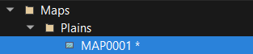

# Getting started

Welcome to this guide! You will find here all what you need to be a pro Paper Maker!

## License

First, you should know that RPG Paper Maker is an Open Source project under GNU General Public License v3.0. Feel free to contribute to the github repository [here](https://github.com/RPG-Paper-Maker/RPG-Paper-Maker) if you have any skills in programming, project management, etc.

**RPG Paper Maker is free for non-commercial use** so you don't have to pay for it if you only want to share your games freely and have fun! However, if you want to sell your games made with the engine you will have to pay for the license. More details [here](http://rpg-paper-maker.com/index.php/downloads#content). If you want to support us, check out our [Patreon](https://www.patreon.com/rpgpapermaker/overview)!

**The commercial license is not released yet. This is comming out soon.**

## Community and support

If you are experiencing any issue on RPG Paper Maker, feel free to ask for some help in the [website forums](http://rpg-paper-maker.com/index.php/forum). You can also share your creations and propose your wanted [next features](https://feathub.com/RPG-Paper-Maker/RPG-Paper-Maker).

## Installation

Go to the [Download section](http://rpg-paper-maker.com/index.php/downloads#content) from the official website and download the installer according to your system. Extract the file.

### Windows

Run `RPG Paper Maker.exe`. This will ask you for downloading the latest version of RPG Paper Maker. Wait for the downloading to be finished.

### Linux

Check out the `README` instructions in the root of the folder. After running the last instruction (`./run.sh`), this will ask you for downloading the latest version of RPG Paper Maker. Wait for the downloading to be finished.

### MacOSX

*Coming soon.*

## Change theme

There actually are two different themes: `Dark` and `White`. If you want to change it, go to `Options > General options...`.

## Create a new project

You can create a new project by clicking here on the main toolbar:

You can also use `CTRL+N` or go to `File > New project...`.

You can choose here the `Project name` corresponding to your game's name. This will auto generate a folder name (you can disable the option `auto-generate` if you want to customize your folder name). And finally, choose the `location` of your project folder. By default, it will be on a freshly created `RPG Paper Maker Games` folder.

## Open an existing project

You can open an existing project by clicking here on the main toolbar:

You can also use `CTRL+O` or go to `File > Open project > Browse...`.

## Change general game settings

A lot of options are available in the `Systems manager`. Click here on the main toolbar and go to the `System` tab:

* `Game name`: *(not available yet)* Change the name of your game.
* `Game native resolution`: *(not available yet)* Change width / height resolution and also choose if you want a Window or Fullscreen display. `Display console` option is for programing debugging.
* `Square size (in px)`: choose here the size (in pixel) of a square in your maps. You should adapt your textures after any change here.
* `Ray portions to show`: *(not available yet)* The map is separated into several portions (16x16 squares). You can change here the number of portions to display.
* `Relief block height (in px)`: *(not available yet)* The height considered for blocking the hero so the hero can go up blocks that are in inferior height value.
* `Max number of save slots`: *(not available yet)* Change the max number of save slots available for the players.
* `Price of sold item`: *(not available yet)* Change the percent value of the original price of an item when you want to sell it in a shop.

## Save your changes

When you are opening a window and clicking on `OK` button, the changes will be saved and there is no way to go back. To save your map editor changes, you can use these shortcuts in the toolbar:

* `Save`: Save the changes on the current opened map.
* `All`: Save the changes on all the modified maps. A map has been changed when you see a `*` after its name:

## Test your game

You can test your opened project by clicking here on the main toolbar:

## Deploy your game

If you want to publish your game (share your game without any need for players to have RPG Paper Maker installed) you have to go to `File > Export standalone...`.

* `Location`: The location of the standalone folder that you want to create. The name of this folder will be `yourGameName{OS}`.
* `Deploy a desktop application`: Choose here to deploy your game as a desktop application (choose the OS in options: Windows, Linux, or Mac).
* `Deploy for web browser`: *(not available yet)* Choose here to deploy your game as a web application. This will generate an `index.html` page and other files.