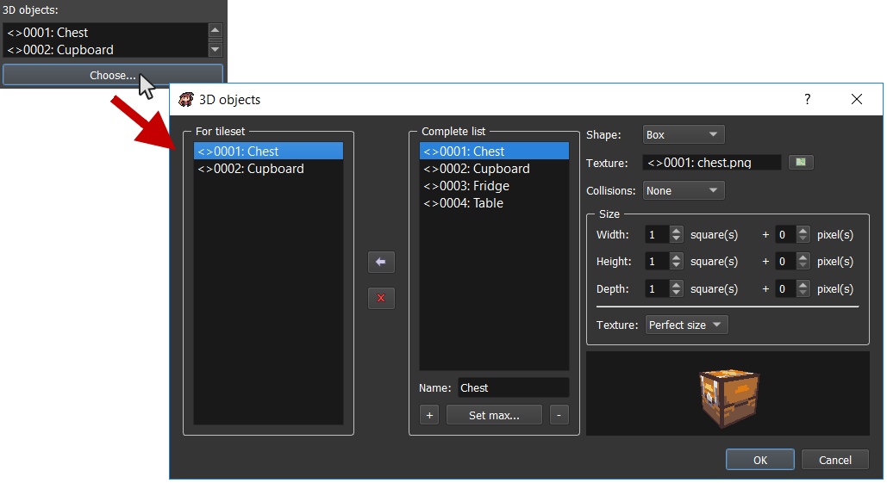

# 3D Objects

You can manage the 3D objects list by clicking here on the main toolbar:

The options for your 3D objects are different according to the `shape` you choose.

*   `Box`: A simple box.

    * `Texture`: The box texture. Box textures have a specific template. You can check it at any time in the Basic Ressource:

    

    * `Collisions`: Choose the kind of collision you want to have with that box.
      * `None`: No collision.
      * `Perfect`: Perfect collision with the box faces.
    * `Size`: The size of the box. You can choose by number of squares and additionnal pixels.
      * `Width`: The box width.
      * `Height`: The box height.
      * `Depth`: The box depth.
      * `Texture`: Select the texture application kind:
        * `Stretch`: Stretch your texture. You can use it if you follow the template with a different size that doesn't take account of size proportions.
        * `Perfect size`: Use it if you want to always respect pixels proportions. See the cupboard example which is 2x2x1 size:

* `Sphere` **(not available yet)**
* `Cylinder` **(not available yet)**
* `Cone` **(not available yet)**
* `Capsule` **(not available yet)**
* `Custom`: Import your own 3D objects models (with `.obj`).
  * `Object`: Select your associated `.obj`.
  * `MTL` **(not available yet)**
  * `Texture`: Choose the texture corresponding to the object UVs mapping.
  * `Collisions`: Choose the kind of collision you want to have with that custom object.
    * `None`: No collision.
    * `Simplified`: Simplified bounding box collision for the object. The collision will represent a single box which is the smallest possible that can contains all the 3D object vertices.
  * `Scale`: The scale size to multiply with. By default, the value is `1.0` so the multiplying has no effect on the 3D object size.

Don't forget to add your objects in the tileset:

.png>)

(or use the texture selector)
