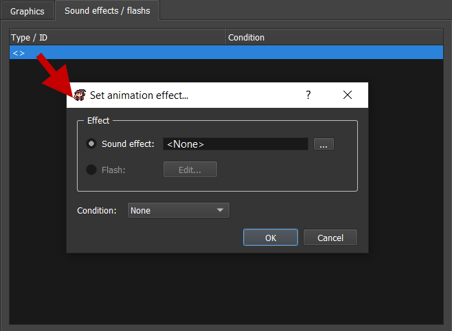

# Battle system

If you want to create to create a RPG, you may need a battle system. Here, we will see all the features linked to the battle implementation.

_Note: if you want to do an action RPG \(battles directly on maps\), you can do it through object & events_

## Battle system datas 

A lot of battle system datas can be found in `Systems Manager > Battle System:`

## Elements 

You can manage here all the elements that you want to have in your game for influencing your damages effects.

* `Name`: Name displayed in game UI.
* `Icon`: Icon displayed in game UI.
* **Efficiency**: You can edit here how efficient is the current element against all the other existing elements. This is pretty usefull when the element is assigned to a class. By default, it's x1.0 \(normal effect\).

## Common statistics 

You can manage here all the statistics that you want to have in your game for influencing your battles \(HPs, lvl, strength, etc.\).

* `Name`: Name displayed in game UI.
* `Script abbreviation`: Choose here an abbreviation. This will be used for game scripts, choose something without capital letter if possible.
* **Properties**:
  * `Fix`: If checked, this statistic would be a fix value \(not a bar\).
  * `Bar`: If checked, this statistic would be a bar value \(an actual value + max value\).

## Common battle commands 

Choose which battle commands you want to have after selecting a hero to do something.

* `Skill`: Choose the corresponding skill.

Render in game:

## Common equipment 

Choose the name of common equipment so you will be able to equip weapons / armors on these equipment slots.

## Weapons / Armors kind 

Create a weapon / armor kind and also choose on which equipment you can assign it.

* `Name`: Name for this kind of weapon / armor.
* Selection of equipment you can assign.

## Battle maps 

Battle maps are in fact maps associated with a specific position \(representing the center point of the battle\). Select a map \(by default in the `Battle Maps` folder in the map selector\) and a position to add a new battle map.

## Statistics associations 

* `Statistic associated to level`: Choose one of your fix statistic to associate with level. Level is a statistic that is increasing for the character evolution: leveling up will increase other statistics.
* `Statistic associated to exp`: Choose one of your bar statistic to associate with experience. Experience is something earned generally after finishing a battle. Once experience goes to its maximum value, the character is leveling up and the map experience bar increases too.

## Formulas 

* `Is dead`: Formula in JavaScript defining conditions to consider that a character is dead. `u` corresponds to the character.
* `Critical influence`: Formula in JavaScript defining the new damages value after having a critical hit. `damage` corresponds to the damages done without critical influence.

## Battle musics 

* `Battle`: Battle music used during the battle.
* `Level up`: Sound used when a hero is leveling up.
* `Victory`: Music used during the victory end battle phase.

## Currencies 

Go to `Systems Manager > System`.

Currencies can be used in the game for trading with NPCs or any other way.

* `Name`: Name of the currency.
* `Icon`: Icon associated with the currency.

## Skills / Items / Weapons / Armors 

Go to `Datas Manager`.

In `Skills` tab:

In `Items` tab:

In `Weapons` tab:

In `Armors` tab:

These four data have common properties:

* `Name`: Name of the data.
* `Type`: Select the type of item / armor / weapon.
* `Consumable`: If checked, the data will disappear after using the data.
* `One hand`: _Not available yet._
* `Icon`: Icon associated with the data.
* `Description`: Description of the data that will be displayed in game.
* `Conditions formula`: _Not available yet._
* `Target`: Target for applying associated effects.
  * `None`: No target selection.
  * `The user`: Select the user only.
  * `An enemy`: Only select one ennemy.
  * `An ally`: Only select one ally.
  * `All enemies`: Select all enemies.
  * `All allies`: Select all allies.
* `Target conditions formula`: _Not available yet._
* `Available`: Available kind of the data.
  * `Battle only`: The data can be used only in battle.
  * `Main menu only`: The data can be used only in main menu.
  * `Always`: The data can be used in battle and main menu.
  * `Never`: The data can never be used.
* `Sound (main menu)`: The sound to play when using it in the main menu.
* `User animation ID`: The animation ID to display on the user before attacking.
* `Target animation ID`: The animation ID to display on the target\(s\) when attacking.
* `Price`: Price of the data when it can be bought / sold in a shop menu.

There also are three more common properties that can be listed: `Costs`, `Effects`, and `Caracteristics`.

## Costs 

Choose the cost of using a skill. This is generally used for HP, MP, and TP statistic. A character will not be able to use a skill if he doesn't have enough for the use cost.

* `Apply cost on`: Select which data will be influenced after using the skill. It can be a `statistic`, a `currency`, or a `variable`.
  * `with value`: Select the value required for the selected data.

## Effects 

Choose the effects done for the target\(s\) data.

* `Damages on`: Select which data will be damaged. It can be a `statistic`, a `currency`, or a `variable`.
  * `with formula`: Select the value damage for the selected data.
  * `Minimum`: Minimum value that can have final damages.
  * `Maximum`: Maximum value that can have final damages
  * `Element ID`: Element applied for these damages.
  * `Variance`: The variance damages in percent. This adds random on your damages. For example, if you choose 20% variance, your damages range would be : \[damage - \(20 \* damage / 100\) \| damage + \(20 \* damage / 100\)\]. If not checked, there is no variance \(= 0\).
  * `Critical`: The critical hit chance in percent. If not checked, there is no chance to do critical hit \(= 0\).
  * `Precision`: The precision hit in percent. If not checked, you have 100% chance to hit.
  * `Stock value in`: You can stock the damages value in a variable. This can for example be used for a next effect.
* `Status Add / Remove`: _Not available yet._
* `Skill Add / Remove`: _Not available yet._
* `Perform skill`: _Not available yet._
* `Call common reaction`: _Not available yet._
* `Special action`: Execute one of the following special actions:
  * `Apply weapon(s) effects and properties`: This will use all the effects of the currently equipped weapon. If the is no weapon equipped, this will apply the next effects following this one.
  * `Open skills choice`: Open the skills choice for battle command.
  * `Open items choice`: Open the items choice for battle command.
  * `Escape`: Escape from the battel.
  * `End turn`: End the team turn.
* `Script`: _Not available yet._
* `Temporarily change target`: You can temporarily change the target for this effect only. You have to return an array of battlers. Example: `[u.battler]` will be the user of the item/skill/weapon.

## Characteristics 

Choose the characteristics added to the character when equipped.

* `Buff increase / decrease`: Select which data will be influenced. This can be:

  * `Statistic value`: Select a statistic. If bar statistic, this will increase the max value.
  * `Element resistance`: Select an element to apply resistance on it.
  * `Status resistance`: _Not available yet._
  * `Experience gain`: _Not available yet._
  * `Currency gain`: _Not available yet._
  * `Skill cost`: _Not available yet._
  * `Variable`: _Not available yet._

  After selecting the data influence, you can choose how this is influenced according to the base value:

  * `* / +`: Choose operation by multiplying by or adding a value.
  * `% / Fix`: Choose unit value.

_Not available yet._

_Not available yet._

## Classes 

Each character has a class. The class defines a lot of attributes that a character can have.

* **Experience**: Define experience progression according to level. Note that you can edit the experience column manually by `double clicking` on the cell.
  * `To next level`: The table indicates the number of experience to gain for going to the next level.
  * `Total`: The table indicates the total number of experience that should be accumulated for going to the next level.
  * `Initial level`: The initial level possible.
  * `Max level`: The maximum level possible.
  * `Base`: The number of experience to have at initial level.
  * `Inflation`: Inflation value changing experience progression according to base and level.
  * `Reset`: Reset to default values.
* **Statistics progression**: Change the statistics progression for level ups.
  * **Informations**:
    * `Statistic`: Select one of the system statistic.
    * `Maximum value`: The maximum possible value. This doesn't always corresponds to the final value because items could add bonus values.
  * **Fix**:
    * `Initial value`: The initial value at initial level.
    * `Final value`: The final value at max level.
    * `Slider progression`:
      * `Slow`: The experience increases slowly at the begining and increase faster at te end.
      * `Linear`: The experience increases constantly.
      * `Fast`: The experience increases fast at the begining and increase slowly at te end.
    * `Random variation`: The variance applied on the progression function. Note that this will always lead to the max value.
  * **Formula**: Use a formula to define the value. `u` corresponds to the character.
* **Caracteristics**: _Not available yet._
* **Skills to learn**: Defines the list of skills that can be learned according to levels.
  * `Skill`: The corresponding skill to learn.
  * `Level`: The level for learning this skill.

## Heroes 

* `Class`: Select an existing class.
* `Faceset`: Select a faceset for battles.
* `Battler`: Select a battler for battles.

All the other properties inherits from the class properties. For `Experience`, the values by default are the class values. The `Set to class values` button updates the values to the class values. For `Statistics progression` list, you can add additional progressions. If the statistic already existed, the progression would be replaced. For `Skills to learn` list, you can add additional skills to learn. If the skill already existed, the level would be replaced.

## Monsters 

Monsters are exactly like heroes but with extra information for battles:

* **Rewards**:

  

  * `Experience`: Choose experience progression that your team can get at the end of a battle.
  * `Currencies`: Choose currencies progression that your team can get at the end of a battle.
  * `Loots`: The loots that your team can get at the end of a battle.

    * `Number`: The number of items to loot.
    * `Probability`: The probability to loot.
    * `Level between`: Choose range level of loot availability.
    * `Loot`: Select `Item`, `Weapon`, and `Armor`.

* **Actions**:

You can manage your monster's AI here. You can specify monster actions with these following options:

* `Priority`: The priority of the action. You can see `Probability` below that will give you the percent chance of the actions according to all the other actions priorities. Warning: Il you put a priority as a variable a `?` will be displayed.
* `Target`:
  * `Random`: Will attack on random target without any AI.
  * `Weak enemies`: Will attack targets with lower HPs. Warning: do not remove or change hp abbreviation in common statistics to have this working.
* **Action**:
  * `Use skill ID`: The monster will use the selected skill.
  * `Use item ID`: The monster will use the selected item.
  * `Number max`: The number max of item that can be used by the monster. If &lt; 0, will be infinite.
  * `Do nothing`: The monster will do nothing.
* **Conditions**:
  * `Turn value`: This action can be done according to the current value of turns in the battle.
  * `Statistic ID`: This action can be done according to the specified statistic percentage. Note: this should be only bars \(with max value\).
  * `Variable`: This action can be done according to the current value of a variable.
  * `Is under effect of status ID`: Not available yet.
  * `Script`: This action can be done according to the script return.

## Troops 

Troops correspond to a monsters group and some states with reactions.

* **Monsters list**:
  * `Monster`: The monster in the group.
  * `Level`: The level of the monster.
* **States**: _Not available yet._

## Status 

_Not available yet._

## Animations 

Animations are used for: weapons, skills, items, and event command display an animation. You can customize these 2D animations with several different options.

* `Picture`: The texture used for the entire animation.
* `Position`: Choose the origin position. You have an indicator of this position with the battler example drawn in the panel.
* **Frames**: List of different frames of the animation.
  * **Graphics**: You can add elements in the panel by left clicking:

You can right-click and click on `Edit...` to edit properties of an element:

* `Index`: The index of the element. An element is always drawn on top of other elements that have lower index.
* `X`: The x position center of the element.
* `Y`: The y position center of the element.
* `Zoom`: The zoom % the element.
* `Angle`: The angle ° of the element.
* `Flip vertically`: If checked, the element will be flipped vertically.
* `Opacity`: The opcaity % of the element.

  Before left clicking, you can choose the texture thanks to this selector:

* **Options**:

  * `Change battler`: Change the battler to display in the panel.
  * `Copy frames...`: Copy frames with the following options.

  

  \*\*\*\*

  * **Frames to copy**: Select all the frames to copy.
  * `Paste from frame`: Paste from this frame.
  * `Clear frames...`: Clear frames with the following options.

  

  \`\`

  * `Create transition...`: Create a transition on several frames with the following options.

  

  \*\*\*\*

  * **Frames**: The frames begin and end transition.
  * **Elements index**: The elements index to apply transition.
  * `X`, `Y`, `Zoom`, `Angle`, `Opacity`: The optional values at the end of the transition. You can use the progress slider to choose how fast is the transition.
  * `Apply texture`: Apply the selected texture to the selected element.
  * `Play hit`: Test the animation when hit.
  * `Play miss`: Test the animation when miss.
  * `Play crit`: Test the animation when critical.
  * `Rows`: The number of rows to split the texture animation. Default value is 5.
  * `Columns`: The number of columns to split the texture animation. Default value is 5.

* **Sound effects / Flashs**: You can add a list of effects \(sound effects or flashs\) here:

* **Effect**:
  * `Sound effect`: Select a sound to play at this frame.
  * `Flash`: _Not available yet._
* `Condition`: Select a condition for playing this sound or displaying this flash:
  * `None`: No condition.
  * `Hit`: When hitting an attack.
  * `Miss`: When missing an attack.
  * `Critical`: When doing a critical attack.

