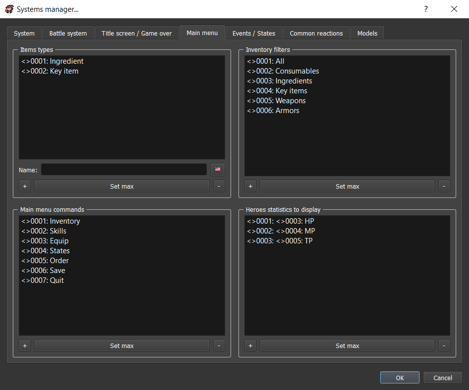
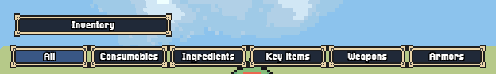
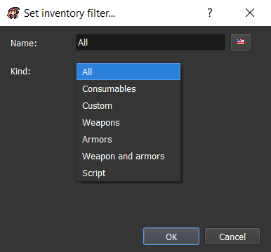
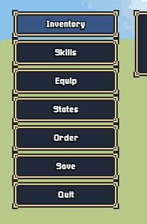
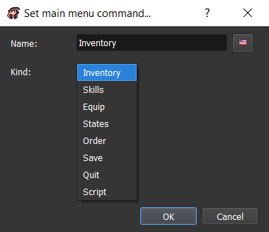
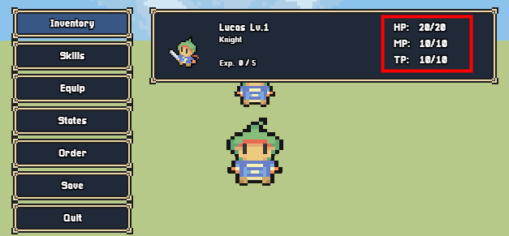
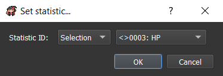

# Main menu

You can customize your ingame main menu by going in `Systems manager > Main menu`:



## Items types

Items types are a list of all the types that you will be able to select when editing an item.

.png>)

## Inventory filters



You can edit the tabs content filters when you are in the inventory.



* `Name`: Select the name that you want to display ingame
* `Kind`: The kind of filter
  * `All`: No filter applied
  * `Consumables`: All the consumables
  * `Custom`: Select an associated item type ID
  * `Weapons`: All the weapons
  * `Armor`: All the armors
  * `Weapons and armors`: All the weapons and armors
  * `Script`: Use a custom script filter that should return `true` or `false` according to `item` given variable that is a `Core.Item` type. Example:

```javascript
return item.system.id === 1;
```

## Main menu commands



The main menu commands are the commands choices box that are displayed on the top left when opening the main menu.



* `Name`: The name to display ingame
* `Kind`: The kind of action to do when clicking on it:
  * `Inventory`: Open inventory menu
  * `Skills`: Open skills menu
  * `Equip`: Open equip menu
  * `States`: Open states menu
  * `Order`: Select heroes list to reorder it
  * `Save`: Open save menu
  * `Quit`: Go back to title screen
  * `Script`: Call a special script. Should return `true` for success and `false` for impossible. You can use the `menu` variable that is a `Scene.Menu` type. Example:

```javascript
menu.windowChoicesTeam.select(0);
return true;
```

## Heroes statistics to display



You can customize the statistics to display on the right side of the hero description.



* `Statistic ID`: The statistic ID to display
