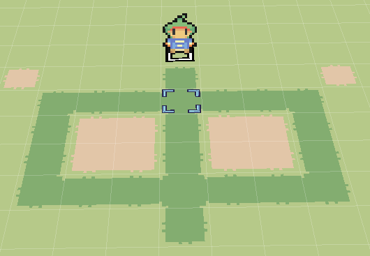
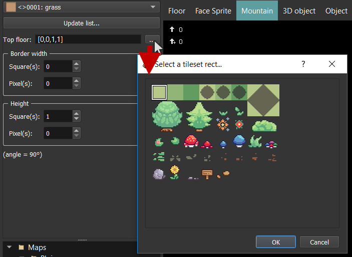
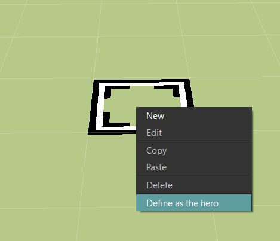

# Редактор карт

Після відкриття проєкту вікно виглядатиме наступним чином:

## Керування картами

Зверніть увагу на список карт **\(1\)**. Тут можна додавати, редагувати, видаляти, копіювати та вставляти карти. Ми рекомендуємо розкладати карти по директоріям за зонами гри. Після створення проєкту також створюється директорія `Бойові карти`, яку можна використовувати для карт, які використовуються як фон в битві. Якщо натиснути на карті `лівою` кнопкою миші, вона відкриється в редакторі карт **\(5\)**. Якщо натиснути `правою кнопкою миші`, відкриється контекстне меню:

При виборі пунктів `Нова карта` або `Редагувати властивості карти` відкривається наступне вікно:

* `Назва`: Назва карти.
* `Набір тайлів`: Набір тайлів, який визначає багато інформації про використовуваний набір текстур \(зіткнення, динамічні текстури, тощо\). Про його налаштування буде розказано в наступному розділі.
* **Розмір**:
  * `Довжина`: Довжина карти в квадратах \(по осі X\).
  * `Ширина`: Ширина карти в квадратах \(по осі Z\).
  * `Висота`: Висота карти в квадратах \(по осі Y &gt; 0\).
  * `Глибина`: Глибина карти в квадратах \(по осі Y &lt; 0\).
* `Музика`: Музика, яка програється в фоні після заходу на карту.
* `Фоновий звук`: Фоновий звук, який програється разом з фоновою музикою. Це може бути вітер, дощ тощо.
* `№ властивостей камери`: № властивостей камери, які використовуються при заході на карту.
* **Небо**:
  * `№ кольору`: Унікальний номер кольору, який буде використовуватися в якості неба.
  * `Picture`: Зображення, яке буде використовуватися в якості неба.
  * `№ скайбокса`: Номер скайбокса, який буде використовуватися в якості неба.
* **Реакції при відкритті карти**: Тут можна налаштувати конкретні речі, які будуть виконуватися при заході на карту. Пізніше ми покажемо, як це можна налаштувати через об'єкти.
* **Битви:**

* `№ бойової карти`: Номер бойової карти, який буде використовуватися при початку битви на цій карті \(якщо вибрані стандартні налаштування\)
* **Випадкові битви**:
  * `Список загонів`: 

* `№ загону`: Номер загону, з яким може початися битва
* `Приорітет`: Пріоритет цього загону
* `Імовірність`: Розрахована імовірність зустріти саме цей загін на основі пріоритетів всіх загонів
* `Земля`: Земля, при кроках на якій може початися випадкова битва
  * `Вся карта` : Битва може початися на всій карті
  * `Земля`: Можна вказати конкретні номери земель, на яких починається битва з вказаним загоном
* `Кількість кроків після наступної битви`: Кількість кроків, після якої починається випадкова битва
* `Варіантність (%)`: Процент відхилення кількості кроків від вказаного значення

## Пересування курсору / сітка / камера 

Камера завжди направлена на курсор, який показано таким чином:

Ось деякі дії, які можна зробити з курсором:

* Пересунути його по осях `X` та `Z` клавішами `AWSD`.
* Пересунути його по осі `Y`:
  * Пересування по квадратах: використовуйте `CTRL + Стілки вверх/вниз` або `CTRL + коліщатко миші`
  * Пересування по пікселях: використовуйте `CTRL + SHIFT + Стрілки вверх/вниз` або `CTRL + SHIFT + коліщатко миші`

* Моментально перенести курсор на квадрат вибраного елементу можна натисканням `CTRL + Ліва кнопка миші`.

Щоб пересунути позицію камери, натисніть на `коліщатко миші` та пересуньте миш в потрібному напрямку:

## Розміщення / видалення елементів 

Область вибору елемента карти **\(3\)** дозволяє вибрати, який елемент розміщатиметься на карті \(підлоги, спрайти, об'єкти, рельєфи тощо\). Ви також можете додати або видалити щось на певному квадраті, натиснувши лівою або правою кнопкою миші.

Ось приклад з підлогою:

## Скасування / повторення 

Після будь-якої зміни карти можна перейти назад або вперед. Натисніть `CTRL+Z`, щоб скасувати дію, або `CTRL+Y`, щоб повторити скасовану дію.

## Запис змін 

Щоб записати зміни в редакторі карт, можна використовувати наступні кнопки на панелі інструментів:

* `Запис`: Записує зміни на відкритій зараз карті.
* `Все`: Записує зміни на всіх редагованих картах. Якщо карта була відредагована, після її назви буде показуватися зірочка `*`:

## Показ / приховання інформації в інтерфейсі 

* `G`: Показати / приховати сітку
* `I`: Показати / приховати інформацію про квадрат, на який показує курсор миші:

## Зміна режиму малювання 

Нижче показано різні режими малювання **\(4\)** для малювання елементів карти:

* `Олівець`: Малює квадрати по одному.
* `Прямокутник`: Малює квадрати по формі прямокутника **\(поки що не реалізоване\)**.
* `Заливка`: Заповнює квадрати з тою з текстурою, яку має квадрат, на який буде вказано мишкою.

## Нижні грані 

Нижче показано доступні типи нижніх гранів:

## Підлоги 

В області вибору текстур **\(2\)** можна вибрати прямокутник в якості текстури. Після вибору натисніть на квадрат карти, щоб поставити там вибрану текстуру.

## Автотайли 

Автотайли — це динамічні підлоги. В них є межі, і вони автоматично мінятимуться в залежності від сусідніх квадратів:

В області вибору тексту **\(2\)** треба лише вибрати квадрат:

## Спрайти 

Спрайти — це вертикальні поверхні, які дозволяють симулювати «паперовий» мір. Вось різні типи спрайтів:

* `Лицьовий спрайт`: спрайт, який завжди повернуто до камери по осям X та Y.
* `Фіксований` : плаский спрайт.
* `Подвійний спрайт`: два пласких спрайти, які перетинаються.
* `Почетверений спрайт`: чотири пласких спрайти, які перетинаються.

Існує ще один тип спрайтів — `Спрайти стін`. Вони динамічні \(як автотайли\).

В області вибору текстур **\(2\)** треба вибрати стіну:

## Гори 

Гори дозволяють зробити карти рельєфними!

В області вибору текстури **\(2\)** є декілька налаштувань для додавання гір:

* `Підлога зверху`: Підлога, яка буде автоматично додана на верхню частину гір. Натисніть на кнопку `...`, щоб відредагувати підлогу зверху.
* `Ширина межі`: Якщо ширина межі дорівнює нулю, гора буде під кутом 90°. Це налаштування дозволяє вказати ширину меж гір \(щоб створити менші схили\).
  * `квадрат(ів)`: Вказується кількість квадратів.
  * `піксел(ів)`: Вказується кількість пікселів.
* `Висота`: Сумарна висота гори.
  * `квадрат(ів)`: Вказується кількість квадратів.
  * `піксел(ів)`: Вказується кількість пікселів, які додаються до квадратів.

Зверніть увагу, що можна задати максимальний кут, після якого гори стануть заважати руху, в розділі лімітів зіткнення на сторінці `Керування системами > Система`.

## 3D-об'єкти 

На картах доступні не тільки спрайти, але і тривимірні об'єкти!

В області вибора текстур **\(2\)** треба вказати потрібний об'єкт:

## Об'єкти 

Всі попередні елементи були статичними \(не рухалися\). Крім того, можна додати об'єкти, щоб зробити карту більш живою. Це можуть бути неігрові персонажі, скрині тощо.

Робота з ними буде описана пізніше. Це одна з найбільших тем під час роботи з редактором.

## Герой / героїня 

Щоб визначити, де почнеться гра, потрібно визначити, хто буде героєм або героїнею на одній з ваших карт. Коли ви створюєте новий проєкт, героєм буде персонаж в центрі першої карти. Якщо ви хочете змінити його, ось простий спосіб:

* Виберіть пустий квадрат в режимі об'єктів, натисніть правою кнопкою миші та виберіть пункт `Визначити як героя` в контекстному меню.

Інший \(складніший\) метод таки:

* Створіть новий об'єкт \(`Двічі натисніть лівою кнопкою миші` по квадрату\)
* Видаліть всі стани і події зі списків \(кнопкою `Del` на клавіатурі\) і виберіть `Hero` в якості моделі в відповідному полі. Можна назвати цей об'єкт «Героїня» або «Герой». В результаті мають бути приблизно такі налаштування:

* Натисніть на кнопку `Гаразд`. `Натисніть правою кнопкою миші` по об'єкту і виберіть пункт `Визначити як героя`.

Це все! Потім буде пояснено, навіщо використовувати об'єкт — це відкриває багато можливостей для створення нестандартних ігрових механік!

_Зауваження:_ Герой або героїня відмічається символом «S» знизу.

## Трансформації 

В 3D трансформації є наступними трьома різними діями:

### Зсув 

_Поки що недоступний._

### Повертання 

Повертання доступне лише для підлог, спрайтів та 3D-об'єктів.

Якщо ви натиснете по елементу карти лівою або правою кнопкою миші, цей об'єкт буде виділено, і до нього буде застосовано вибрані налаштування трансформації. Ви можете вказати поворот по осях `X`, `Y` або `Z`, який буде застосовано при натисканні.

* `[Вибраний об'єкт]`: Display information about the current selected object bellow. New transformations will be applied to this selected object.
* `+ / =`: Операція, яка буде використана при трансформації \(додавання або встановлення\).
* `Кут`: Кут, який будо додано до вибраного об'єкту або присвоєно йому.
* `Застосувати правою/лівою кнопкою миші`: Якщо ця опція вибрана, трансформацію буде застосовано при натисненні на об'єкт. Якщо вибрана операція `+`, права кнопка миші буде робити зворотну операцію `-`. Якщо ця опція не вибрана, вибраний об'єкт мінятиметься зразу ж при зміні поля `Кут`.
* `Встановити як стандарт. X/Y/Z поворот`: Записати поточне значення поля `Кут` в налаштування рушія, щоб це значення вибиралося щоразу після запуску редактора.
* `Скинути до стандарту X/Y/Z поворот`: Заміняє поточне значення поля `Кут` записаним стандартним значенням повороту..

### Масштабування 

_Недоступне._

## Опції шарів 

Наступні опції дозволяють вибрати, використовується режим шарів чи ні:

* `Без шарів`: Заміняє вибраний квадрат новим.
* `З шарами`: Розміщає новий квадрат над вибраним. Обмежень по кількості немає.

Приклад використання шарів зі стінами:

## Скайбокси 

Скайбокси дозволяють створити ілюзію величезного тривимірного простору.

Скайбокс — це просто величезний куб з текстурою, який повертається за камерою. Відредагувати скайбокси можна в розділі `Керування системами > Система > Sky boxes`:

Після цього скайбокс можна вибрати у властивостях карти в полі `№ скайбокса`.

