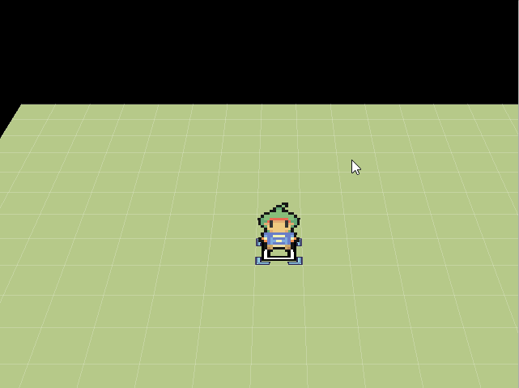
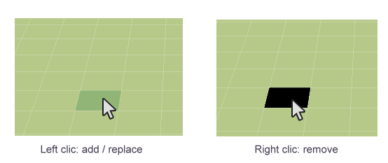
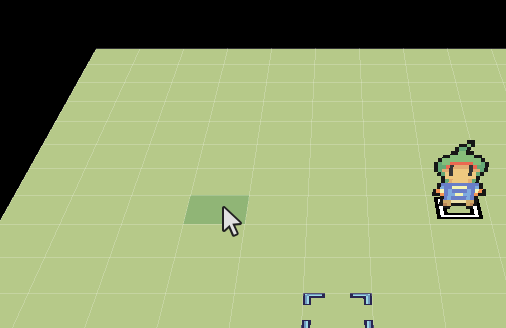
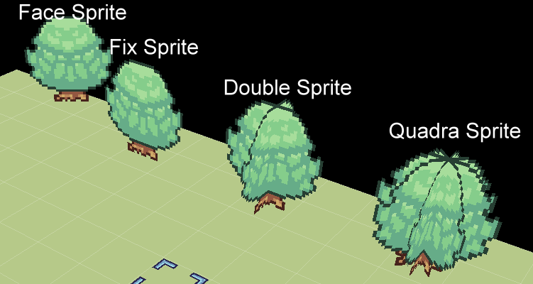
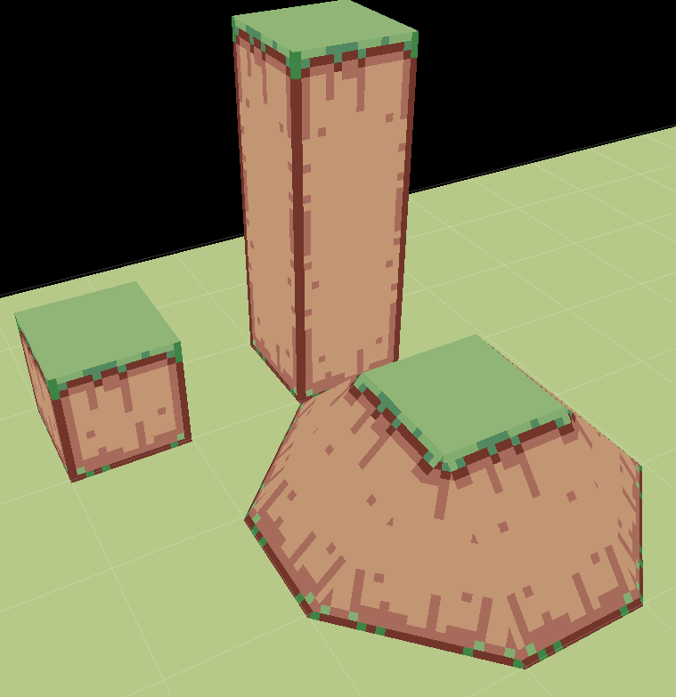

# Map editor

After opening a project, you should have this view:

## Manage maps

Take a look at the map selector **\(1\)**. You can add, edit, remove, copy, and paste folders or maps here. We recommend that you use folders to sort your maps for each zones of your game. By default, there's also a `Battle maps` folder that you can use to put all the maps that you will use for battle backgrounds. It is not required to put these maps into this specific folder. Clicking on a map will load this one on the map editor **\(5\)**. `Right clicking` will open this context menu:

If you want to create / edit a map, you will get this window:

* `Name`: The map name.
* `Tileset`: A tileset represents a lot of information applied on a specific set of textures \(collisions, dynamic textures,...\). We will see how to configure it in a next chapter.
* **Size**:
  * `Length`: The map length number of squares \(X axe\).
  * `Width`: The map width number of squares \(Z axe\).
  * `Height`: The map height number of squares \(Y axe &gt; 0\).
  * `Depth`: The map depth number of squares \(Y axe &lt; 0\).
* `Music`: The music that is played in the background when entering the map.
* `Background sound`: The background that is played in the background with the music. This can be wind, rain, etc.
* `Camera prop. ID`: The camera property ID used when entering the map.
* **Sky**:
  * `Color ID`: The unique color ID used for the sky.
  * `Picture`: A picture used as background for the sky.
  * `Skybox ID`: The skybox ID used for the sky.
* **Map startup reactions**: You can configure here particular things happening when entering the map. We will se later how to do that thanks to objects.
* **Battles**: **\(not implemented yet\)**

## Move cursor / grid / camera 

The camera is always looking at the following cursor:

Here are some actions possible with the cursor:

* Move on `X` and `Z` axis by using `QWSD` on keyboard.
* Move on `Y` axis:
  * Move by square: use `CTRL + Arrow Up/Down` or `CTRL + mouse wheel`
  * Move by pixel: use `CTRL + SHIFT + Arrow Up/Down` or `CTRL + SHIFT + mouse wheel`

* Teleport the cursor on the pointed element square by using `CTRL + Left click`.

To move the camera position, press the `mouse wheel` and move the mouse in the direction you want:

## Place / Remove elements 

The map element selection portion **\(3\)** allows you to select kind of element to place in the map \(lands, sprites, objects, reliefs, etc.\). You can add or remove something in a specific square by clicking left or right.

For example with a floor:

## Undo / Redo 

You can go back / after a change in each map. Press `CTRL+Z` for undo and `CTRL+Y` for redo.

## Save changes 

To save your map editor changes, you can use these shortcuts in the toolbar:

* `Save`: Save the changes on the current opened map.
* `All`: Save the changes on all the modified maps. A map has been changed when you see a `*` after its name:

## Show / Hide some UI details 

* `G`: Show / Hide grid
* `I`: Show / Hide information about the pointed square:

## Change paint mode 

Here are the different paint mode **\(4\)** for drawing your elements in the map:

* `Pencil`: Draw squares one by one.
* `Rectangle`: Draw squares after tracing a rectangle **\(not available yet\)**.
* `Pin of paint`: Fill squares with the same texture as the one pointed.

## Lands 

Here are the possible lands to place:

## Floors 

The texture selector **\(2\)** allows you to select a rectangle for a texture. After selecting a rectangle, place your mouse on a square of your map to place your floor.

## Autotiles 

Autotiles are dynamic floors. This will have borders with automatic changing according to the neighbor squares:

In the texture selector **\(2\)**, you just have to select a square:

## Animated autotiles 

_Not available yet._

## Sprites 

Sprites are vertical planes that can be used to simulate a "paper" world. Here are the different types of sprites:

* `Face Sprite`: A sprite that is always facing the camera on the X / Y axe.
* `Fix Sprite`: A flat sprite.
* `Double Sprite`: Two crossing flat sprites.
* `Quadra Sprite`: four crossing flat sprites.

Another kind of sprites are `Walls Sprite` that are dynamic \(such as autotiles\).

In the texture selector **\(2\)**, you just have to select a wall:

## Mountains 

You can add some reliefs to your map thanks to mountains!

In the texture selector **\(2\)**, you have several possible options for designing your mountains:

* `Top floor`: The floor that whill be automatically added on top of the mountains. This floor depends on the tileset texture. Click on the `...` button to edit the top floor.
* `Border width`: If the border width is equal to zero, this will be a 90° mountain. You can adjust here the width of the borders of the mountains \(this will create small slopes\).
  * `Square(s)`: Select the number of squares.
  * `Pixel(s)`: Select the number of pixels added.
* `Height`: The total height of the mountain.
  * `Square(s)`: Select the number of squares.
  * `Pixel(s)`: Select the number of pixels added.

Note that you can se the angle value bellow these options so you can refer to this for angle collisions in `Systems manager > System`.

## 3D Objects 

There are not only sprites, but also 3D objects available for your maps!

In the texture selector **\(2\)**, you just have to select an object:

## Objects 

All the previous elements were static \(it doesn't move\). There are objects in order to add some life on your map. This can be NPCs, chests, etc.

We will see later how to manage it because this is one of the biggest topics of the engine.

## The hero 

To define where the game should start, you have to define who is the hero in one of your maps. When you create a new project, the hero is the character at the center of the first map. If you want to change it, here is the simple way:

* Select an empty square on object mode, right click on it and click on `define as the hero`.

Another way \(more complex\) is:

* Create a new object \(`Double click` on a square\)
* Remove all the states and events from the lists \(by using `Del` on keyboard\) and choose `Hero` as model in the combo box. You can name it "Hero" if you want. You should have something like this:

* Click on `OK`. `Right click` on your object, and choose `Define as Hero`.

That's it! You will understand later why we are using an object and why this will open a lot of opportunities for customizing your games!

_Note:_ You can see who is the hero with a "S" symbol under it.

## Transformations 

In 3D, transformations are these 3 different action:

### Translation 

_Not available yet._

### Rotation 

Apply rotation to sprites or 3D objects only.

If you left / right click a map element, this will select the object and apply the current configured transformation. You can choose the axis `X`, `Y`, or `Z` to apply the rotation on by selecting the corresponding tab.

* `[Selected object]`: Display information about the current selected object bellow. New transformations will be applied to this selected object.
* `+ / =`: The operation to apply on transformation \(add or apply\).
* `Angle`: The angle to add or apply to the selected object.
* `Apply on left / right click`: If checked, you will apply the transformation each time you click on a selected object. If `+` operation is activated, right click will in fact be a `-` operation. If not checked, updating `angle` will immediately update the selected object.
* `Define as default X/Y/Z rotation`: Save current `angle` input in engine settings so you get this value in the `angle` input each time you restart the engine.
* `Reset to default X/Y/Z rotation`: Fill current `angle` input with the saved default rotation value.

### Scaling 

_Not available yet._

## Layers options 

You can choose here if you want to be on layer mode or not here:

* `No layer`: Replace the selected square by a new one.
* `Layer`: Add a new square on top of the selected one. There is no limit.

Example of layers used with walls:

## Skyboxes 

Skyboxes are used to give illusion to be in a huge 3D world space.

Skybox is simply a huge textured cube that follows the camera. You can edit you skyboxes in `Systems > System > Skyboxes`:

And then, you can use it in map properties while selecting `Skybox ID`.

