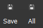

# Map editor

## -- Overview

This section will explain the basics of each aspect of the map editor. It will include what each section is used for, how to interact with it, what each button/menu does, and the keyboard controls for map editing.&#x20;

For more in depth explanations and usage look at the ADVANCED section about mapping.&#x20;

## -- Meet the Editor

After opening a project, you will be brought to what we can consider the home screen of our project- The Map Editor. From here you have access to every feature the engine has to offer.&#x20;

Let's look at each individual section.&#x20;

<figure><figcaption></figcaption></figure>

### (1) The Map Selector

A.K.A the map tree, this is where you create and organize the maps that make up your game. You can create folders and drag items around at any time(this won't affect your code, like teleport commands, so it's safe to do).

Click on the map you want to appear on the right side (5) for editing. Clicking on a folder displays no data in the other sections.&#x20;

It is recommended that you use folders to categorize your maps. There are different approaches to naming conventions like area names, level numbers, story elements, etc.&#x20;

<figure><figcaption></figcaption></figure>

You can use folders inside of folders to further categorize things. Whatever works best for you.&#x20;

In the default RPG battle system regular maps are used as the backdrop. So by default there is a folder called "Battle maps" which is used to store these maps. This isn't required but is highly recommended to keep them separate from normal maps the hero will walk on. Although for some games you might just use normal maps for battle.&#x20;

To make a new map you have to right click on a folder. Maps can't exist outside of at least one folder. By default each project starts with a top folder called "Maps". You can't even delete everything from the map tree, there will always be one folder present.&#x20;

You can right click on a map for the usual options like edit, copy, delete.&#x20;

If you right click on a folder you get similar options for that folder. When you copy a folder it can only be pasted on another folder or an open space under the list.

When you create or edit a map, you will get this window:

<figure><figcaption></figcaption></figure>

* `Name`: Label for your map that appears in the map tree.
* `Tileset`: This determines what tiles you have available to draw onto this map.
*   **Size**:

    * `Length`: The map length in number of squares (X axis, left to right).
    * `Width`: The map width in number of squares (Z axis, front to back).
    * `Height`: The map height above 0 in number of squares (Y axis, floor to sky).
    * `Depth`: The map depth below 0 in number of squares (Y axis, floor to seabed).

    \*Depth isn't always needed if you plan your maps ahead of time. But if you suddenly want to add lower levels to a map you can increase the depth to be able to draw lower in the Y axis.
* `Music`: The music played in the background while on this map.
* `Background sound`: This is like a second sound channel that lets you play a repeating sound file alongside the music. Common uses would be wind/rain, birds chirping, etc.
* `Camera prop. ID`: The settings for the camera that are applied when entering the map. Any previous changes to the camera are lost.
* **Sky**: (the area around or behind your map tiles)
  * `Color ID`: Use a solid color for the entire sky.
  * `Picture`: Use a picture for the entire sky. It doesn't rotate with the camera.
  * `Skybox ID`: Uses 6 images to form a cube around the map. This does rotate with the camera.

**There are 2 tabs on the right side:**

* **Map startup reactions**: Like objects on your map you can add code here. By default it's set up to run this code only once, each time you enter the map. However you can adjust the STATES/EVENTS however you'd like.
* **Battles:** This lets you enable random battles on the selected map. ****&#x20;

* `Battle map ID`: This determines what map the fight will take place on. You can use a variable for this.
* **Random battles**: Create a list of possible enemy troops to battle.\
  \*Double click an empty space or right click to add to the list\
  (see below image for that dialogue box)
* Number of steps after next battle: Determines how many steps are required to trigger a battle. (1 square = 3-4 steps)
* Variance (%): Provides variation to the above number so it's not the same number of steps each time. (It's a percentage)\
  \*300 steps with 20 variance = 240-360 steps between battles

* `Troop ID`: The group of enemies to fight.
* `Priority`: Determines how often this troop will be picked to fight. Higher number gets picked more often.
* `Probability`: The calculated probability of this troop getting picked, based on the priorities of all troops in the list. (Since there is only one troop it's showing 100%. It changes as you add more.)
* `Terrain`: Determines which parts of the map can trigger this fight.
  * `Entire map` : You can trigger this battle from anywhere on the map.
  * `Terrain`: Choose a number and only tiles with that assigned number will trigger this fight. You can add multiple numbers.

### (2) The Tile Selector

This is where you see all the tiles available to draw with. These tiles can also be used by objects in place of a full character sprite sheet.&#x20;

Only 1 tileset can be selected per map, however there is no limit to how large a tileset can be. So you can put all your game's tiles on one tileset and use it for every map. Or you can use different files for different maps. (I prefer one large tileset)

There are really only 2 functions here:

* Left Mouse Click - Select a single tile. This will be used with whatever draw tool you select.
* Left Mouse Click and Drag - Use this to select more than one tile. Useful for drawing large objects like trees or houses. It's alignment with the grid changes between odd and even number of tiles selected. If your 3 tile wide tree isn't matching up, try drawing it 1 or 2 tiles at a time.&#x20;

The map and tile selector boxes are connected.&#x20;

* You can drag the horizontal separator up and down to see more of one or the other. It's useful to see more of the tiles when drawing maps.&#x20;
* You can also move the vertical separator left and right to hide or show more of both sections. It's wise to limit your tileset in width, so you don't have to make this box too wide in order to see everything.&#x20;

### (3) Drawing types

There various types of terrain and each one works differently. You will be switching between these on a regular basis. The currently selected type that you will be drawing with is always highlighted.

Each type has sub types. The word you see is the subtype selected. When you hover your mouse over that type you will see a list of subtypes. Click one and that word is now showing, which tells you what kind of tile you are about to draw. If that type is highlighted, of course. Click the words directly to switch types without changing the subtype.&#x20;

Land - These tiles are laid flat and make up what the player will walk on.

* Floor - Draw tiles from the tileset to make up a floor.&#x20;
* Autotile - These use unique resource files. They can be animated and have special properties. These resource files have to be imported to a list before they appear in the tile selector. (More on this in the next chapter)

Sprites - These tiles are drawn standing up, like the hero.&#x20;

*

    
* Face Sprite - Draws tiles from the tileset that always turn with the camera to "face" the viewer.
* Fix Sprite - Draws tiles from the tileset that don't turn with the camera. They remain "fixed" in their orientation
* Double Sprite - Same as Fix Sprite, except 2 copies of the tile are crossed together. They don't turn with the camera, but never appear flat when seen from any side.
* Quadra Sprite - Same as Double Sprite, except 4 copies to appear more full.

* Wall - These use unique resource files and are drawn using their own unique method. They can only be drawn by choosing a starting point and an end point in a straight line. Then the graphic fills in a wall in between. You can't single click to delete a wall. You have to right click a starting point then right click an end point and it will erase everything in between. You need to be on the correct Y axis for this.&#x20;

These resource files have to be imported to a list before they appear in the tile selector. (More on this in the next chapter)

Mountains - These are squares and slopes that give a 3D feel to any map.&#x20;

* Mountain - These use unique resource files that are used to create squares, with FLOOR tiles used on top. By changing some options you can create slopes of various sizes instead.&#x20;

These resource files have to be imported to a list before they appear in the tile selector. (More on this in the next chapter)

3D Objects - These use pre-rendered models of any shape and size as static scenery.

* 3D Object - Lets you place and drag around your 3D objects on the map.

Object - These are used for the hero, npcs, interactive items, or to simply add code to a map. They use 2D sprites for a graphic in either fixed or face orientation. You can use 3D objects but that feature is not fully functional (as of Dec 2022).

* Object - Lets you create and drag around objects on the map.

View - This is for viewing the map.

* View - Lets you see things as they will appear in the game.

### (4) Drawing tools

Once you select the type, it's time to choose a tool to draw with. Not all drawing tools are available for all types.&#x20;

There are 3 groups separated by a vertical line:

* Group 1 determines if it will align to the grid or not.
  * The first icon has an isometric view of a square, to say it will align to the grid and the other squares.
  * The second icon is just a pixel, to say you can place it on any pixel you want.&#x20;

Some tiles benefit from being aligned to the grid and it makes it easier overall, especially when working with the Move Object command.&#x20;

Other tiles look better when pixel placed, like scenery, for a more natural look. Trees and flowers, for example.&#x20;

*   Group 2 are your basic art tools.

    

    * The first icon is the MOVE tool. With it you can move what is already drawn. Click and drag them around.
    * The second icon is the ROTATION tool. With it you can rotate what is already drawn. In place of the Tile Selector you will see some options. Choose here which axis you want it to rotate on and by how much, then click on something drawn to apply it.
    * The third icon is the SCALING tool. With it you stretch what is already drawn. Choose which axis to alter, then click and drag something. It will stretch in that direction.&#x20;
    * The fourth icon is the PENCIL tool. It will draw whatever you have selected from the Tile Selector. Click and drag to draw freehand. Right click will delete whatever the mouse cursor is pointing at, however it can only delete whatever is from the selected Draw Type. (You can't erase sprites while floor is selected)
    * The fifth icon is the SQUARE tool. It will let you click once to start a square, then drag to the desired size and let go of the mouse button to finish. Using right click instead will delete in the same way.&#x20;
    * The sixth icon is the PAINT tool. It will fill the area you click on with whatever you have selected from the Tile Selector. Using right click instead will delete in the same way.
*   Group 3 determines what layer it will draw on.\

    

    * The first icon has an isometric view of a single square, this is the default layer. When you draw there is only one layer. Drawing on an existing spot will remove the previous tile. It will not delete more than one layer under it if many are stacked.
    * The second icon is an isometric view of a 2nd square on top, to say that this will be drawn as an extra layer on top of whatever you click on. With this enabled you can draw an infinite number of layers on top of already drawn tiles. When you right click to delete it will remove the top layer first. You would have to keep right clicking to remove each layer in a stack.&#x20;

!! IMPORTANT !! - Be careful when using the extra layer tool. When you are done using it always remember to switch back to the default layer. Drawing some things with the extra layer can have undesired consequences, resulting in the need to redraw parts of your map. It's not fun.

A common behavior of all drawing tools is that when you click and drag, the cursor is locked to that Y coordinate. You will need to click again to affect any other Y coordinate.&#x20;

When you are drawing, the camera angle plays a big part in where you can draw. It will always try to place the tile you want to draw on top of anything under your cursor. You may need to turn the map, or change the zoom level, to draw in the exact spot you want to. Turning the camera upside down is sometimes required.\
\
For example, lets says there is a flat map with a mountain in the middle. If your cursor appears over the mountain, it will automatically draw at the higher Y elevation of that mountain. If your cursor appears over the ground below, it will draw at that lower Y elevation. If you wanted to draw floor tiles under the mountain, you would start drawing on the floor next to the mountain and drag the cursor under the mountain, because the drawing will be locked to that Y value and it will prevent the tile from drawing on top of the mountain.

The Advanced > Mapping section will go into more detail on using these tools effectively.&#x20;

### (5) Drawing space

This is the area for viewing and drawing your maps.&#x20;

You will see data in the bottom left corner of this section that will help guide you, especially when using the pixel drawing option.

It displays the information where your cursor is. You can hover over a tile to see it's coordinates and other info. This also tells you where it's going to draw/delete when you click, so if it's going to affect a tile on a higher Y value it will tell you here beforehand.

There are 2 numbers in the top left corner of this section. This tells you where on the Y axis you will be drawing(unless your cursor is over a tile with a higher Y value). When you change this value the visible grid moves up and down. This is listed in the menu under Edition>Height up/down. Height moves in full squares, and Height Plus moves in pixels on top of that.&#x20;

Generally left mouse button is for drawing graphics or selecting an object.&#x20;

Right click will delete graphics or give a context menu for an object.

If you have a scroll wheel it will change the camera zoom level. You can also click and drag the scroll wheel to turn the camera.

Keyboard shortcuts are needed to draw at different Y elevations (see below Keyboard Shortcuts/Modifiers).

### (6) Main Toolbar

This contain icons for the most common functions of the editor.&#x20;

You can right click anywhere on this toolbar for an option to toggle it on and off. When it's off, you right click anywhere in the main menu section to get it back.

When the editor is in windowed mode and not long enough, you will see double arrows on the right hand side of the toolbar. Click this to view the hidden icons.&#x20;

### (7) Main Menu

From here you can access all functions, including what's already visible in the toolbar.&#x20;

However, there are a few things found only here so I will cover those.

* File
  * Open BR Folder - This opens the location of the default resource files that came with RPM, if you need to examine them for any reason. (BR = Basic Resources)
  * Export Standalone - To create a copy of your game to publish.
  * Close Project - This will bring you back to the RPM launch page.&#x20;
* Edition (A.K.A. Edit)
  * Shows you some useful keyboard shortcuts, or allows you to trigger those functions with mouse clicks.&#x20;
* Options
  * Set BR Path - Lets you choose the location for the engines default resources. Very few people will ever need to change this.
  * Set DLC Path - Lets you choose the location for the engines DLC resources, if you have any.&#x20;
  * Debug Options - Remember this for when you have a bug to fix.
  * General Options - Some options that apply to the editor.
  * Change Language - Choose the language for the editor. (Doesn't affect the game)
  * Auto Display Updater - This is a check box to toggle it on/off. When on, it will check for updates every time you start RPM.&#x20;
*   Display

    * Show / Hide Grid - Toggles the grid visible on your maps. Recommended you leave this on as the grid easily shows you which Y elevation you are currently set to draw on. (You can use the "View" Draw Type to see your map without the grid)
    * Show / Hide Square Info - Toggles the information where your cursor is pointing. (It's not very obtrusive and extremely helpful, so you might only need this off if you want clean screenshots from the editor)&#x20;

    .png>)
* Help
  * About - Check what version of RPM you are currently running.

## -- Keyboard Shortcuts/Modifiers

When looking in the main menu you can see some of those options have keyboard shortcuts next to the name; CTRL+N, SHIFT+UP, G, etc. You can get by without knowing most of them, although the Height Up/Down(moving Y axis grid) can only be achieved by using the keyboard.&#x20;

There are keys that modify how your mouse behaves when working on your maps and it's not really stated anywhere inside the program (yet).

* SHIFT - While holding this, you can click and drag to turn the camera. This is helpful if you only have 2 mouse buttons.&#x20;
* CTRL - While holding this, you can click somewhere on your map and the camera will instantly move there. It also changes the scroll wheel to move the Y axis grid up and down. You will do this often. If you use it temporarily to draw something up in the air, always remember to move the Y axis grid back to normal.
* SHIFT+CTRL - While holding this, you can move the Y axis grid by pixels, instead of full squares.&#x20;

As a side note - there are some common OS buttons that can help speed up your work on some objects and menus. You don't have to control everything with the mouse.&#x20;

* Arrow keys - These can change the option that is highlighted, like when looking at a list of code or events. Some fields allow you to press up or down to change the value, like choosing a number for a variable or time event. Usually these can also be changed by spinning your scroll wheel.&#x20;
* Enter - On most windows it will choose/activate the option that is highlighted(although for some options it produces no result). The starting point differs based on what window you opened. There are times when you can press enter more quickly than moving your mouse cursor.&#x20;

\*For example, when you open an object the OK button is highlighted. If you don't need to change anything on the object you can press enter and the window will close. It easy to dismiss it as only saving a small fraction of time compared to moving the mouse to the OK button, but when practiced this can save a lot of time in the long run. However, things are inconsistent across the editor right now so I find it hard to make full use of this.&#x20;

* Escape - On some windows it will act like pressing the cancel button. It will close the window without saving any changes.&#x20;
* Tab - Changes what option is highlighted.&#x20;

This is common with all Windows programs, so I don't know how it might be in all OS/versions. Pressing Tab allows you to cycle through all the available buttons, check boxes, and text fields in the current window. When it reaches the end it goes back to the first one. SHIFT+TAB cycles in reverse.

\*Normally the fields are cycled in a natural sequence, but in RPM you will see the selection bouncing around the window out of sequence. Hopefully this will get organized in the future.

* Spacebar - On some windows it will edit the option that is highlighted. This is commonly used when working on your code. You can right click a line of code and click edit, you can double click that line of code to jump into the edit window, or you can press spacebar to open what is highlighted. (Sometimes Enter will do the same thing)

These keys comes in handy when doing certain kinds of actions, especially mass changing some lines of code.&#x20;

## -- Cursors 

There are 2 different cursors you will see on your map.

&#x20;

The camera always follows the cursor on the left. You control it with keyboard controls. There are no scroll bars so this is the only real way to look around your map. You can't move it outside the boundaries of the map.&#x20;

The cursor on the right is the selector for the OBJECT Draw Type. A mouse click will place this cursor which used for things like pressing SPACEBAR, CTRL+C, CTRL+V, etc.&#x20;

## -- Undo / Redo 

You can use this common feature to rollback changes to your map. You can find it in the main menu, where it shows the keyboard shortcuts.&#x20;

* Undo - CTRL + Z
* Redo - CTRL + SHIFT + Z

This works for things like drawing/erasing any graphic, creating/deleting objects, writing in a text field, and probably more.

It doesn't work for everything so be careful. A few things that don't work are; changing editor options, creating/deleting maps and folders, creating/deleting lines of code.&#x20;

## -- Save your changes 

Don't forget to save often.&#x20;

\*Caution - this engine is still in development and sometimes crashes. It gets more stable with each version and it's currently not too bad, but it can happen.&#x20;

To save your changes you can use the main menu or these shortcuts in the main toolbar:

* `Save`: Save the changes only on the currently selected map.
* `All`: Save the changes on all maps.&#x20;

When a map has been changed you will see a `*` after its name in the map tree:

When you are in a menu like SYSTEMS and you press OK, those changes are automatically saved. Even if you were to quit without saving, only map changes would be lost. If the engine crashes before you hit OK, you will lose those changes. I assume this works for most other menus.

### Automatic Backups

A recent update introduced an automatic backup feature. Every 30 minutes it creates a backup of the important project files. It doesn't copy all the resources so each backup is only about 5mb. &#x20;

How to restore backups is not yet clear, but you probably just make a copy of the main project and drop the backup files in.&#x20;

## -- Conclusion

It's a very simple layout and is easy to get used to. Drawing maps in 3D takes some getting used to, but everything is harder with a 3rd dimension.&#x20;

&#x20;                                                           Written by KevinOfNine
