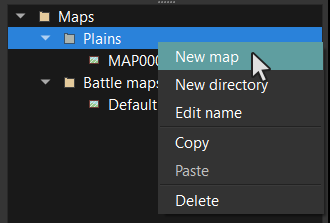
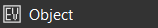
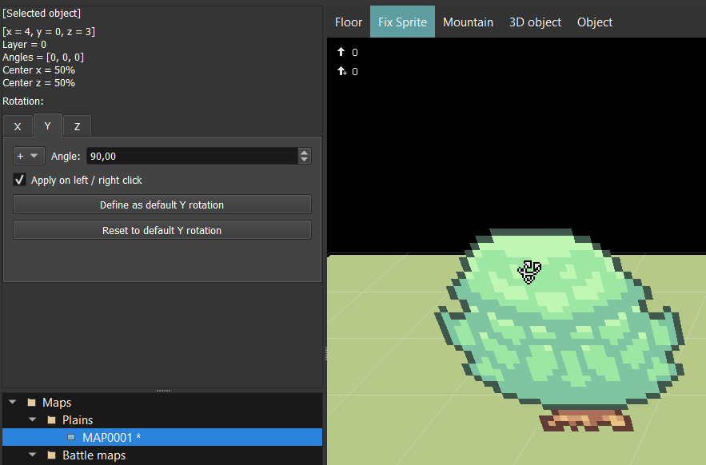

# Map editor

Après avoir ouvert un projet, vous devriez voir ceci :

## Gestion des cartes

Jetez un œil au sélecteur de cartes **\(1\)**. Vous pouvez ajouter, modifier, supprimer, copier et coller des dossiers ou cartes ici. Nous recommandons l'utilisation de dossier pour trier vos cartes pour chaque zones de votre jeu. Par défaut il y a également un dossier pour les cartes de combats `Battle maps` . Il n'est pas obligatoire de ranger des cartes spécifiquement dans ce dossier. Cliquer sur une carte chargera celle-ci dans l'éditeur de carte **\(5\)**. `Clic droit` ouvrira ce menu contextuel :

Si vous souhaitez créer/éditer une carte, vous aurez cette fenêtre :

* `Name`: Le nom de la carte.
* `Tileset`: Un ''tileset' \(jeu de tuiles\) représente un tas d'informations appliqué sur une jeu de texture spécifique \(collision, textures dynamiques...\). Nous verrons comment les configurer dans un prochain chapitre.
* **Size**: \(Taille\)
  * `Length`: Le nombre de carrés en longueur de la carte  \(axe X\).
  * `Width`: Le nombre de carrés en largeur de la carte \(axe Z\).
  * `Height`: Le nombre de carrés en hauteur de la carte \(axe Y &gt; 0\).
  * `Depth`: Le nombre de carrés en profondeur de la carte \(axe Y &lt; 0\).
* `Music`: L'arrière plan musical lorsque vous entrez sur la carte.
* `Background sound`: Les effets sonores d'arrière plan qui peuvent accompagner la musique. Cela peut être du vent, de la pluie, etc.
* `Camera prop. ID`: Les propriétés d'identifiants de la caméra lorsque vous entrez dans une carte:
* * `Color ID`: L'Identifiant unique de couleur utilisé pour le ciel.
  * `Picture`: Image utilisée comme arrière plan pour le ciel.
  * `Skybox ID`: L'identifiant utilisé pour le ciel.
* **Map startup reactions**: \(réactions au démarrage de la carte\) Vous pouvez configurer ici des réactions particulières lors de l'entrée dans la carte. Nous verrons plus tard comment faire cela via les objets.
* **Battles**: **\(batailles\)**

* `Battle map ID`: The battle map ID when entering in a battle in this map \(if default selected\)
* **Random battles**:
  * `The troop list`: 

* `Troop ID`: The troop ID that you can encounter
* `Priority`: The priority for this troop
* `Probability`: The calculated probability according to each troops priorities
* `Terrain`: The terrain where the steps are triggering
  * `Entire map` : Apply on the entire map
  * `Terrain`: Not implemented yet
* Number of steps after next battle: The number of steps to trigger a random battle
* Variance \(%\): The steps variance in percentage

## Déplacement du curseur / grille / Camera

La camera cible toujours le curseur suivant :

Voici quelques actions possibles avec le curseur :

* Se déplace sur les axes `X` et `Z` en utilisant les touches clavier `QWSD` .
* Déplacement sur l'axe `Y`  :
  * Déplacement par carré : utiliser `CTRL + Flèche Haut/Bas` or `CTRL + molette souris`
  * Déplacement par pixel : utiliser `CTRL + SHIFT + Flèche Haut/Bas` ou `CTRL + SHIFT + molette souris`

* Téléportez le curseur sur la case de l'élément pointé en utilisant `CTRL + clic gauche`.

Afin de déplacer la position de la caméra, appuyez sur la `molette souris` puis bougez la souris dans la direction voulue :

## Placer / Retirer des éléments

La partie de sélection des éléments de la carte **\(3\)** vous permets de choisir le type d'éléments à placer sur la carte \(terrains, sprites, objets, reliefs, etc.\). Vous pouvez ajouter ou retirer des éléments dans une case spécifiques en faisant clic gauche ou droit..

Par exemple avec un sol :

## Défaire / Refaire

Vous pouvez revenir en arrière après un changement sur chaque cartes. Appuyez `CTRL+Z` pour défaire \(undo\) et `CTRL+Y` pour refaire \(redo\).

## Sauvegarder les changements

Pour sauvegarder les changements de l'éditeur de carte, vous pouvez utiliser ces raccourcis dans la barre d'outils :

* `Save`: Sauvegarde les changements sur la carte actuellement ouverte.
* `All`: Sauvegarde les changement sur toutes les cartes modifiées. Une carte a été modifiée si vous voyez une `*` derrière son nom :

## Montrer/ Cacher des détails de l'interface

* `G`: Montrer / Cacher la grille
* `I`: Montrer / Cacher des informations de la case sélectionnée :

## Changer le mode de dessin 

Il y a ici les différents mode **\(4\)** pour dessiner vos éléments sur votre carte :

* `Pencil`: Dessine des carrés un par un.
* `Rectangle`: Dessine des carrés après avoir tracé un rectangle **\(Actuellement non disponible\)**.
* `Pin of paint`: Rempli les carrés de la même texture que celle de la case pointée.

## Terrains

Voici les possibilités de terrain à utiliser :

## Sols 

Le sélecteur de texture **\(2\)** vous permet de sélectionner un rectangle pour une texture. Après la sélection d'un rectangle, placez votre souris sur une case de votre carte pour y placer votre sol.

## Autotiles 

Autotiles \(tuiles automatisées\) sont des sols dynamiques. Elles ont des bordures qui changeront automatiquement selon les cases voisines :

Dans la sélection de texture **\(2\)**, vous avez juste à sélectionner une case :

## Tuiles animées

_Actuellement non disponible._

## Sprites 

Les Sprites sont des plans verticaux permettant de simuler un monde "papier". Voici les différents types de sprites :

* `Face Sprite`: Sprite qui sera toujours en face de la caméra sur les axes X / Y.
* `Fix Sprite`: Un sprite plat.
* `Double Sprite`: Deux sprites plats entrecroisés.
* `Quadra Sprite`:  Quatre sprites plats entrecroisés

Un autre type de sprite est le `Walls Sprite` \(sprites muraux\) qui sont dynamiques \(à l'instar des tuiles automatisées\).

Dans le selecteur de texture **\(2\)**, sélectionnez simplement un mur :

## Montagnes

Vous pouvez ajouter du relief à votre carte grâce aux montagnes !

Dans le sélecteur de texture **\(2\)**, vous avez plusieurs possibilités afin de façonner vos montagnes :

* `Top floor`: Le sol qui sera automatiquement ajouté au sommet de vos montagnes. Ces sols dépendront du jeu de tuiles \(tileset\) utilisé. Cliquez sur le bouton `...` pour éditer le sol au sommet.
* `Border width`: Si la largeur de la bordure est égale à 0, cela sera une montagne à 90°. Vous pourrez ici ajuster la largeur des bordures de vos montagnes \(cela créera de petites pentes\).
  * `Square(s)`: Sélectionne le nombre de case.
  * `Pixel(s)`: Sélectionne le nombre de pixels ajoutés.
* `Height`: La hauteur totale de vos montagnes.
  * `Square(s)`: Sélectionne le nombre de cases.
  * `Pixel(s)`: Sélectionne le nombre de pixels ajoutés.

Notez que vous pouvez voir la valeur de l'angle sous ces options, afin de vous y référer pour l'angle des collisions dans `Systems manager > System`.

## Objets 3D 

Il n'y a pas juste des images \(Sprites\), mais également des objets 3d disponibles pour vos cartes !

Dans le sélecteur de texture **\(2\)**,vous avez juste à sélectionner un objet :

## Objets 

Tous les précédents éléments étaient statiques\(ils ne bougent pas\). Il y a des objets permettant de donner vie à vos cartes. Cela peut être des PNJ \(personnages non joueurs\), des coffres, etc.

Nous verrons plus tard comme les paramétrer, car ce sera l'un des plus gros sujets concernant le moteur de jeu.

## Le héros 

Pour définir le point de départ du jeu, vous devrez définir qui est le héros dans l'une de vos cartes. Lorsque vous créez un nouveau projet, Le héro est le personnage au centre de la carte. Si vous voulez le changer, voici une façon simple de le faire :

* Sélectionnez une case en mode objet, clic droit dessus et choisissez `define as the hero`.

Une autre manière \(plus complexe\) serait de :

* Créer un nouvel objet \(`Double clic` sur sur une case\)
* Retirer tous les évènements et états des listes\(En utilisant la touche `suppr.` \) puis choisissez  `Hero` comme modèle dans le menu défilant. Vous pouvez le nommer "Hero" Si vous le souhaitez. Vous devriez obtenir quelque chose comme ça :

* Cliquez sur `OK`. `Clic droit` sur votre objet, puis choisir `Define as Hero`.

Ça y est ! Vous comprendrez plus tard pourquoi nous utilisons un objet et pourquoi cela vous offrira un tas d'opportunités pour configurer vos jeux !

_Note:_ Vous pouvez voir qui est le héros via le symbole "S" dessous.

## Transformations 

En 3d, les transformations sont sont les 3 actions suivantes :

### Translation 

_Non disponible actuellement._

### Rotation 

Applique une rotation uniquement aux sols, sprites ou objets 3d.

Si vous cliquez droit / gauche sur un élément de la carte, cela sélectionnera l'objet et appliquera la configuration de transformation actuelle. Vous pouvez choisir les axes `X`, `Y`, or `Z` afin d'appliquer la rotation en sélectionnant l'onglet correspondant.

* `[Selected object]`: Affiche des informations concernant l'objet sélectionné. Les nouvelles transformations seront appliquées sur cet objet.
* `+ / =`: L'opérateur à utiliser pour la transformation  \(ajouter ou appliquer\).
* `Angle`: L'angle à ajouter ou appliquer à l'objet sélectionné.
* `Apply on left / right click`: Si coché, vous appliquerez la transformation à chaque clic sur l'objet sélectionné. Si l'opérateur `+` est activé, le clic droit deviendra en réalité un opérateur `-` . Si décoché, modifier `angle` modifiera immédiatement l'objet sélectionné.
* `Define as default X/Y/Z rotation`: Sauvegarde la valeur d'entrée d' `angle` actuelle dans les paramètres du moteur, afin que vous puissiez obtenir cette valeur d' `angle` à chaque fois que vous redémarrez le moteur.
* `Reset to default X/Y/Z rotation`: Rétablit l' `angle` actuel par la valeur de rotation sauvegardée par défaut .

### Mise à l'échelle 

_Non disponible actuellement._

## Options de calques 

Vous pouvez choisir si vous souhaitez être ou non en mode calque :

* `No layer`: Remplace la case actuelle par une nouvelle.
* `Layer`: Ajoute une nouvelle case au-dessus de celle sélectionnée. Il n'y a aucune limite.

Exemple de calques utilisés avec les murs :

## Skyboxes 

Les Skyboxes \(littéralement boîtes de ciel\) sont utilisées afin de donner l'impression d'être dans immense espace 3d.

Les Skyboxes sont tout simplement une immense texture sur un cube qui suit la caméra. Vous pouvez les éditer dans `Systems > System > Skyboxes`:

Puis, vous pouvez les utiliser dans les propriétés de la carte en sélectionnant `Skybox ID`.

