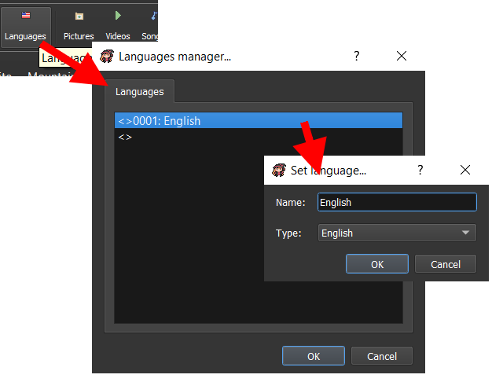
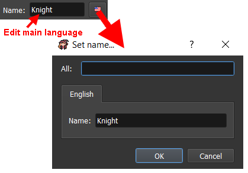
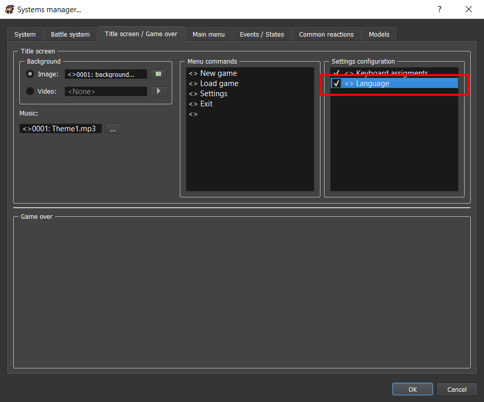
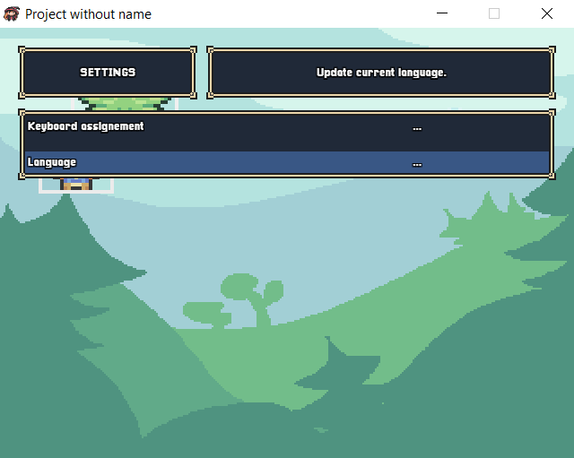

# Multi languages

RPG Paper Maker contains a languages manager, so you can have several possible translations in your game.

## Languages manager

You can open the languages manager in the tool bar by clicking on `Languages`:

* **Languages**: Edit the list of available languages:
  * `Name`: The language name \(for inside the engine\)
  * `Type`: The language type, that can be any available language in the engine, or a custom one

## Edit a translatable name

You can then edit a translatable name according to your created languages. Example with a class name:

* `Name`: Edit the main language translation directly
* _Language button_: Edit specific languages translation:
  * `All`: Edit for all the languages
  * ... and then use the tabs for editing for a specific language

## Title screen setting option

You can enable or disable languages change ingame in title screen settings in `Systems Manager > Title screen / Game over`:

Render in game:

