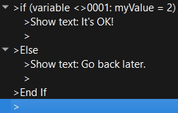
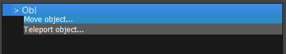
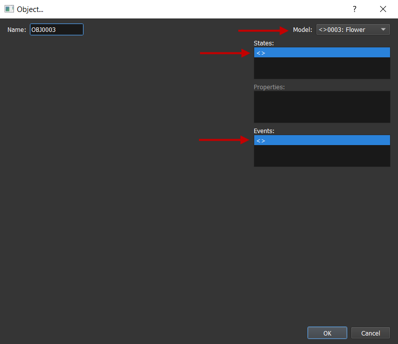

# Objects & Events

You know how to create beautiful maps, but you want to make it be alive by adding NPCs, treasures, etc. These elements are called `objects`. These objects will also react to `events` (hero action, chronometer, attack, etc.). Objects and events are here to galvanize your maps and create your game stories!

## Events 

**/! Events in RPG Paper Maker are a different notion than in RM classic series.**

You can access to events in `Systems manager > Events / States`.

Events represent the fact that something important just happened and the objects in the map can react or not to it. An event can be for example the fact that your hero pressed the action button, or even the fact that a rain tempest just started. These events are sent to objects by other objects. There are two types of events:

* **System events** (time, keyboard pressure, etc.) that are not sent by objects in the map, but by the game system itself.
* **User events** (quest completed, sword hit) that you can be created by yourself and sent thanks to local objects.

An event also takes some `parameters`. For example, if you want to play a sound each three seconds in the background, you can use the time event with the parameter time = 3000 (milliseconds) and repeat = ON. Imagine such amazing things you can do with parameters (a sword hit event taking a power parameter for example). You can choose the default value of a parameter when editing parameters of an event.

**/! Don't confuse physics and events. You should not use events for wind animations or gravity, etc.**

## Reactions 

Reactions are a tree of commands that will be executed one by one. For example a command can be to display text on screen or to move specific objects in the map. Here is an example of reaction:

This reaction will check if the variable myValue is equal to 2. If it's OK, this will display the message "It's OK!". If not, this will display the message "Go back later.".

To edit / add a new command in a reaction, `Double click` on a corresponding node. This will open this window containing a large list of commands:

We will see later all these commands details one by one.

There is also a way to find your commands faster with keyboard search:

You can also copy / paste / delete by `Right-clicking` on the corresponding command node.

## Common reactions 

If you see that you are often copying the same set of commands a lot of time maybe you should consider creating a common reaction. You can access to these in `Systems manager > Common reactions`.

This way you will be able to call this common reaction instead of always copying it. It's even taking parameters if you have some variations in your reaction.

* `Block hero when reaction`: If checked, the hero will not be able to move until the reaction is finished.

## Objects 

An object is something that can move or/and react to some events in a map. So basically a tree is not an object (except if you can cut it so it would have a reaction to an axe hit) but only a static element. It can be a NPC, a monster, or anything else. Note that your hero is an object itself so you can perfectly program its reactions.

To add an object in a map, select the `Object` map editor section. Point on a map square and `Double click` or press `Enter` after clicking on the square. This will open a new window.

.png>)

* `Name`: Choose a name for your objects. This can help later if you want to execute actions on this object externally.
* `Only one event per frame`: We will see what are events, if checked the object will have only one reaction per frame and not several in the same time.
* `Model`: Choose a model for this object. We will see later how to configure models.

### Events 

You can configure which event the object can react to in the `Events` section. `Double click` on a node:

You can select if you want a user or system event and change parameters value:

System events are the following:

* `Time`: Event sent when time interval is cleared.
  * **Interval** (default: 0): Time to wait in milliseconds.
  * **Repeat** (default: ON): Send the event after each interval or once.
* `Chronometer`: _Not available yet._
* `KeyPress`: Event sent when pressing a key on keyboard.
  * **ID** (default: anything): The ID of the key.
  * **Repeat** (default: OFF): If ON, this event will be sent as long as you press the key with a small offset at the first pressure.
  * **Immediate repeat** (default: OFF): If ON, this event will be sent as long as you press the key without any offset.
* `KeyRelease`: Event sent when releasing a key on keyboard.
  * **ID** (default: anything): The ID of the key.
* `MouseDown`: Event sent when the mouse is pressed down.
  * **X** (default: 0) : Mouse X position when event is triggered.
  * **Y** (default: 0) : Mouse Y position when event is triggered.
  * **Left** (default: ON): If ON, this event will be sent only if it's from mouse left click.
* `MouseUp`: Event sent when the mouse is up.
  * **X** (default: 0) : Mouse X position when event is triggered.
  * **Y** (default: 0) : Mouse Y position when event is triggered.
  * **Left** (default: ON): If ON, this event will be sent only if it's from mouse left click.
* `MouseMove`: Event sent when the mouse is moved.
  * **X** (default: 0) : Mouse X position when event is triggered.
  * **Y** (default: 0) : Mouse Y position when event is triggered

### States 

An object has a set of `States`. For exampleero can be in a normal state, or poisoned / vulnerable. Note that an object can be in several states at the same time.

You can add a new state on this list. There also is a `Update complete list...` button if you want to create new common states.

For each state, you have to choose different reactions to specific events. You can copy / paste reactions through states by using `Copy reaction` and `Paste reaction` buttons. These different options are also available for each state:

.png>)

* `Graphics`: Select the object graphics here (character picture). Choose below the kind of element (Sprite etc.).
*   `Moving`: Options linked to the object moves when there is no reaction.

    * `Type`: The type of moving.
      * `Fix`: The object will not move at all.
      * `Random`: The object will move randomly in the map.
      * `Route`: The object will loop on a route that you can edit with the `Edit route...` button. Check out move object command documentation [here](event-commands.md#move-object) that is exactly the same.

    NOTE: You can edit speed and frequency list in `Systems manager > System`:
* `Speed`: The speed value when the object is moving. This value is multiplied with the traveled distance with equal time. This also is multiplying the frame duration. Default value is 1.
* `Freq`: The frequency value when the object is moving. This value is changing the time in second(s) to wait before executing the next move. Default value is 0 (second(s)).

* `Name`: The name of the speed / frequency.
* `Value`: The value of the speed / frequency (can only be a number).

* `Move animation`: If checked, all the frames of the character will be drawn for move animation. If not, this will only draw the first frame of the character animation.
* `Stop animation`: If checked, all the frames of the character will be drawn for stopped animation. If not, this will only draw the first frame of the character animation.
* `Climb animation`: _(not available yet)_ If checked, all the frames of the character will be drawn for climbing animation. If not, this will only draw the first frame of the character animation.
* `Direction fix`: If checked, the graphics will not change direction to look at the hero. If not, it will look at the hero.
* `Set with camera`: If checked, the graphics will update orientation according to the camera orientation. If not, the camera orientation changes nothing.
* `Pixel offset`: If checked, the move animation will go 1px down after two frames. This adds an interesting effect.
* `Keep position`: If checked, the object always keep its position after moving, even after loading save or changing map. If not, the object position is reinitialized after loading save or changing map.
* `Detection`: A detection to select for sending an event each frames.

### Properties 

The object also has a set of properties. It can be HPs, age, gender, etc. It all depends on what you need and your type of game.

* `Name`: The property name.
* `Initial value`: The initial value of the property when the object is loaded for the first time.

## Example: create a chest 

Here is a simple way to produce a chest:

* Be sure to have a state for the chest in the systems manager when it is opened:

* Complete reactions for each state and don't forget to replace state at the end of the normal state:

## Edit / Copy / Paste / Delete an existing object 

You can open a context menu by `Right clicking` on an object:

## Models 

Models are objects that can be commonly used. You can have models list in `Systems manager > Models`.

For example, if you want to add flowers that can be picked in your maps, you can create a model "Flower", and use this model for an empty object in your map:

* Create model:

* Use model flower for a map object:

### Default model 

The model with ID 1 is the default model when you create a new object. You can change here the default information to have in an object creation.

### Hero model 

The hero is also an object and reacts to a lot of systems events:

* `KeyPress > Up, Down, Left, Right Hero`: Move the object hero to the pressed directions thanks to move object command.
* `KeyPress > Left, Right Camera`: Change the camera orientation thanks to move camera command.
* `KeyPress > Action`: Send the custom event `HeroAction` to the facing square objects thanks to the send event command.
* `KeyPress > MainMenu`: Open the main menu thanks to the open main menu command.

### Inheritance 

If an object uses a model but also has content, this new content will replace some of the model content. Models themselves can have models.

* **State**: If there is a state with the same ID, the model reactions for this state ID will be replaced by the current content.
* **Property**: If there is a property with the same name, the model reactions for this property name will be replaced by the current content.
* **Event**: This has no influence.

## Map startup reactions 

In map properties, you can see this section:

This simply is an invisible object that will be useful for kinematics when entering a new map, for example. This is invisible, so there are no state graphics. By default, it is reacting to the event `Time` with 0 for interval parameter and OFF for repeat parameter. That means that these reactions will be executed in high priority when entering the map. This can be used for kinematics and some other stuff.

## Detections 

It is important to use detection with objects. In fact, you are already using it when you react to `Hero Action` event. `Hero Action` event is an event that is sent by the hero itself to the objects that are in front of him. In order to determine where the events are sent, we use what we call `detection`.

You can access to detection list in `Systems manager > System`:

.png>)

And here is the front detection! You clearly see here that your event can be sent in front. There is an arrow indicating the square position of the object sending the event, and also the orientation. You can add detection boxes by using `left click` and `right click` to delete existing detection boxes.

* `Name`: The detection name.
* `Field`: The detection field that you can increase/decrease.
  * `Left`: Number of squares on the left side of the object sending the event.
  * `Right`: Number of squares on the right side of the object sending the event.
  * `Top`: Number of squares on the top side of the object sending the event.
  * `Bot`: Number of squares on the bot side of the object sending the event.
* `New box length/width/height`: The height that will be applied on the next boxes.
  * `Square(s)`: Number of squares for detection box length/width/height.
  * `Pixel(s)`: Number of pixels in addition for detection box length/width/height.
* `Automatic`: A way to automatically generate detection boxes adding.
  * `Circle`: Draw a circle with given `radius`.
  * `Rectangle`: Draw a rectangle with given `length` and `width`.
  * `Generate`: Clicking on this button will generate the selected form and options.
