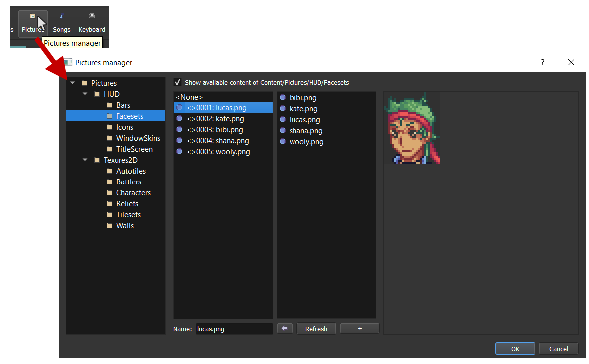
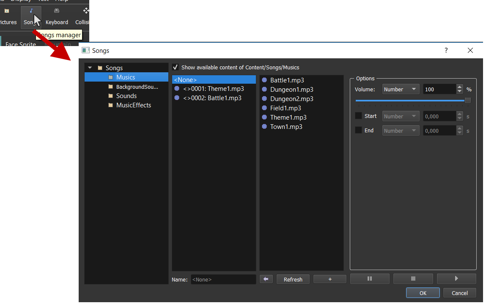
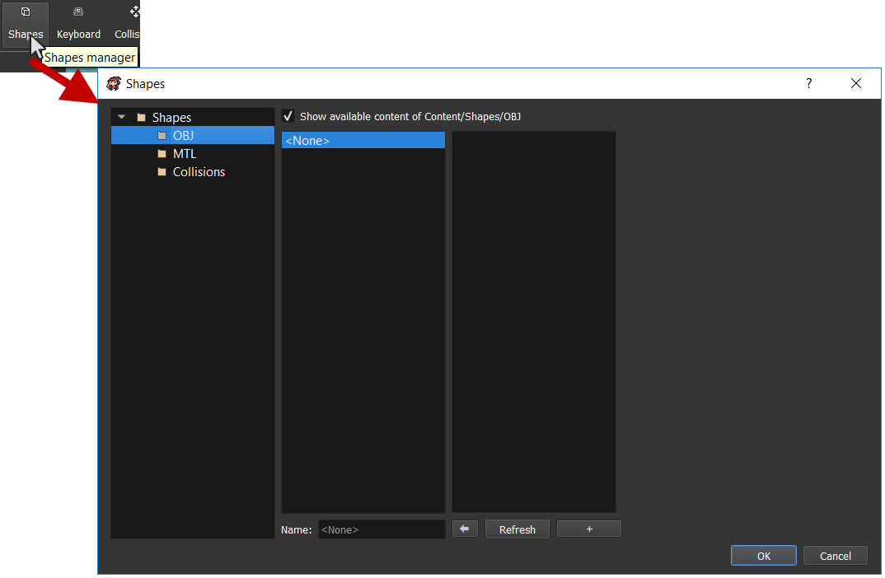

# Resources management

When you are editing your maps, you are using textures that are proposed by default. You also have, music, interfaces, etc. All this stuff is called **BR \(Basic Resources\)**. It's located to the install folder. You can find the folder location here:

You can also use `Auto` button to automaticaly find the BR folder in the RPG Paper Maker instance you are actually using.

## Manage pictures 

Open the pictures manager by clicking here on the main toolbar:

On the left, you have a tree containing all the pictures kind available in your project:

* `Bars`: All the graphic bars for specific statistics.
* `Faceset`: All the face images used in battles when targeting a character.
* `Icons`: All the icons used in the game.
* `WindowSkins`: All the information used for windows, arrows, texts, etc.
* `TitleScreen`: All the graphics for title screen.
* `Autotiles`: All the autotiles textures.
* `Battlers`: All the battlers used for battles corresponding to different sprites states.
* `Character`: All the character sprites with walk animations.
* `Reliefs`: _Not available yet._
* `Tilesets`: All the tilesets used for map textures.
* `Walls`: All the walls textures.

The second list corresponds to all the pictures that you are using in your game \(according to the kind of pictures you selected\). Each picture has an `ID` and a `name`. This system is in place in order to:

* Avoid having useless textures to be loaded
* Being able to change the names of your resources without problem

If you check the option `Show available content of ...`, this will show the available pictures that are located in the Basic Resources folder.

## Add / Remove pictures 

To add pictures in your game list: select a picture in the available content list, and press on the `left arrow` button below \(or `double click`\). To remove a picture in your game list, select one of your used picture and press `Del` on you keyboard.

## Use my custom pictures 

Click on the `+` button and select one or several pictures. This will add your custom pictures in the available content list. Not that you can distinguish BR and non BR pictures thanks to the bullets colors:

If you added your pictures manually inside the project folder, you will need to use the `Refresh` button in order to see your changes in the list.

Now add your pictures to your game project the same way you did for BR pictures!

## Manage songs 

Songs are also a resource proposed in the BR. Open the songs manager by clicking here on the main toolbar:

You can manage your songs exactly like pictures. You can also test music options on the right:

* `Volume`: The song volume \(in %\).
* `Start`: The beginning time of the song in seconds.
* `End`: The end time of the song in seconds.

Also note that there are four sorts of songs:

* `Music`: Music that are looping \(used for maps themes, battle musics, etc.\).
* `Background sounds`: Sounds that are looping on top of the current played music \(used for rain, wind, etc.\).
* `Sounds`: Sound played one \(used for cursor, attacks sounds, etc.\).
* `Music effects`: Short music stopping the currently played music. After the end of this music, the previously played music goes back \(used for object found music, level up music, etc.\).

## Manage shapes 

You can import your own 3D models in your maps! Open the shapes manager by clicking here on the main toolbar:

Again, you can manage your songs exactly like pictures. Here are the different kind of shapes that you can handle:

* `OBJ`: `.obj` files for importing 3D objects models.
* `MTL` **\(not available yet\)**
* `Collisions`: **\(not available yet\)**

