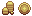
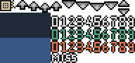

# Resource management

##

## -- Overview

This section will explain how to create, import, and manage all your resource files.&#x20;

## -- Types of resources

There are many types of resource files used in RPM. You can see this by looking in the main resource folder for your project.&#x20;

You can navigate there manually or press the FOLDER button on the main toolbar.&#x20;

<figure><figcaption></figcaption></figure>

Then find your way to the Content folder.&#x20;

<figure><figcaption></figcaption></figure>

Don't use subfolders inside these default folders of your project, the editor will not see them.&#x20;

### Datas&#x20;

This is for items that don't fit any other category and are mostly just data you won't normally touch.&#x20;

The folder itself contains .json files that make up the database of your project. There are some ways to manipulate this stuff but it's for advanced users.&#x20;

If something in your project gets corrupted you might be instructed to replace these files to fix it. It may allow transferring database info between projects, but it's unconfirmed territory. User beware and always make backup copies if you go messing around in here.

* Maps - This is where your maps are stored. A folder is created for each one starting with MAP0001. It seems that deleting a map in the editor does not delete it's folder here.&#x20;
* Saves - This is where save games are stored from playing the game. While working on your project and using test play, they will appear here as normal. When you use the built-in export function the save games will NOT go with it.&#x20;
* Scripts - This is for advanced programmers. If you don't know what it does, don't touch it.

### Fonts

This is for your fonts. Place them here and set them up in the database.&#x20;

### Images

This is for all your graphics. It's separated into 2 categories:

* HUD - These are used for drawing things on screen.
  * Animations - Battle effects like visual effects, weapons, and spells.
  * Bars - HP bars, etc.&#x20;
  * Facesets - Images to show alongside dialogue/messages.
  * GameOver - Full screen images to display on game over.
  * Icons - Small images to show inside messages or next to item names.&#x20;
  * Pictures - Images of any size to be drawn and manipulated on screen.
  * TitleScreen - Full screen images to display on the title screen.
  * WindowSkins - Used to make up all the windows drawn.&#x20;
* Textures2D - These are used for mapping and objects.
  * Autotiles - Special tiles that change based on how they are drawn.&#x20;
  * Battlers - Used for all characters/targets in battle.&#x20;
  * Characters - Sprite sheets you attach to objects.&#x20;
  * Mountains - Images that make up the squares/slopes of mountain tiles.&#x20;
  * Objects3D - Pre-rendered models you attach to objects or place directly on maps.&#x20;
  * Particles - Images used for particle based functions, like weather effects (rain/snow).
  * SkyBoxes - Images used to make up the cube of SkyBoxes.&#x20;
  * Tilesets - Images used to draw tiles and objects on your maps.
  * Walls - Images that are used for the Wall draw type.&#x20;

### Shapes

Used for something, probably. Needs more data. There are 3 folders here:

* Collisions
* MTL
* OBJ

### Songs

This is for all the audio of your game.&#x20;

* BackgroundSounds - Repeating sound files.
* MusicEffects - Non-repeating music files that pause the currently playing music.&#x20;
* Musics - Repeating music files.&#x20;
* Sounds - Non-repeating sound files.&#x20;

### Styles

Used for something, probably. Needs more data. By default it contains a .css file.

### Videos

This is for video files you can play in your game.&#x20;

## -- How to import&#x20;

There are a few different ways depending on the type of resource. Here's how to add them in the editor:

<figure><figcaption></figcaption></figure>

There are individual windows for each type and they have 2 different appearances. You access them from this part of the main toolbar.

### Pictures / Videos / Songs / Shapes / Fonts

<figure><figcaption></figcaption></figure>

These windows have 3 columns. On the left is where you start by choosing the subtype to work on. Sometimes there is only one to choose from. The middle columns shows what resources are imported and ready to use. The right column shows what files are on your computer and available to import from the project resource folder. The check box at the top must be enabled to see the right column.

If the item you want to import is not in the right column then you can press the + button to add a file from anywhere on your computer. The export button doesn't seem to work for me, so I'm not sure. I assume it's supposed to let you pull files out of the game.&#x20;

There are 2 buttons between the middle and right columns.&#x20;

* The arrow moves an item from the right column into the middle column. You can also double click it for the same result.
* The red X is to delete the highlighted item in the middle column. It has no effect on the right column. You can press the delete key to delete from either column. Deleting files from the right column will also delete them from project folder, so be careful.

When you place a resource in the middle column it's assigned the next available ID number and put at the bottom of the list. You can safely rearrange these. The blue icons are the default graphics, and red icons are for your custom imported resources.&#x20;

You can rename them if you want. That won't change the name of the actual file so it might be difficult to find the actual file later to match what you called it in the engine. Keep that in mind. This would be used if you change the file name, and want the engine to match. &#x20;

! IMPORTANT ! Make sure you remove a resource from the middle column if you plan to delete it from the project folder. Otherwise you will get an error when it tries to load it in game.&#x20;

When you add new files to the project folder directly while the engine is open, you may need to close and reopen any windows for it to refresh and see them. Some windows have a REFRESH button for this purpose. If you make direct changes to a file in an external program you will need to refresh to see it. Often switching between maps, opening a menu like DATAS/SYSTEMS, or saving the project should do this.&#x20;

Because there are multiple columns it's important to ensure you have the correct one highlighted when performing actions. You might go to pick an item and browse the right column, then press OK thinking that one is selected. But unless you select that item from the left column it won't be correct.&#x20;

### Autotiles / Walls / 3D Objects / Mountains

<figure><figcaption></figcaption></figure>

These types have a more simplified window. It starts with the list on the left. Click the + or use SET MAX to increase the list and add more items.&#x20;

Give your new entry a name and use the TEXTURE field to choose the resource file. This window functions like above; move items from right to left then make sure you select the correct one from the left column.&#x20;

Each of these types use the same list concept, but have a few different options and will be explained later.

## -- Resource properties

A common question about resources is: how do I arrange my graphics? Most programs use set values and templates for how they have to be arranged. While this is true for a few things in RPM, like the top line in a CHARACTER file is the object facing south, the size of the whole image is often up to you.&#x20;

Every resource is made up of frames.&#x20;

<figure><figcaption></figcaption></figure>

This is like a canvas where you paint your graphic. The player will only see 1 frame at a time. And you only have so much room. Is your sprite is too large to fit in the canvas? Make the canvas larger.

<figure><figcaption></figcaption></figure>

When you stack these together you get a whole resource file - ready to be placed in your project folder. The engine takes that whole file and cuts it into equal pieces based on your settings.

<figure><figcaption></figcaption></figure>

Generally the frames go from left to right. The leftmost one being what the player sees first and what is used when it's set to not animate. It also serves as the standing pose. When you stop moving it resets to frame 1.&#x20;

You can find most of the settings discussed in this chapter in SYSTEMS, on the SYSTEM tab.&#x20;

<figure><figcaption></figcaption></figure>

* Map frame duration - This determines the speed of all animations outside of battle. This affects anything you might use on a map except for anything that has it's own duration setting. Numbers for duration are in milliseconds, so only make small changes to it.&#x20;
* Animation frames - This determines how many frames for the resource files: Characters, (needs more data)
* Battlers frames - This determines how many frames for the sprites used in battle, characters/targets.&#x20;
* Battlers rows - This determines how many poses for the battle sprites.&#x20;
* Autotiles frames - This will determine how many frames, but only for autotiles.
* Autotiles frame duration - This will set the speed, but only for autotiles.&#x20;

So to create your resource - stack your variable sized canvas to a size that equals FRAMES x POSES. You decide the number of frames, but most of the resources don't let you choose how many poses. You will need to know the number for each type. You can look at the default resources(BR) as a reference, your other files already imported, or bookmark this page.

Let's look at the rules for each type:

### Fonts

There are no real restrictions (that I've seen) but there are properties you should know about.&#x20;

The menus in and out of battle are drawn with fixed distances between words/numbers. So if your large font takes up all the space a lot of information will be cut off.&#x20;

One example is the stats. If you give the stats long names it pushes the numbers out of sight. You can minimize this by keeping things brief that show up in menus. Or just switch to a smaller font.

Certain fonts, like retro ones, don't look good below a certain size and it still leads to cut off information. Run your fonts through all the menus to test how they align. &#x20;

### Animations

* Frames - Fixed @ 5
* Poses - Fixed @ 5
* Canvas size - Infinite

<figure><figcaption></figcaption></figure>

This one doesn't have poses. Instead each frame is made available for the animation editor. You can use any size as long as it's in a 5x5 grid.&#x20;

If you need large and small images, set your canvas size to the larger one and use that for the small image. You might want to center small images in the frame.&#x20;

### Bars

This is new and needs more data

<figure><figcaption></figcaption></figure>

### Facesets

* Frames - Infinite
* Poses - Infinite
* Canvas size - User defined

<figure><figcaption></figcaption></figure>

This one doesn't have poses. Instead each frame is made available when picking a faceset in the editor. You can add as many as you want, as long as they have the same canvas size. All facesets have to use the same size canvas, but you can put small images in and adjust it's position as needed.&#x20;

Or you can instead use the Show Picture command for facesets. That would allow animation. In fact, you can make the default message box transparent (with external image software) and use Show Picture for all messages, for maximum flexibility. (This can't be done for menus, just dialogue boxes)

You have some settings in SYSTEMS:

<figure><figcaption></figcaption></figure>

* Default Dialog box options - Opens a window with the settings shown in the next image.
* Facesets size - This is the canvas size of your frames.&#x20;
* Faceset scaling width - Needs more data
* Faceset scaling height - Needs more data

<figure><figcaption></figcaption></figure>

* Position - Above or Below, determines if it shows on top of the message box or below. This might be used for large busts that go behind the message box.&#x20;
* X - Offset the image left/right from it's default position.
* Y - Offset the image up/down from it's default position.

That default position is on the left side of the message box.&#x20;

### GameOver

* Single file - No frames/poses

Any image is stretched to fit the current game window.&#x20;

The game runs at different resolutions between full screen and windowed mode, so this ensures the image always fits.&#x20;

### Icons

* Frames - Infinite
* Poses - Infinite
* Canvas - User defined

<figure><figcaption></figcaption></figure>

<figure><figcaption></figcaption></figure>

There are no poses. All icons are available when entering text in a Show Message command or creating items in DATAS. You can do single icons per file, group similar ones across a few files, or jam everything into one. You can find the setting for canvas size in SYSTEMS.&#x20;

### Pictures

* Single file - No frames/poses

These are all single images of any shape and size. (Well technically they are either square or rectangle)

### TitleScreen

Single file - No frames/poses

Works the same as GameOver. If you use a video for the title screen, it freezes on the last frame of the video. So you can put your title screen image there and it will remain on screen after the video is done.&#x20;

### WindowSkins

* Needs more data

<figure><figcaption></figcaption></figure>

The idea is that you have a large file with all the menu elements, and then in the settings you choose the size (and placement?) of each individual element. So it takes some testing and coordination with the settings for this one.&#x20;

If you want to try, take a look at the default settings and tweak those values one by one to see the result.&#x20;

### Autotiles

* Needs more data

There are 2 kinds of autotiles. Normal static ones look like this:

<figure><figcaption></figcaption></figure>

Each color seen here (2x3 tiles each) will be displayed as a single tile in the editor. You can put more than one into a single file, but the specifics on sizes need more data.

They contain all the possible shapes to auto create paths and edges based on how you draw the tiles. It's best to try drawing with some of these to better understand how they get assembled.&#x20;

If you want to do animated tiles, arrange each file like this:

<figure><figcaption></figcaption></figure>

Like most other animating resources you will add frames from left to right. The whole 2x3 block is your "frame". This will show up as a single vertical line of tiles in the editor.&#x20;

In order for the animation to work you need to check the box for ANIMATE when picking it.&#x20;

### Battlers

* Frames - User defined
* Poses - User defined
* Canvas size - Infinite

<figure><figcaption></figcaption></figure>

You set the frames and number of poses in SYSTEMS, and canvas size is your choice.&#x20;

The editor calls the first pose number 0, and counts up from there. These default poses can't be changed but any new poses you add can be further defined in DATAS on the STATUS tab.

This one is for the Death status. What it does is change your sprite to pose 8 when inflicted with the Death status.&#x20;

<figure><figcaption></figcaption></figure>

The other poses are hardwired into the battle system to trigger when you do the following:

0 - Idle\
1 - \
Need that data, it's around here somewhere. Stuff like attacking, using a skill, taking damage. \
8 - Dead

We use 8 even though it's the 9th pose of the whole file, because we start counting at 0.&#x20;

By creating a new status and assigning it a new pose(battle position), all you have to do is inflict the player with that status and the pose will change. However built in actions might override this.&#x20;

More data is needed on using extra poses.&#x20;

### Characters

* Frames - User defined
* Poses - Locked @ 4 (Each direction)
* Canvas - Infinite

<figure><figcaption></figcaption></figure>

You can add more frames in SYSTEMS by increasing the Animation Frames. The first pose is always facing SOUTH, and each subsequent pose turns clockwise. D, L, U, R.

The canvas size is up to you but you'll want to keep the sprites centered horizontally. The main body of the object should be in the center. If there is an uneven side, like holding a long sword, you should increase the canvas width on the opposite side to keep the body in the middle. This becomes important when working in 3D where you can turn the camera.

For a sprite to appear to be touching the ground it's bottom will need to rest at the bottom of the canvas. Raising it up will bring it off the ground. This is used for flying things and even jumping animations.&#x20;

You can use tileset tiles instead but they are limited. It can be helpful to take a tile from the tileset and make it into a character sheet.

### Mountains

* Unique file - No frames/poses
* Canvas - Locked @ 48x48

Like autotiles these contain all the graphics needed to make shapes. You chose what kind of shape to draw and the engine wraps this around it like a texture.

There are 2 approaches to this:

<figure><figcaption></figcaption></figure>

You can create a single large 3x3 tile and let the engine cut it to pieces to fill your shape.&#x20;

<figure><figcaption></figcaption></figure>

Or you can copy a single tile 9 times to fill up the 3x3 tile. Now it will fill the shape only with that single tile. This is very useful for retro games. Slopes still create angles of overlap.&#x20;

! IMPORTANT ! You can't have a single pixel of transparency on these files. If you do, the entire thing appears transparent. Not sure if this is a bug or intended, but it might change in the future.&#x20;

### Objects3D

* Needs more data

You can make these with an external program or you can make an image with all the textures flattened out and the engine will fold it into a 3D object.

<figure><figcaption></figcaption></figure>

### Particles

* Single file - No frames/poses

An image of any size that is drawn on the screen in various ways. Right now this only applies to the weather affects. But you can add anything you want - like having it rain coins, comets, or cats and dogs.&#x20;

### SkyBoxes

* Unique file - No frames/poses
* Canvas - Needs more data

<figure><figcaption></figcaption></figure>

The default ones are 256x256. You can make one image and use it for all 6 sides of the cube, or you can make the other images unique - even connected for full effect.&#x20;

It appears pretty far away, using average fixed camera angles, and you rarely see much of it connecting. Especially the bottom half of the cube. Do some tests with the camera angles of your game before spending much time making these, for better results.&#x20;

(I recall doing some testing and I could use some different sizes, but large images didn't work right. Needs data)

### Tilesets

* Single file - No frames/poses
* Canvas - Infinite

An important factor here is your square size, found in SYSTEMS. Square = Tile. So all of your tiles on the tileset need to match this number. It's best to have it match your other graphics if you want things to line up.&#x20;

It doesn't have to be the same number. If your characters are 64x64 you can still use 16 or 32 as the tile size, but you'll need to draw multiple tiles to fit under the character. It might have other side effects as well, like making things appear disproportionally sized. It's best to sort this out early, run some tests, and try to avoid changing it in the middle of development.&#x20;

### Walls

* Unique file - No frames/poses
* Canvas - Variable

<figure><figcaption></figcaption></figure>

These work very similar to mountains. In fact, when I make a mountain resource I drop a copy of it in the Walls folder. They share the same size and are cut up in a similar way to fill the length of the wall. \
\
The difference is that you can make these different sizes and they can have transparency.&#x20;

<figure><figcaption></figcaption></figure>

More data is needed on the canvas size limits. (I didn't know until I wrote this that walls could be a different size)

### Shapes

* Needs more data

Used in conjunction with 3D objects.&#x20;

### Songs

All sub types found in this folder seem fine using the common file types.&#x20;

Confirmed working:

* .wav
* .mp3
* .ogg

### Videos

The engine seems fine using the common file types. Videos are anchored in the upper left corner. If they are too small the rest of the screen is filled with black color. If it's too large it will be cut off.&#x20;

Confirmed working:

* .mp4
* Most others, but I'll need to check my data to list them. There's about 4-5 others.&#x20;

The only hiccup is that not all file types will work in the preview box of the editor, but it still plays fine in the game. The only thing to note is that longer files take longer to load.&#x20;

Based on my testing there is no noticeable difference in load times or quality between different file types of the same length. Use whatever works best for your needs. Maybe you want to ensure it works in preview mode. Maybe you want the best compression, or the highest quality.&#x20;

### -- Conclusion

That covers how to create and import all the types of resources currently available. One more reminder to always run tests on your resource sizes. Working in 3D adds a new layer of complexity on how things actually appear in the game that some users may not be used to. Your choice of camera angle will set the stage.&#x20;

The following chapters will go into more detail on configuring some of these resources.&#x20;

&#x20;                                                 Written by KevinOfNine
