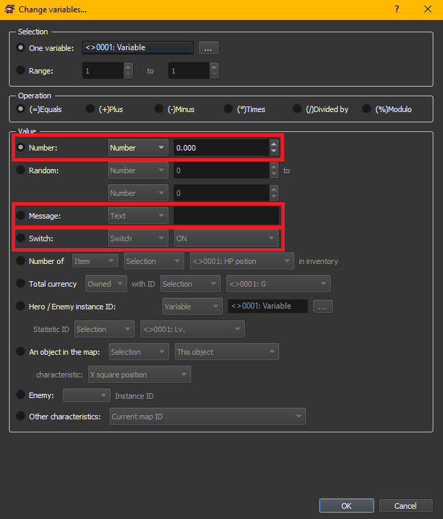
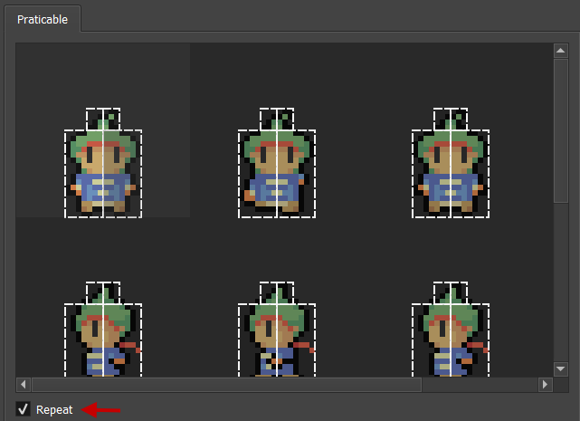

# Tilesets & Collisions

## -- Overview

This section will explain how to setup your tiles and the collisions that determine where objects can go within your maps. Along with some of the basics of how objects can interact with each other.&#x20;

## -- Tilesets 

A tileset is the file that contains all the individual tiles that are available to draw on each map. You can have as many tilesets as you want, but you can only select one tileset per map. The tileset your map uses can be changed with a command mid-game.&#x20;

The database entry allows you to set various properties of those tiles. You can use the same tileset for more than one entry and set different properties for each one.&#x20;

Tileset files must be placed in the project folder under /images/textures/tilesets.

### Add a new tileset

Open the Data Manager and click the Tilesets tab

<figure><figcaption></figcaption></figure>

<figure><figcaption></figcaption></figure>

As with all data lists, click the + to create a new entry.&#x20;

<figure><figcaption></figcaption></figure>

Then click the Picture button to select your tileset file.&#x20;

<figure><figcaption></figcaption></figure>

Make sure the file you want to use is on the left side and that it is highlighted before clicking OK.&#x20;

<figure><figcaption>
Files on the right are in your project folder. If you don't see them, click the checkbox "Show available content".
</figcaption></figure>

### Tileset Properties

Now that you have a new tileset entry, it's time to set it's properties. If you don't, the player will be able to walk over/through everything.&#x20;

### - Battle Map

The Battle Map setting lets you choose which map/position is used by default when you allow random battles on the map (Located in the Map Properties>Battles tab).

<figure><figcaption>
These are created on the Systems>Battle Systems tab.
</figcaption></figure>

It's not required to set this option on the tileset. You can set it in the Map Properties as well.&#x20;

### - Practicable&#x20;

This tab allows you to set collisions that will be applied only when the tile is used as a Sprite. This setting has no effect on floor tiles.&#x20;

<figure><figcaption></figcaption></figure>

Start by clicking on a tile to create a dotted square. Then you can resize the square by dragging the edges. Larger objects require you to click multiple tiles.&#x20;

You can right click and choose edit to use specific numbers for more accurate squares.&#x20;

<figure><figcaption></figcaption></figure>

To delete a square you can click on it to highlight it in purple, then press Delete on your keyboard. Or you can right click a square and choose Delete.&#x20;

### - Directions&#x20;

This tab controls how an object can walk over a tile when it's used as a Floor tile.&#x20;

<figure><figcaption></figcaption></figure>

Each tile has 4 arrows that determine which side of the tile the player can walk through.&#x20;

An arrow means you CAN walk through that side.&#x20;

A square means you CAN'T.

You can click each individual arrow to make change. If you click the square in the middle it toggles each one. Arrows become squares and squares become arrows.&#x20;

Here are some common uses, with red lines indicating where you can't walk:

<figure><figcaption></figcaption></figure>

1. A tile that can only be entered from the north side
2. A tile that can't be walked on at all
3. A tile that only allows north-south
4. A tile that only allows east-west

### - Terrain

This tab allows you to assign ID numbers to each tile which can be used in your code to identify what tile an object is standing on. This can have many uses like making the object slow down, take damage, or checking if they can jump onto that tile.&#x20;

<figure><figcaption></figcaption></figure>

Left click to increase the number and right click to decrease it.

To make use of Terrain ID, start by using the Set Variable command:

<figure><figcaption></figcaption></figure>

It will check which tile the object is standing on and write the Terrain ID into a variable. You can then use a Condition to decide what happens when a certain ID is found:

<figure><figcaption></figcaption></figure>

### - Climbing

This tab lets you set a tile to be climbable when it's used as a Sprite. When enabled, an object that walks into it will automatically climb up one side and down the other.&#x20;

<figure><figcaption></figcaption></figure>

An O means it CAN be climbed.

An X means it CAN'T.

When the player first starts climbing, whatever direction they are holding will be "forward". Pressing the opposite direction will be "back", allowing them go back the way they came.&#x20;

When you reach the top, it has a small area that is treated as a floor tile. You can walk around normally until you touch an edge, then you will start to climb down whatever side you touch.

This is a new feature and can be a little buggy. Placement of your sprite is very important when used as a ladder. The top needs to be placed close to the edge of the floor tile for you to be able to transition from the top of the ladder to the higher ground.&#x20;

There is a setting that determines climbing speed on the Systems>System tab:

<figure><figcaption>
You can use a variable to adjust it mid-game
</figcaption></figure>

Some of these tabs allow you to change the zoom.

<figure><figcaption></figcaption></figure>

## -- Other types

There are several other types of special tiles that can be placed on your maps. They each have their own drawing tool in the editor and method for importing.&#x20;

Currently all these are linked to the tileset. When you make a new tileset you will have to import them all over again to have them show up in the list.&#x20;

If you want to keep them, you can copy a tileset entry so it includes all these. However you will have to adjust all the Practicable, Direction, Terrain, and Climbable settings.&#x20;

Staring with version 3.0, these will no longer be linked to a tileset. So all of them will always be available, no matter which tileset you use.&#x20;

### - Autotiles&#x20;

These are special floor tiles that will change shape when you draw the same tile next to it. It takes pieces of a few preset tiles to form continuous shapes. Often used for things like roads or water.&#x20;

Autotile files must be placed in the project folder under /images/textures/autotiles.

<figure><figcaption></figcaption></figure>

Here is an example of how the graphic file is laid out:

<figure><figcaption>
is this out of date?
</figcaption></figure>

The first square is used when you draw a single tile. Next to that is the square containing the pieces that will be used for corners. And below that are the squares used for long lines and inverse corners. The engine will use 1/4 or 1/2 of these tiles to create the whole shapes.&#x20;

To add a new one, click the Autotiles icon:

<figure><figcaption></figcaption></figure>

Click the + to add a new entry, then the texture button to choose the file for that entry:

<figure><figcaption>
On this screen, each Autotile is represented by a single square, which is how it will appear in the editor
</figcaption></figure>

When choosing a texture file you can have multiple Autotiles in a single file. It will look like this:

<figure><figcaption></figcaption></figure>

An animated Autotile has its frames organized from left to right, and will look like this:

<figure><figcaption></figcaption></figure>

You must check the box for "Animated" to designate an entire file as animated tiles. Therefore you can't mix animated and non-animated Autotiles in the same file.&#x20;

When you check the box for Animated it assumes all frames on the top row are for the same Autotile. All frames on that row will be grouped together. To add more Autotiles, they must be placed below and not to the side.&#x20;

The number of frames and speed of an Autotile is set in the Systems Manager:

<figure><figcaption></figcaption></figure>

Once you have imported all the files, you must add them to the list. First choose the Autotile drawing tool:

<figure><figcaption></figcaption></figure>

Then on the left, click on Update List:

<figure><figcaption>
This step may not be required after version 3.0
</figcaption></figure>

Move them to the left so they can be used:

<figure><figcaption></figcaption></figure>

### - Walls

These are special sprites that can be drawn as vertical walls of any length. They can only be drawn in straight lines, from point A to point B.

Wall files must be placed in the project folder under /images/textures/walls.

Click the Walls icon to add new ones to the list:

<figure><figcaption></figcaption></figure>

Move them to the left side to make them available when using the Walls draw tool.&#x20;

<figure><figcaption></figcaption></figure>

You will see a white line indicating the starting point of the wall.&#x20;

<figure><figcaption></figcaption></figure>

Click and drag with the left mouse button to see your wall extend. Release the button to finish.&#x20;

<figure><figcaption></figcaption></figure>

If you do not create a straight line, the wall will disappear and show red lines. Meaning you can't draw it like that. Releasing the mouse button like this will cancel the attempt.&#x20;

<figure><figcaption></figcaption></figure>

To delete a wall, right click any part of the wall and drag your mouse. When you release, it will delete that section of the wall.&#x20;

<figure><figcaption></figcaption></figure>

### - 3D Objects

These are special objects with more details and options available. They can be pre-made in external programs like Blender or made from wrapping an image texture around a box.&#x20;

3D Object files must be placed in the project folder under /images/textures/objects3D.

See the 3D Objects section for further information.

[3d-objects.md](3d-objects.md "mention")

### - Mountains

These are special textures that are used to form cubes or shapes of various size and shape. They are mainly used as mountain but can be used creatively for other purposes like stairs and doors.&#x20;

Mountain files must be placed in the project folder under /images/textures/mountains.

Click the Mountains icon to add them to the list:

<figure><figcaption></figcaption></figure>

Move them to the left side to make them available when using the Mountain draw tool.

<figure><figcaption></figcaption></figure>

Choose which texture you want to use, then adjust the Settings to select the size and shape.

These default settings create a cube that is 1 tile x 1 tile. The actual size in px depends on your system setting for Square Size. Mountain collision height and angle will affect how objects interact with them.

<figure><figcaption></figcaption></figure>

Adjust the Border Height to make a cube that is taller or shorter. You must increase the pixel setting before setting the square setting to 0.&#x20;

If the Border Height in px is equal to or lower than the Mountain collision height setting, the object will climb over it.&#x20;

For example, this mountain size will allow the player to walk on top of it because the Mountain collision height setting is currently on 4.&#x20;

<figure><figcaption></figcaption></figure>

1 square of the border height is equal to the square size setting. So using the defaults, you would need to set the Mountain collision height setting to 16 to allow objects to climb over a mountain with a border height of 1 square.&#x20;

When drawing mountains you can stack single cubes on top of each other, or change the border height. Each method will create a different looking mountain.&#x20;

<figure><figcaption></figcaption></figure>

By drawing the same texture next to it, the engine will combine them and create a continuous wall. It will not merge different textures.&#x20;

<figure><figcaption></figcaption></figure>

When you adjust the Border Width, it will change from a cube to a cube with angled sides.&#x20;

<figure><figcaption></figcaption></figure>

The Angle listed corresponds to the Mountain collision angle setting. If the angle is equal to or less than the setting, the player will be able to walk up the slope.&#x20;

Both of the Mountain collision settings can be variables and changed mid-game.

The engine doesn't offer single tile slopes yet, but you can create them by using border width and height of 1. Then placing cubes to cover the angled sides.&#x20;

<figure><figcaption>
You might want to make it 2 tiles wide for easy access
</figcaption></figure>

## -- Collisions 

Collisions control how objects interact with each other and the environment. When you import new resources they will not have a collision. YOU MUST ALWAYS set a collision for anything that should be solid, otherwise you may have bugs. Like your hero walking through walls.&#x20;

These bounding boxes are red and determine where an object can/can't walk. The above settings for tiles and characters use red ones.&#x20;

There is another type of box that is blue and is used for other interactions, like talking and attacking. The Send Event command uses blue ones. More on this below.&#x20;

### Bounding boxes 

A Bounding Box is a simple geometric shape that is used to check for an interaction between 2 objects. When you set a square collision, it is automatically turned into a cube that is placed around the sprite.&#x20;

<figure><figcaption>
A cylinder requires more processing, so cubes are used to increase performance
</figcaption></figure>

When an object with a collision moves, the engine will check if it's red bounding box touches another red bounding box and stop it from moving. This is why if there is no collision, it will walk through everything.

For object interactions, like getting hurt when you touch an enemy, the Send Event command is used to create a new collision/bounding box. Then you can choose what happens when that collides with something. More on this below.

To see the bounding boxes as you play, you can enable it from the editor. This can be useful for debugging or just to understand how things work.

Check the following option:

<figure><figcaption></figcaption></figure>

<figure><figcaption>
This can cause lag on low-end computers
</figcaption></figure>

When the camera is facing N, E, S, or W the red bounding box will appear as a diamond.&#x20;

When the camera is facing in between, like NE or SW, the red bounding box will appear as a square.&#x20;

<figure><figcaption>
Other boxes turn as well, but it can possibly change how 2 boxes interact
</figcaption></figure>

The different shapes will affect how your object moves in the game world. Floor tiles will be square and your hero is a diamond. So if even the tip of the diamond touches the floor tile, you won't be able to pass.&#x20;

<figure><figcaption></figcaption></figure>

The tip of the diamond extends below the visual appearance of the sprite, so it can take a while for players to adjust. They might think the collision is only the yellow line, but it also includes the red triangle.&#x20;

The edges of the bounding box determine when an interaction is triggered, not when they overlap. Assuming you have a tile size of 16 px, if your bounding box is 16 px tall you will not be able to walk under a 1 tile high space like this:&#x20;

<figure><figcaption></figcaption></figure>

Because the top edge of your box touches the bottom edge of the tile above and won't let you pass. You need to change the height of your box to 15 px to pass under. You may or may not want this behavior, it's your choice.&#x20;

### Different shapes 

Depending on which sprite you are using, bounding boxes can be various shapes:

Fix sprites are flat. The player will be able to walk closer to them.

Other types of sprites will have a full diamond like the player. The player will have to walk further north/south in order to pass by. &#x20;

<figure><figcaption>
Floor tiles
</figcaption></figure>

Floor tiles that are set to block the hero, like the dark square, don't show a bounding box. However, you can imagine something like this flat red bounding box in it's place. In this scenario, the hero is unable to walk directly S or W because the tips of it's diamond are hitting the blocked floor tile.&#x20;

Autotiles work the same way as floor tiles.

Mountains have a few options:

<figure><figcaption></figcaption></figure>

* The default is going to be the most common. This will make the collision match the size and shape of the mountain.&#x20;
* Force Always (not sure, needs more specific data)
* Force Never would be used to allow an object to pass through. One example, using a mountain tile as a door.&#x20;

Walls work similar to sprites, in that they will have Practicable and Climbable tabs.&#x20;

3D Objects have their own special options for collisions, however it is not fully implemented. There are 2 places to set collisions for these:

1. Collisions icon > 3D Objects tab

<figure><figcaption>
3D Objects
</figcaption></figure>

You are limited to NONE, or SIMPLIFIED. Which likely uses the basic shape/size of the object as it's collision. Needs more data.&#x20;

2. 3D Objects icon

<figure><figcaption>
3D Objects
</figcaption></figure>

It provides the same options, just in a different place. Changing it in one place, also changes it in the other.&#x20;

## -- How to set collisions 

The best place to adjust your collisions will be the Collisions Manager since it combines all collision types in one place. This is the only place to set collisions for Characters, but all others have a second place to set them.&#x20;

<figure><figcaption></figcaption></figure>

It's good practice to set collisions when you import the graphics, like in the Tileset or Autotiles windows.  But if you need to adjust them later, Collisions will be your central location.&#x20;

### - Characters 

To set collisions for your characters, click the Collision icon and choose the Character tab. Remember this is the only place to set them and you must set them every time you import a new character that should have a collision.&#x20;

Since characters are animated, you can set a different collision for each frame. This would be useful for a character that drastically changes shape as it animates.

In general, it's easier to manage when all frames share the same collision. By checking the box for Repeat, all frames will use the collision from the first frame.&#x20;

The size and shape of this collision may vary, but generally you will make the width no larger than the square size. If it is larger, the object will not be able to pass through narrow spaces. Then you will have to tailor your maps to fit the larger collisions.

<figure><figcaption>
One way to get around this is to walk NE or NW into this passage, instead of trying to walk directly N through it 
</figcaption></figure>

If the player collision is exactly the size of 1 square, it can be difficult for the player to walk into those narrow spaces. Since they have to be perfectly aligned to do so. By shrinking the collision by 1 or 2 px, it makes that easier. Keep in mind that if you make it too small, the edges of your sprite will appear inside walls.

### - Objects

Objects will use whatever collision is set for the sprite you choose.

<figure><figcaption></figcaption></figure>

This will apply the collision of that hero. If you choose no sprite, then it will have no red bounding box to block other objects. However, it can still be interacted with using blue bounding boxes like those used by the Hero Action event.&#x20;

### - Send Events

The Send Event command is used to create special bounding boxes that allow you to create a wide range of actions. This lets you choose the size and shape of the box along with the action that is triggered when it interacts with another object.&#x20;

This is one of the most useful commands available in RPM.&#x20;

The first step to using this command is to make a Detection in the Systems Manager:

<figure><figcaption></figcaption></figure>

You can make a bounding box that will be placed at the location of the object that runs the Send Event command. The size and shape will depend on what you want to do, so how you complete this step will vary.&#x20;

<figure><figcaption></figcaption></figure>

The arrow indicates the object that runs the command, so you can position as needed (in front, behind, to the side, etc). Let's look at the Hero Action example. This will be programmed into your Hero model by default in your new project.&#x20;

You can find it in Systems > Model tab > Hero > Keypress \[Action] Event:

<figure><figcaption></figcaption></figure>

Under Target, by choosing a Detection ID, you can select the bounding box you want to appear. This action uses "Front".&#x20;

Under Event, you choose what Event will be triggered if another object it is hit by the bounding box. This action uses "Hero Action".

When you press the Accept button, this small bounding box appears in front of the hero.&#x20;

<figure><figcaption></figcaption></figure>

On it's own this does nothing. If you walk up to this empty sign object and talk to it, nothing happens.&#x20;

The most important part of this equation is the Event on the object that this bounding box touches. By adding a Hero Action Event, you have a place to put code that will run when the Hero Action bounding box touches it.&#x20;

<figure><figcaption></figcaption></figure>

Now if you talk to the sign, it will display a message. This is the most basic example that most users might already be somewhat familiar with.&#x20;

This command will be explained further in it's own section.

There is also a Detection option in the bottom of the object window:

<figure><figcaption></figcaption></figure>

This will act like a Send Event command running on repeat, however the specific details on how it works will require more data.&#x20;

## -- Conclusion

These settings are some of the most important ones in creating a functional game world. How you set them up will depend on the size and shape of your resources. Do some testing early on to figure out the best settings before you start making a lot of maps to avoid unexpected behavior later on.&#x20;

&#x20;                                                 Written by KevinOfNine
