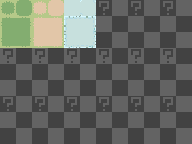

# Tilesets & Collisions

We've previously seen that the map properties had an option `Tileset` selection. We will now see what it is.

## Tilesets 

A tileset corresponds to a set of information linked to the map textures and collisions. Open the Data manager by clicking here on the main toolbar and select the `Tilesets` tab:

If you want to add / remove tileset\(s\), you can use the `Set max...` button or `+` or `-`. You can change the `Picture` by clicking on the following widget that will open a reduced picture manager \(containing only one kind of picture\). That picture will correspond to the static textures that you will use for your maps having this tileset.

You can also change special textures \(autotiles, walls, etc.\) linked to the tileset.

## Collisions 

Collisions are important in video games. You need to manage if the moving objects are colliding with other objects or any other map elements.

## Bounding boxes 

Bounding box are simple geometries that are used for checking intersections. Each object has a corresponding bounding box, after each move the engine will check if the object bounding box intersect with another bounding box in the map.

There is a way to see the bounding boxes for debugging \(if you encounter any strange behavior\). Check the following option:

## Simple boxes and Oriented boxes 

Depending on which sprite you are using, bounding boxes can be oriented like this:

Fix sprites are flat, so they don't need to be oriented. However, face, double, and quadra sprites are voluminous and their bounding box could be a cylinder. A cylinder collision is over killed so we are using oriented boxes that are reasonable to manage collisions with great performances.

## How can I change collisions? 

For tileset, you can edit it directly in the picture preview on the `Tilesets` tab of datas manager. Another way is to open the collisions manager merging all the possible collisions. Open the collisions manager by clicking here on the main toolbar:

## Practicable 

You can for example change the tileset collision by resizing it for each square. This will affect the size of the bounding boxes. You can resize it with your `mouse` or `Right click` and click on `Edit` in order to open a window for selecting the rectangle values.

## Directions \(only for floors\) 

You can indicate in which direction there will be a collision.

## Characters 

Characters are animated and you can handle different collisions for different frames. But, if you want to have the same collisions for all the frames, check the `Repeat` option.

## Autotiles 

You can manage the autotiles list by clicking here on the main toolbar:

You can manage picture and collisions for each autotiles here. Autotiles are dynamic floors. This will have borders with automatic changing according to the neighbor squares. Here is an example of an autotile picture:

Rendering in map:

Don't forget to add your autotiles in the tileset:

This can also be done in the texture selector **\(2\)**:

## Animated autotiles 

_Not available yet._

## Sprites walls 

You can manage the walls the same way you did for autotiles in:

* Collisions manager
* In the texture selector
* `Tilesets` tab in datas manager:

## Mountains 

You can manage the mountains the same way you did for autotiles in:

* In the texture selector
* `Tilesets` tab in datas manager:
* `Collisions`:
  * `Default (according to height and angle):` To manage collisions with mountains, go to `Systems manager > System` and set the `Mountain collisions height limit (in px)` and `Mountain collisions angle limit (in degree)`.
  * `Force always collides`: Force collision everytime.
  * `Force never collides`: Force no collision everytime.

## 3D objects 

You can manage the 3D objects list by clicking here on the main toolbar:

The options for your 3D objects are different according to the `shape` you choose.

* `Box`: A simple box.

  * `Texture`: The box texture. Box textures have a specific template. You can check it at any time in the Basic Ressource:

  

  * `Collisions`: Choose the kind of collision you want to have with that box.
    * `None`: No collision.
    * `Perfect`: Perfect collision with the box faces.
  * `Size`: The size of the box. You can choose by number of squares and additionnal pixels.
    * `Width`: The box width.
    * `Height`: The box height.
    * `Depth`: The box depth.
    * `Texture`: Select the texture application kind:
      * `Stretch`: Stretch your texture. You can use it if you follow the template with a different size that doesn't take account of size proportions.
      * `Perfect size`: Use it if you want to always respect pixels proportions. See the cupboard example which is 2x2x1 size:

* `Sphere` **\(not available yet\)**
* `Cylinder` **\(not available yet\)**
* `Cone` **\(not available yet\)**
* `Capsule` **\(not available yet\)**
* `Custom`: Import your own 3D objects models \(with `.obj`\).
  * `Object`: Select your associated `.obj`.
  * `MTL` **\(not available yet\)**
  * `Texture`: Choose the texture corresponding to the object UVs mapping.
  * `Collisions`: Choose the kind of collision you want to have with that custom object.
    * `None`: No collision.
    * `Simplified`: Simplified bounding box collision for the object. The collision will represent a single box which is the smallest possible that can contains all the 3D object vertices.
  * `Scale`: The scale size to multiply with. By default, the value is `1.0` so the multiplying has no effect on the 3D object size.

Don't forget to add your objects in the tileset:

\(or use the texture selector\)

