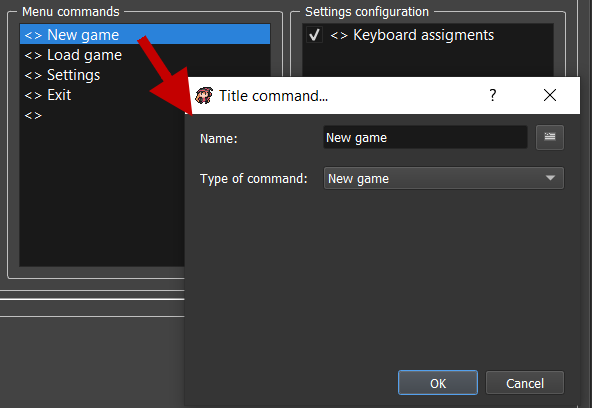

# Title screen & Game Over

Got to `Systems datas > Title screen / Game over`:

.png>)

## Title Screen 

In the first section, you can edit some of the title screen properties.

### Background 

* `Image`: Picture used for title screen background.
* `Video`: Video used for title screen background.
* `Music`: Music used when player is in title screen.

### Menu commands 

Customize here the commands to display in the title screen.

* `Name`: The displayed text in-game.
* `Type of command`: The type of command.
  * `New game`: Run a new game.
  * `Load game`: Open saves menu.
  * `Options`: Open the settings menu.
  * `Exit`: Quit game.
  * `Script`: Execute custom script that can be entered in the appropriate textarea.

### Settings configuration 

* `Settings configuration`: The settings menu can be customized here by reordering and / or displaying some of the options.
  * `Keyboard assignments`: Configuration of the keyboard assignements proposed in the `Keyboard manager`.

## Game Over 

In the second section, you can edit some of the game over screen properties.

### Background 

* `Image`: Picture used for game over screen background.
* `Video`: Video used for game over screen background.
* `Music`: Music used when player is in game over screen.

### Menu commands 

Customize here the commands to display in the game over screen.

* `Name`: The displayed text in-game.
* `Type of command`: The type of command.
  * `Continue`: Load the last save of the current slot. If there's no current save on this slot, this will run a new game.
  * `Title screen`: Open title screen menu.
  * `Exit`: Quit game.
  * `Script`: Execute custom script that can be entered in the appropriate textarea.
