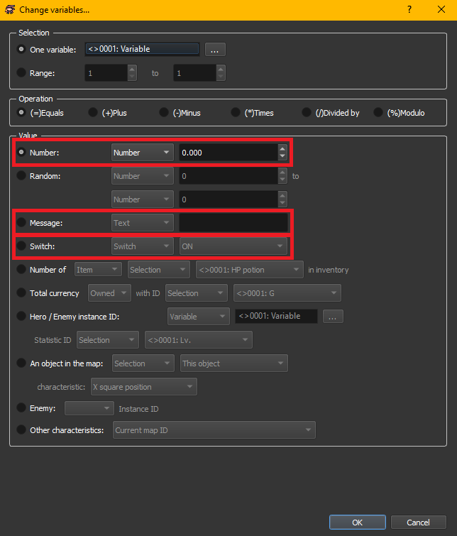
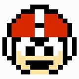

# Variables & Conditions

## -- Overview

This section will explain the important commands that store and make use of data throughout your game. These are required in even the most simple games.&#x20;

## --Variables

Simply put, a variable is a place to store data that you can edit and read throughout your game. There are also Parameters and Properties which function a lot like variables, with different attributes and scope. Those will be explained below.

There are 3 types of data you can store and even more ways to make use of them.&#x20;

### Data Types

Paper Maker allows the following types of data:

* Number - Both positive and negative.&#x20;
* Switch - ON or OFF.
* Message - A string of alphanumeric text.&#x20;

<figure><figcaption>
The circle/dot to the left of each field is called a Radio Button
</figcaption></figure>

When writing data into a variable, you can choose the type of data you want to store by selecting one of the above highlighted fields. All other options look at existing data in the database and write that into the variable as a number.&#x20;

### Entering Data

There are many different reasons for writing data into a variable. One common use is Hero HP. The variable contains a value for how much HP the Hero has left. Every time you get hit, something is subtracted from that variable. At any point you can check what the value is, to see how much HP is remaining.&#x20;

Let's look at each option available when writing data into a variable.

### - Selection

<figure><figcaption></figcaption></figure>

First you choose which variable you want to write into. Click the ... button choose a single variable, or use the Range option to write the same data into a group of variables.&#x20;

<figure><figcaption></figcaption></figure>

On the left you have pages that can be used to help organize your variables. You can rename the pages to things like "Hero Stats" or "Quest Progress".&#x20;

It's good practice to group similar variables together instead of simply using the next available space whenever you need a variable. If you are working on something new, skip ahead and make a new page. That way you have space to add similar variables to the same page later on.&#x20;

As with other database lists, you can rearrange the order of these pages by drag and drop. The variable ID numbers won't change and you can further organize your variables.

Click the page on the left, so that on the right you can choose one of the variables to use for this operation.&#x20;

It is good practice to always name your variables to fit the usage. Hero HP, Time Remaining, etc. You want to be descriptive without making it too long, so that you can easily read it all in your code.&#x20;

<figure><figcaption></figcaption></figure>

 Protip: By writing some words all in CAPS, it helps them stand out in a full list of variables. &#x20;

<figure><figcaption></figcaption></figure>

### - Operation

<figure><figcaption></figcaption></figure>

Next you choose what kind of operation this will be.&#x20;

Equals - Overwrite the old value with the new one.

Plus - Add the new value to the variable.&#x20;

Minus - Subtract the new value from the variable.&#x20;

Times - Multiply the variable by the new value.&#x20;

Divided by - Divide the variable by the new value.&#x20;

Modulo - Divide the variable by the new value, then get rid of the remainder. \*

* Equals works for all data types.
* Plus \ Minus works for Number and Message.
* The rest only work for Number.

\*This function, a.k.a. Mod, might not be familiar to most people but it can be useful. It divides a number by the value entered, and only gives you the remainder.&#x20;

Let's say you have 10 divide by 3. You will end up with 3.333.&#x20;

If you instead use 10 mod 3, you will end up with 1. Because 3 fits into 10 three times, which is a total of 9. The remainder is 1.

One possible use for this is to remove decimal points. If you have a variable with a value of 3.333, start by making a copy of it. Do Mod 1 to the copy, which results in 0.333. Then subtract the copy from the original. 3.333 - 0.333 = 3. There are other ways to do this with javascript, but this method can be done with default commands and some math.&#x20;

### - Value

There are many options in this category.&#x20;

### -- Number

<figure><figcaption>
Some fields allow decimals
</figcaption></figure>

The most commonly used option. The drop down menu gives you the following choices:

* Number - Choose a number to be used in the operation.&#x20;
* Variable - Uses the value of the selected variable in the operation.&#x20;

### -- Random

<figure><figcaption></figcaption></figure>

Set the range and the engine will pick a number at random between the two values.&#x20;

### -- Message

<figure><figcaption></figcaption></figure>

Enter some text to be written into the variable. You can use the ADD operation and it will include the new text to the right of the existing message. Remember to add spaces and punctuation when required.&#x20;

### -- Switch

<figure><figcaption></figcaption></figure>

Choose the new state of the switch - ON or OFF.

### -- Inventory

<figure><figcaption></figcaption></figure>

Checks how many of a certain item the player is holding and writes that number into a variable.&#x20;

There is a drop down menu here that gives the following options:

* Selection - Allows you to choose the item directly from a drop down menu.
* Number - Allows you to choose a number, which corresponds with the ID of an item in the database. You can see HP potion has an ID of 1.
* Variable - Allows you to use the value of a variable to choose the ID of the item that is checked.&#x20;

### -- Currency

<figure><figcaption></figcaption></figure>

The first drop down menu lets you get a number for:

* Owned - How much of the currency you have right now.&#x20;
* Earned - How much you received since starting the game. Owned + Used.&#x20;
* Used - How much you spent in stores or had taken away with commands.&#x20;

The last drop down menu has you choosing which currency to check, if your game uses more than one.

### -- Statistic

<figure><figcaption></figcaption></figure>

Get the value of a statistic of a Hero or Enemy. Knowing the ID can be difficult. IDs are assigned in sequence as a Hero or Enemy is encountered. Unless your game is extremely linear, there is no direct way to know this unless you manually keep track with variables.&#x20;

For Heroes, a simple method is to add all the heroes to your party at the start of a New Game. This will secure their IDs starting with 0. Then you can change some of them to be HIDDEN with the Modify Party command, so they are not available to the player. When you want to give them back to the player, move them from HIDDEN to TEAM/RESERVE. This doesn't work if an unlimited number of heroes could be added, such as a Pokemon clone. The other choice is to keep track with variables as the heroes are added.

For Enemies, there is an option below that can provide it's ID but it only works inside a troop reactions. You could also keep track with variables.&#x20;

### -- Map Characteristic

<figure><figcaption></figcaption></figure>

Allows you to find various map related information about an object.&#x20;

The drop down allows you to choose This Object, which will be the object that runs this command. The Hero is an available option, too. Followed by a list of all objects on the current map. It's not possible to target objects in a different map.

If you use Number in the first drop down menu, you can then make sure a certain object always has the same Object ID in each map. That way you can refer to it by number in your code and it you know it will target the correct object.&#x20;

The last drop down menu gives the following choices:

* X, Y, and Z square position - This corresponds to the values you see in the editor. 0, 0, 0 is in the NW corner of the map at ground level. Squares will often be more useful, since commands like Move Object and Teleport Object will be measured in squares.&#x20;

<figure><figcaption>
Square = Tile
</figcaption></figure>

* X, Y, and Z pixel position - This will depend on your square size. If your square size is 16 px, then a square position of 4 will be a pixel position of 4 x 16 = 64 px.&#x20;
* Orientation - This gives you what direction the object is facing. It corresponds with the character sheet resources.&#x20;

<figure><figcaption></figcaption></figure>

* Terrain - This gives you the Terrain ID of the tile below the object.&#x20;

### -- Enemy

<figure><figcaption></figcaption></figure>

If you try to use this option outside of a troop reaction, the drop down list will be empty. As the enemies available will change with each battle. When used inside a troop reaction you will be given a list of the monsters in the troop.&#x20;

<figure><figcaption></figcaption></figure>

Once you have it's ID, you can then use other commands that target an object by it's ID such as Change Statistic and Transform Battler.&#x20;

The only limit is that you have no command to know which enemy the player is currently targeting. &#x20;

### -- Other Characteristics

Here you can find various game information.&#x20;

* Current Map ID - The map the hero is currently on. You can see ID in the Map Properties.

<figure><figcaption></figcaption></figure>

* Number in Team - Gives the number of heroes currently in your party.&#x20;
* Number in Hidden - Gives the number of heroes currently hidden from your party.&#x20;
* Number in Reserve - Gives the number of heroes currently placed in reserve.&#x20;
* Total number of steps - Keeps track of the number of steps walked by the player during the entire game. 1 tile is about 3-4 steps.&#x20;
* Total number of seconds - Keeps track of total playtime.
* Total number of saves - Keeps track of how many times you save the game.&#x20;
* Total number of battles - Keeps track of how many battles the player has entered.
* Camera Position X, Y, and Z - Gives a number for the current Camera position in pixels.
* Total Second of Music - Tells you how long the current "Music" song has been playing.&#x20;
* Total Second of Background Music - Tells you how long the current "Background Music" song has been playing.&#x20;

<figure><figcaption>
The wording is inconsistent, but Background Sound and Background Music are the same thing
</figcaption></figure>

Specific usage of all these options will be explained further in later sections.&#x20;

## Parameters & Properties

Along with Variables, you also have Parameters and Properties. All of them hold data but have different ways of making use of it.&#x20;

### - Variables

Variables are simple to use and global, meaning they can be accessed by all objects and reactions no matter where you place the code.&#x20;

To create a variable, click the Variables icon or open the Change Variables command:

<figure><figcaption>
The rest is explained above
</figcaption></figure>

### - Parameters

Parameters work like variables, but are only available to the area they were created on (Events or Common Reactions). A parameter made in one area is not available to the other.&#x20;

There are 2 areas that have parameters.

1. Systems Manager > Event/States tab:

<figure><figcaption></figcaption></figure>

Double left click or right click the "< >" to create a new entry.

Then you will see it appear in the settings for your Event:

<figure><figcaption></figcaption></figure>

To change a parameter, you have to edit the value from Default to something else.&#x20;

The commands activated during this event will be using the new value for that parameter.&#x20;

2. Systems Manager > Common Reaction tab.&#x20;

<figure><figcaption></figcaption></figure>

That list will be separate and only show up when calling a Common Reaction.

<figure><figcaption></figcaption></figure>

Your common reaction would then reference the new parameter values in it's commands.&#x20;

<figure><figcaption></figcaption></figure>

There is no command to alter a parameter mid-game. You would have to use a variable/property as the value. Then you can change the variable to change the parameter.&#x20;

<figure><figcaption></figcaption></figure>

For some usage it can save you from having to create a variable, keeping your list of variables from getting bloated. Some of the other data types can be useful like Anything, None, or Keyboard, but that will be very specific and suited for advanced users.&#x20;

### - Properties

Properties are local, meaning they can only be accessed by the object they are created on. That also means any conditions that want to read the value have to be on the same object.&#x20;

To create a property, open an object and create a new entry in the Properties box.

<figure><figcaption>
Double left click or right click to create a new entry. 
</figcaption></figure>

These are useful because you can have the same property on multiple objects and each one will store it's own value. Any commands using the property have to be on the object itself. This allows you to copy and paste completed objects and they will all function independently.&#x20;

For example you can give an object a HP property and every time the player attacks it, 1 is subtracted from it's HP. It has no effect on the HP property of other objects. You can't use external objects to check a property, it has to be check on itself.&#x20;

 You **can** make a property be a variable, write a property into a variable and use/edit that value, or write any existing variable into a property.

Another example is to create a space for commands that can only happen the first time it is activated. Such as keeping track of when an NPC has been talked to and having it say something extra the first time you talk to it.&#x20;

<figure><figcaption></figcaption></figure>

You can copy and paste this NPC and simply update the text. Each one will keep track of it's own property and only allow the condition to run once per NPC.

Most commands can reference variables, parameters, or properties. They won't show up in this list until they are created. &#x20;

<figure><figcaption></figcaption></figure>

## Default Values

There are different defaults for the various types of data.&#x20;

* Variables automatically start at 0.
* Parameters ask you to choose the default value.
* Properties ask you to choose the default value.

If you choose a certain type of data as the default, any type of data can be accepted and it becomes that data type moving forward.&#x20;

## -- Conditions

Variables alone won't accomplish much. Aside from plugging variables into commands, conditions will check a variable and run some code based on the value inside. Let's refer to them as IF statements and you can think of them logically.&#x20;

IF the variable is equal to 0, THEN do X.\
IF the variable is equal to 1, THEN do Y.\
IF the variable is equal to 2, THEN do Z.

You have the option to add an ELSE statement, which decides what happens when the IF part isn't true.&#x20;

IF the variable is greater than 0, THEN do X. ELSE, do Y.&#x20;

If the value is 1 or more it will do one action, if it's less it will do something else. When to use ELSE will depend on what you are trying to accomplish. Usually you will only use ELSE when there are only 2 possible outcomes. If there are more than 2 outcomes, you might want to use multiple conditions with the ELSE part disabled. &#x20;

Check the box at the bottom of the condition window to enable ELSE.&#x20;

<figure><figcaption></figcaption></figure>

<figure><figcaption></figcaption></figure>

There will be many times where you only need the IF statement. It is good practice to disable the ELSE statement instead of leaving it empty.&#x20;

When using Conditions you start by choosing a type of data to look at. Most of them have different criteria.&#x20;

### Variables / Parameters / Properties

This section will likely be the most commonly used. You will be using many variables to keep track of things in your game. Tracking hero actions, by increasing one as you swing a sword. Quest progress, by increasing one each time you talk to the next NPC or complete an action. All switches/messages are essentially variables.

If you don't have any parameters or properties set up, you will only have the option to choose a variable.&#x20;

<figure><figcaption></figcaption></figure>

Once they are added you will be able to select them from the drop down menu.&#x20;

<figure><figcaption></figcaption></figure>

When using these you will have the following standard mathematical options:

* Equal to
* Not Equal to
* Greater Than or Equal to
* Less Than or Equal to
* Greater Than
* Less Than

The final field is what you are comparing to. Generally, it should match the type of data that is inside the var/param/prop. If you write Switch:ON into a variable, you might want to compare it to another Switch data type. Not all cross combinations of types might work.&#x20;

For simple IF statements you will mostly be using a static number, like 4. But for complex and dynamic systems you will start comparing it to another var/param/prop. This will be explored in more detail later on.&#x20;

### Heroes

This section contains many types of data related to your heroes, each with different criteria to check against. Not just math options like greater than.&#x20;

You start by choosing the target.

<figure><figcaption></figcaption></figure>

This will apply to all heroes, unless you check the optional box below that will choose which group of heroes to look at. You might want this to affect only your active party.&#x20;

The rest of the commands are self explanatory.

<figure><figcaption></figcaption></figure>

### Possessions

This section is for checking what items the hero possesses, both in the inventory or equipped on the heroes. These only use math options like greater than and it's all self explanatory.&#x20;

<figure><figcaption></figcaption></figure>

### Other

This section contains all other types of data that don't fit into the previous categories.

* Keypress - Check if a key is or isn't being pressed. Set this to Switch:ON to know when the key is being pressed. The engine is always keeping track of these values automatically.

<figure><figcaption></figcaption></figure>

* Object is looking at - Check which direction an object is facing. It's represented by a number starting at 0, counting up clockwise from south. The engine is always generating this value automatically.

<figure><figcaption></figcaption></figure>

* Object is climbing - Check if an object is currently in it's climbing animation. Only works for tiles you enable climbing on in Data>Tileset.

<figure><figcaption></figcaption></figure>

* Chronometer - Checks the value of an existing chronometer (timer). You must first use the Chronometer command to start one. Here you choose it's matching ID to monitor it and run code when it reaches a certain time.&#x20;

<figure><figcaption></figcaption></figure>

* Escaped last battle - An internal switch is turned ON if you escape your most recent battle and this will check if it's currently ON. You might disable the bonus of a new battle if you ran away from the last one.&#x20;

<figure><figcaption></figcaption></figure>

* Script - Check something using javacsript.&#x20;

<figure><figcaption></figcaption></figure>

## Variable Substitution

In most of your commands you will have an option to pick a number or use a variable. By using a variable you can edit the variable elsewhere to change the outcome of it's usage.&#x20;

Here are some examples.&#x20;

### Making a choice

You might give the player a choice of which hero to heal.&#x20;

Your team has 4 heroes with the IDs 1,2,3 and 4. You can use a show choice command with a variable set to a different value in each choice.&#x20;

<figure><figcaption></figcaption></figure>

You can use that variable to refer to whichever hero was picked by the player.&#x20;

<figure><figcaption></figcaption></figure>

### Which one to check?

To check a single hero you could set a variable to a static number and reference the variable in the condition.&#x20;

<figure><figcaption></figcaption></figure>

You might want to check all 4 heroes for that Battle Sword. You could make 4 conditions, 1 for each hero. Or you could increment the variable and loop the code. As long as your hero's IDs are in sequence.

<figure><figcaption></figcaption></figure>

> Sets the variable to the first hero in the sequence.
>
> The condition checks the first hero for the sword.
>
> If it's found, a message indicates who had it, then it's replaced with Empty (same as unequipping).
>
> It increments the variable, so that it now points to the second hero.
>
> It increments another variable, so that we can keep track of how many times the loop runs.
>
> We have to check 4 heroes, so if the count is below 4 it needs to keep looping. So it jumps to the TOP.
>
> It runs the same condition a second time, this time with the variable set to 2. So it checks the second hero for the sword.
>
> It repeats this for each hero and when the count reaches 4 it stops looping and finishes.

&#x20;

The possibilities are endless. Keep in mind that the field a variable is replacing determines it's usage. Some fields ask for a new number value, which hero to choose, which skill to forget, etc. Using a variable is often the same as entering a static number/choice. Whatever the default usage is.&#x20;

## -- Conclusion

How complex you make use of these is up to you. For those just learning, start simple and slowly work your way up to complex. Good external note taking can help you keep track of everything, especially when you need to look at your code after a long time has passed. &#x20;

&#x20;                                                 Written by KevinOfNine
