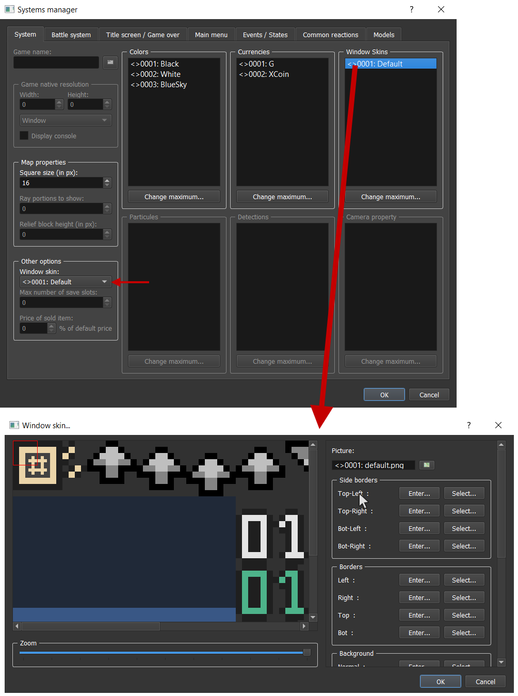
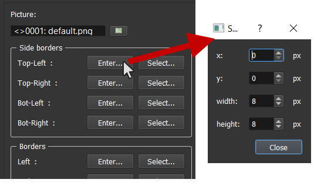
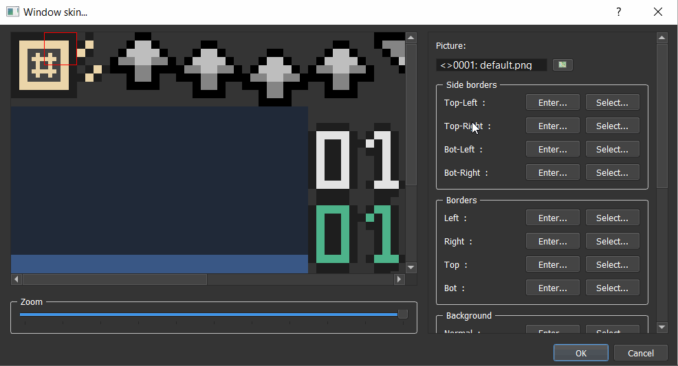

# Windows skins

## Window Skins 

A WindowSkin is a picture that is cut for being used as a design for window boxes \(text dialog for example\), arrows \(end of message, target selection, up/down\), texts in battles \(damage numbers with normal, critical, heals, and miss\). RPG Paper Maker doesn't have a fix template, you can edit the cutting of each element of your WindowSkin by yourself.

Here is the default Window Skin image used:

### Create a Window Skin and / or change default Window Skin 

Got to `Systems Manager > System`.

* On left: Change default.
* On right: Manage all WindowSkins.

### Edit WindowSkin 

To view a cutting, put your mouse on the widget associated \(example: top-left border\). You'll see a red rectangle. If you want to change it, there are two ways.

#### Enter 

Click on the `Enter...` button to open a dialog box and edit the rectangle with input numbers.

#### Select 

Click on the `Select...` button and draw the rectangle with your mouse directly on the picture preview.

### Properties 

* `Picture`: The picture used by the WindowSkin.
* **Side borders**: The side borders used for the window boxes.
* **Borders**: The borders used for the window boxes.
* **Background**:

* `Normal`: The background image used for the window boxes.
* `Selection`: The background image used for the window choices / tabs when selected.
* `Option`:
  * `Repeat`: Repeat the background image for larger windows.
  * `Stretch`: Stretch the background image for larger windows.
* **Arrows**:
  * `Target selection`: The arrows animation used for the battle target selection.
  * `End of message`: The arrows animation used for the command show text command.
  * `Up / Down`: The arrows used for the input number.
* **Texts**:
  * `Normal damage`: The texts numbers used for normal damages.
  * `Heal damage`: The texts numbers used for heal damages.
  * `Critical damage`: The texts numbers used for critical damages.
  * `Miss`: The texts numbers used for miss damages.

