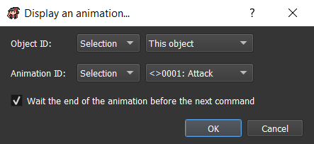
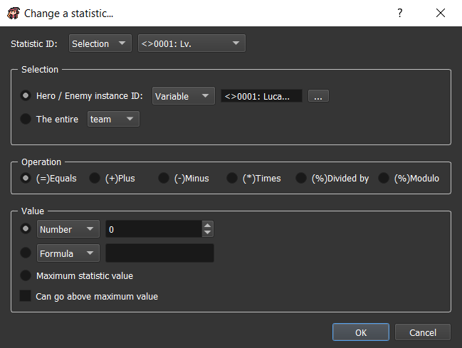
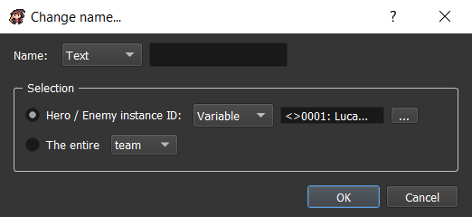
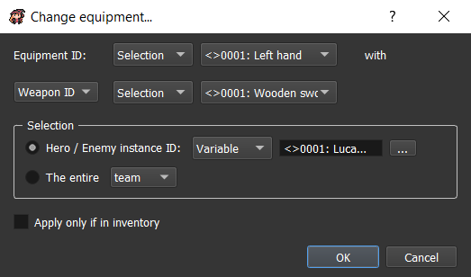
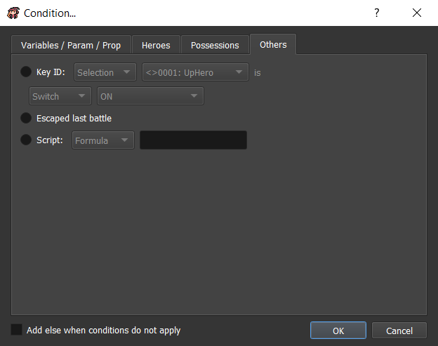
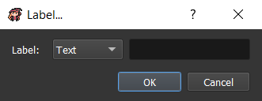
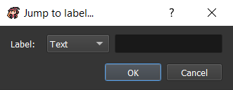
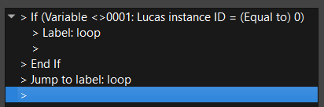
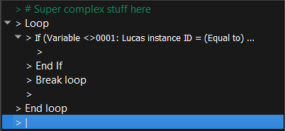

# Event commands

Now that you are a pro for objects and event, let's see all the event commands that are possible to use.

## Show text 

Displays a text in a dialog box with the current dialog box options.

* `Interlocutor`: This will display a text inside a small box on top of the text box for indicating the interlocutor's name. If empty, this will not show the box.
* `Faceset`: The faceset to display inside the dialog box on the left.
* `Message`:
  *  : Apply bold effect on the selected text.
  *  : Apply italic effect on the selected text.
  *  : Apply left align effect on the selected text.
  *  : Apply center align effect on the selected text.
  *  : Apply right align effect on the selected text.
  * `Font size`: Apply the selected font size on the selected text.
  * `Font name`: Apply the selected font name on the selected text.
  * `Text color`: Apply the selected text color on the selected text.
  * `Back color`: Apply the selected back color on the selected text.
  * `Outline color`: Apply the selected outline color on the selected text.
  * `Variable`: Display the value of the current selected variable.
  * `Parameter`: Display the value of the current selected parameter.
  * `Property`: Display the value of the current selected property.
  * `Hero name`: Display the name of the selected hero instance ID.
  * `Icon`: Display the selected icon.

Render in game:

## Display a choice 

* `Choices`: The list of choices texts.
* `Options`:
  * `Cancel auto index`: The choice index to select when pressing cancel button.

Using adapted show text command:

Using without show text command before:

## Input number 

_Not available yet._

## Set dialog box options 

Set all the dialog box options.

* `Window skin ID`: The window skin ID to display.
* `Transform`:
  * `X`: The x position of the window.
  * `Y`: The y position of the window.
  * `Width`: The width of the window.
  * `Height`: The height of the window.
* `Padding`:
  * `Left`: The left padding of the window.
  * `Top`: The top padding of the window.
  * `Right`: The right padding of the window.
  * `Bottom`: The bottom padding of the window.
* `Faceset`:
  * `Position`: The position of the faceset. You can choose if it's behind or above the window.
  * `X`: The additional x position of the faceset.
  * `Y`: The additional y position of the faceset.
* `Text`:
  * `Outline`: Select if texts should have outlines.
  * `Color ID`:
    * `Text`: The color ID to use for texts.
    * `Outline`: The color ID to use for outlines.
    * `Background`: The color ID to use for backgrounds.
  * `Size ID`: The size ID to use for texts.
  * `Font ID`: The font ID to use for texts.

## Change screen tone 

Change the screen tone \(dominant color\). The RGB color \(0, 0, 0\) changes nothing on the screen tone.

* `Red`: The red dominant color.
* `Green`: The green dominant color.
* `Blue`: The blue dominant color.
* `Grey`: The grey dominant color \(saturation\). If grey = 0, then no changes. If grey = 100, then the screen will only have grey colors.
* `Adding color ID`: You can combine the previous color with an existing color.
* `Wait the end of the change before the next command`: If checked, the command will end only after `Time` number.
* `Time`: Time to wait for changing the screen tone.

## Shake screen 

This is useful for staging your cinematics by simulating earthquakes, for example.

* `Offset`: The number of pixel offset for each shake.
* `Shake number`: The number of shakes per second.
* `Wait the end of the move before the next command`: If checked, the next command will be executed when the shakes ends.
* `Time`: Duration of the total shakes.

## Flash screen 

This will simply fill your screen with a color and linearly go back to normal screen color.

* `Color ID`: The color ID to display on screen.
* `Wait the end of the move before the next command`: If checked, the next command will be executed when the flash ends.
* `Time`: Duration of the flash.

## Change meteo 

_Not available yet._

## Change map properties 

_Not available yet._

## Wait 

Wait during a specific time.

* `Time`: Time to wait in seconds.

## Change chronometer 

_Not available yet._

## Teleport object 

This will teleport an object on an existing map with a new position.

* `Object ID`: The object ID to teleport.
* **Position**:
  * `Select...`: Choose map and position thanks to a map previewer.
  * `ID map`, `X`, `Y`, `Y plus`, `Z`: Choose map ID an position to go manually.
  * `Object (ID)`: Choose an object to teleport on.
* **Options**: _Not available yet._

## Move object 

This will move an object in the current map with a specific route. You can also temporary change some properties linked to the object state.

* `Object ID`: The object ID to move.
* `Ignore if impossible`: If checked, the moves that can't be executed \(example: a wall blocking the route\) would be ignored. If not checked, this will try the impossible move as long as it become possible \(example: use for NPCs moving\).
* `Wait the end of moves`: If checked, the command would end only when all the moves are executed. If not, the command would end immediately \(moves executed in parallel\).
* `With camera orientation`: If checked, the direction moves \(north, south, west, east\) would take account of the camera orientation. If not, the direction moves would not take account of the camera orientation.
* **Step / square moves**:
  * `Square`: Change all the direction moves unit to square.
  * `Step`: Change all the direction moves unit to step.
  * `1 to North / South / West / East / North-West / North-East / South-West / South-East`: Move the object to 1 square / step in the selected direction.
  * `1 to random`: Move the object to 1 square / step in a random direction.
  * `1 to the hero`: Move the object to 1 square / step in the hero direction.
  * `1 opposite to the hero`: Move the object to 1 square / step in the opposite of the hero direction.
  * `1 in front`: Move the object to 1 square / step in front.
  * `1 back`: Move the object to 1 square / step back.
* **Change direction**: _Not available yet._
* **Change object options**:
  * ON / OFF: For some options, you can use the option ON or OFF.
  * Permanent: If checked, the object option will be conserved even after saving.
  * Change graphics: Change the obejct graphics.

## Display an animation 

Display an animation in the current map.

* `Object ID`: The object ID where the animation will be played.
* `Animation ID`: The animation ID to play.
* `Wait the end of the animation before next command`: If checked, the next command will be executed only after the animation end.

## Move camera 

Check out the camera guide [here](camera-control.md).

## Reset camera 

_Not available yet._

## Create object in map 

_Not available yet._

## Remove object from map 

Remove an object from the map. This removing is effective as long as you don't change map or load the game in saves.

* `Object ID`: The object ID to remove in the map.

## Display a picture 

Display a picture on top of the screen.

* `Image ID`: The image ID to display.
* `Index`: The index of the image to display. You can display several images in the same time if they have different index. The more the index is high, the more the image is displayed on top. If two images have the same index, then the ancient image will be removed.
* `Origin`:
  * `Top / Left`: The origin position will be \(0, 0\) \(= top left of the screen\).
  * `Center`: The origin position will be the center of the screen.
* `Coordinates`:
  * `X`: The x position according to the origin.
  * `Y`: The y position according to the origin.
* `Effects`:
  * `Zoom`: The % zooming of the image.
  * `Opacity`: The % opacity of the image.
  * `Angle`: The ° angle of the image.

## Set / Move / Turn a picture 

Set / Move / Turn a picture that is already displayed on top of the screen.

* `Image index`: Select the index of the image to set / move / turn.
* `Set`:
  * `Image ID`: Change the image ID to display.
  * `Zoom`: Change the % zooming of the image.
  * `Opacity`: Change the % zooming of the image.
* `Move`:
  * `X`: Change the x position according to the origin.
  * `Y`: CHange the y position according to the origin.
* `Turn`:
  * `Angle`: Change the ° angle of the image.
* `Wait the end of the actions before the next command`: If checked, the command will end only after `Time` number.
* `Time`: Time to wait for updating the picture.

## Remove a picture 

Remove a picture that is displayed on top of the screen.

* `Image index`: Select the index of the image to remove.

## Play a video 

_Not available yet._

## Start shop 

_Not available yet._

## Enter a name 

_Not available yet._

## Open main menu 

This will open the main menu.

Render in game:

## Open saves menu 

This will open the saves menu.

Render in game:

## Title screen 

Go to the title screen.

## Game over 

This will go to the game over screen.

_**/! Today, there is no game over screen, it's only closing the game window.**_

## Play a music 

This will play a music on the current map.

* `Select song by ID`: Instead of using the left list, you can select by ID values.
* **Options**:
  * `Volume`: The music volume \(in %\).
  * `Start`: The beginning time of the music in seconds.
  * `End`: The end time of the music in seconds.

## Stop music 

This will stop the music played in the current map.

* `Disappear with time`: Number of seconds for music played for disappearing.

## Play a background sound 

This will play a background sound on top of the current music.

Check out the play music command [here](event-commands.md#play-a-music) that is similar.

## Stop background sound 

This will stop the background sound played in the current map.

Check out the stop music command [here](event-commands.md#stop-music) that is similar.

## Play a sound 

This will play a sound on top of all the songs.

Check out the play music command [here](event-commands.md#stop-music) that is similar.

## Play a music effect 

This will play a music by pausing the current played music. When the music effect is finished the previously played music is unpaused.

Check out the play music command [here](event-commands.md#play-a-music) that is similar.

## Change battle music 

_Not available yet._

## Change victory music 

_Not available yet._

## Send event 

This will send an event to the selected target.

* **Target**:
  * `All`: _Not available yet._
  * `Detection`: Send the event to a specific detection.
    * `Sender can't receive`: The detection is not applied to the sender.
  * `Object`: Send the event to a specific object.
* **Event**:
  * `Event system`: Select a system event \(events sent by the game system itself\).
  * `Event user`: Select a user event \(custom events sent by the map objects\).
  * `Parameters values`: Select the event parameters values. You can keep the default value.

## Change state 

This will change the state of the current object. An object can have several states at the same time.

* **Object**:
  * `Map ID`: The map ID to change state.
  * `Object ID`: The object ID to change state.
* **Selection**:
  * `State ID`: The new state ID.
* **Operation**:
  * `Replace`: Remove all the current states of the object and add the new state.
  * `Add`: Only add the new state.
  * `Remove`: Remove the object state having this ID.

## Change property 

This will change a property value of the current object.

* **Selection**:
  * `property ID`: The property ID to change.
* **Operation**: The operation to use according to the current property value.
* **Value**:
  * `New value`: The new value to apply to the property with the corresponding operation.

## Modify currency 

Change the currency value.

* **Selection**:
  * `Currency ID`: The currency ID to change value.
* **Operation**: The operation to apply to the currency value.
* **Number**: The number value to apply to the currency.

## Modify inventory 

This will update inventory containing. You can for example add items to it.

* **Selection**:
  * `Item ID`: An item to select.
  * `Weapon ID`: A weapon to select.
  * `Armor ID`: An armor to select.
* **Operation**: The operation to use according to the current number of the selection in the inventory.
* **Number**: The value to use for updating the selection number.

## Modify team 

This will update team organization.

* `Create new instance with level ... in team / reserve / hidden of`: Create a new instance of a hero or monster in team, reserve, or hidden.
  * `Stock instance ID in`: Choose a variable where you want to stock the instance ID. This can be useful to move or remove characters in team.
* `Move / Remove the character with ID ... in team / reserve / hidden`: _Not available yet._

## Allow / Forbid saves 

* `Allow`: If checked, the saves menu will be allowed.

## Allow / Forbid main menu 

* `Allow`: If checked, the main menu will be allowed.

## Change general options 

_Not available yet._

## Start a battle 

This will start a battle with your team against a troop \(group of monsters\).

* **Troop's ID**:
  * `ID`: Fix troop ID.
  * `Random (in map property)`: Random ID indicated in map property window.
* **Battle map**:
  * `ID`: Fix battle map ID.
  * `Select...`: Choose battle map and position thanks to a map previewer.
  * `ID map`, `X`, `Y`, `Y plus`, `Z`: Choose battle map ID and position to go manually.
* **Options**:
  * `Allow escape`: If checked, it would be possible to use battle command `Escape` in this battle.
  * `Defeat causes Game Over`: If checked, losing in this battle will automatically direct to game over. If not checked, there will be two commands container : one for the winning state, and the second for the losing state.
* **Transition**:
  * `Start / End`: Start / End type of transition:
    * `None`: Immediate transition.
    * `Fade in / out`: Transition on a color.
    * `Zoom in / out`: Transition by zooming in / out.

## Display / Hide enemy 

_Not available yet._

## Force an action 

_Not available yet._

## End battle 

_Not available yet._

## Change battle music 

_Not available yet._

## Change victory music 

_Not available yet._

## Change a statistic 

You can here change a statistic value to one or several characters \(heroes or enemies\).

* `Statistic ID`: The statistic ID to change value.
* **Selection**:
  * `Hero / Enemy instance ID`: Select the instance ID of a character. They are mainly stocked into a variable.
  * `The entire`: Select a group, this can be the `team`, `reserve`, or `hidden`.
* **Operation**: Select the operation to apply to the current statistic value.
* **Value**:
  * `Number`: Choose a dynamic number value.
  * `Formula`: Enter a formula as a value.
  * `Maximum statistic value`: Take the maximum value of a statistic \(used to heal maximum HP, for example\)
  * `Can go above maximum value`: If checked, the given value can be superior to maximum value of the statistic.

## Change experience curve 

_Not available yet._

## Change status 

_Not available yet._

## Change a skill 

Choose if you want a character to learn or forget a specific skill.

* `Skill ID`: The skill ID to learn or forget.
* **Selection**:
  * `Hero / Enemy instance ID`: Select the instance ID of a character. They are mainly stocked into a variable.
  * `The entire`: Select a group, this can be the `team`, `reserve`, or `hidden`.
* **Operation**: Choose here if you want to learn or forget the selected skill.

## Change name 

Choose a character you want to change the name. This isn't like the command enter hero name, this doesn't open any HUD so the player can enter a name.

* `Name`: The new character name.
* **Selection**:
  * `Hero / Enemy instance ID`: Select the instance ID of a character. They are mainly stocked into a variable.
  * `The entire`: Select a group, this can be the `team`, `reserve`, or `hidden`.

## Change class 

_Not available yet._

## Change equipment 

You can force a character to equip a weapon or an armor.

* `Equipment ID`: The equipment slot ID to force equip.
* `with Weapon ID / Armor ID`: The weapon or armor ID to force equip \(according to equipment ID\).
* **Selection**:
  * `Hero / Enemy instance ID`: Select the instance ID of a character. They are mainly stocked into a variable.
  * `The entire`: Select a group, this can be the `team`, `reserve`, or `hidden`.
* `Apply only if in inventory`: If checked, the equipment is not equiped if not in inventory. If not checked, the item will be added to inventory and then equiped.

## Condition 

Create a container for commands that will be executed only if the indicated condition is true.

* `Add "else" when conditions do not apply`: Create another container for commands that will be executed only if the indicated condition is false.
* **Variables / Param / Prop**:

* `This`: Compare a variable or a parameter or a property with any other type of value.
* **Heroes**:

* `Hero(es)`: Select `all the heroes` or `none of the heroes` or `at least one hero` or `the hero with instance ID`. in `team` or `reserve` or `hidden`.
  * `Are named`: Check if the selection have this name.
  * `Are in`: Check if the selection is in the `team` or `reserve` or `hidden`.
  * `Are able to use the skill ID`: Check if the selection is able to use the selected skill ID.
  * `Are equiped with`:
    * `weapon ID`: Check if the selection is equipped with the selected weapon ID.
    * `armor ID`: Check if the selection is equipped with the selected armor ID.
  * `Are under effect of status ID`: _Not available yet._
  * `Have the statistic ID`: Compare a selected statistic of the selection with any other type of value.
* **Possessions**:

* `Currency ID`: Compare a selected currency number with any other type of value.
* `Item ID`: Compare a selected item number in inventory with any other type of value.
* `Weapon ID`: Compare a selected weapon number in inventory with any other type of value.
  * `Check weapons equiped too`: If checked, the equipped weapons will be included in the number of weapons.
* `Armor ID`: Compare a selected armor number in inventory with any other type of value.
  * `Check armors equiped too`: If checked, the equipped armors will be included in the number of armors.
* **Others**:

* `Key ID`: Check if selected key is ON or OFF.
* `Escaped last battle`: Check if the player escaped last battle \(using escape battle command\).
* `Script`: Check according to the script return value \(for programmers\).

## Loop 

Create a container for commands that will be executed on a loop.

## Break loop 

If inside a loop container, this will go out of the loop and go to the next command after the loop.

## Label 

Add label to your reaction, you will combine it with jump to label command. You can choose any name you want.

## Jump to label 

Combined with label command, you can choose to move to the named label. Here is a nexample that will create a loop:

The commands will be executed like this:

Condition ? &gt; No &gt; End if &gt;Jump to label loop &gt; Label loop &gt; End if &gt; Jump to label loop &gt; Label loop &gt; ...

## Stop the reaction 

Stop the current reaction.

## Comment 

Comments won't be interpreted in game, it's only here for you. You can leave a comment in specific places to remember why you used specific commands.

## Call a common reaction 

This will call a common reaction with the corresponding parameters.

* `Common reaction`: The common reaction to call.
* **Parameters values**: The parameters to apply with the common reaction.

## Change variables 

This will change one or several variable\(s\) value.

* **Selection**:
  * `One variable`: The unique variable to change.
  * `Range`: The range of variables IDs to change.
* **Operation**: The operation to use according to the current variable\(s\) value.
* **Value**:
  * `Number`: A simple number.
  * `Random`: A random number between two selected values.
  * `Message`: A simple message.
  * `Switch`: A simple switch.
  * `Number of ... in inventory`: _Not available yet._
  * `Total currency ... with ID`: _Not available yet._
  * `An ... with instance ID ... statistic ID`: _Not available yet._
  * `An object in the map ... characteristic`: The selected object characteristic:
    * `X square position`: The x square position of the selected object.
    * `Y square position`: The y square position of the selected object.
    * `Z square position`: The z square position of the selected object.
    * `X square position`: The x pixel position of the selected object.
    * `Y square position`: The y pixel position of the selected object.
    * `Z square position`: The z pixel position of the selected object.
    * `Orientation`: The orientation of the selected object.
  * `Other characteristics`: _Not available yet._

## Script 

Execute a script code \(for advanced programmers\).

* `Use dynamic`: Non-static code \(in variable, or parameter, or property\).

