# How to create a plugin

Now that you have all the keys to start your own plugins, let's do it!

Open the scripts manager:

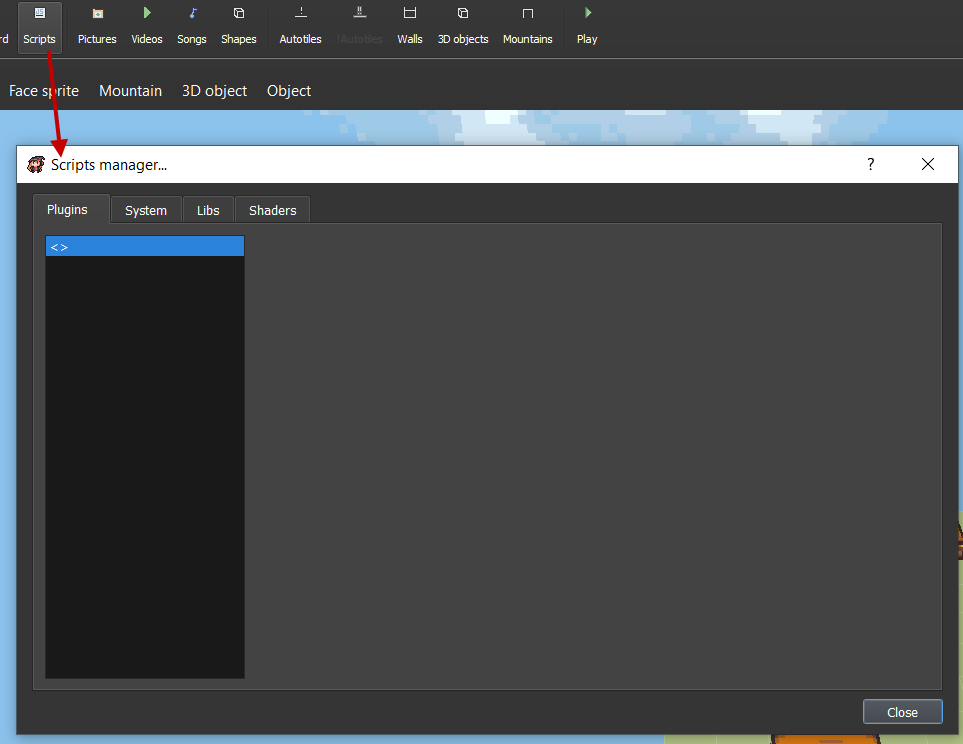


You can also check the System, Libs and Shaders folder files in the different tabs.


Let's create our first plugin now. Double click on an empty plugin and create an empty one.

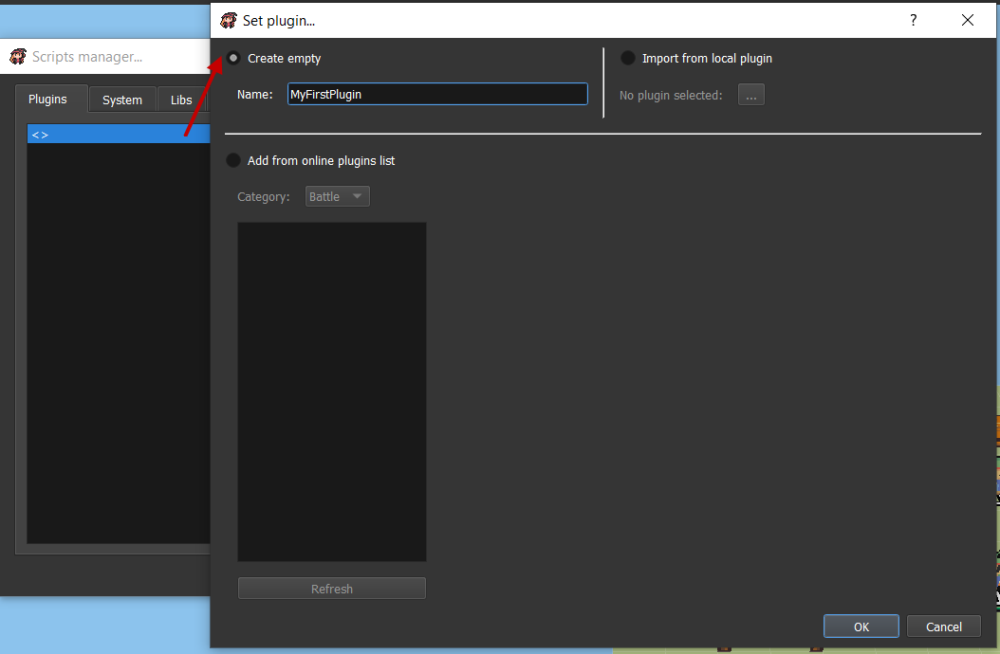

You'll have an access to several options with the `Edit` tab:

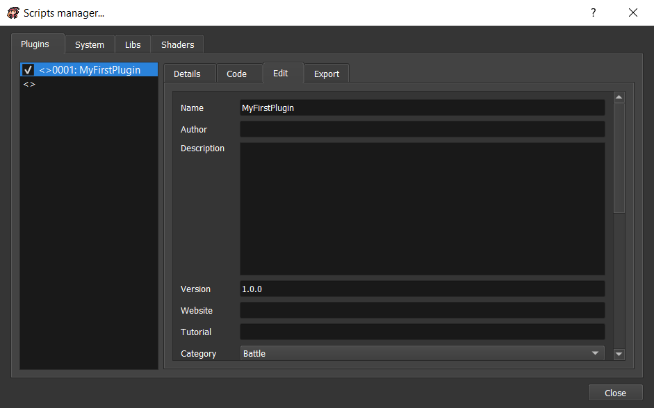

* `Name`: The plugin name. It should be unique in your project.
* `Author`: You can put your name here.
* `Description`: Describe what is doing your plugin.
* `Version`: The plugin version. It should have the following format: `X.X.X`.
* `Website`: A website url related to your plugins.
* `Tutorial`: A tutorial url related to this specific plugin.
* `Category`: The plugin category. It can be:
  * `Battle`
  * `Menus`
  * `Map`
  * `Others`
* `Parameters`: The plugin parameters. We'll see more how it works below.
* `Commands`: The plugin commands. We'll see more how it works below.

You also have access to `Code` tab if you want to directly edit the plugin code inside the engine instead of Visual Studio Code.

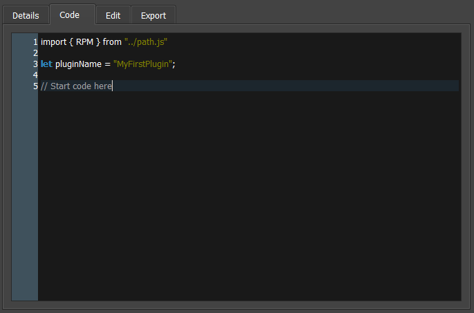

If you check in Visual Studio Code, you will see that a new folder was created in the `Plugins` folder.

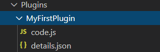

Everytime you create a new plugin, a folder with the plugin name is created. This folder will contain:

* `code.js`: The JS file containing your plugin code.
* `details.json`: All the details of the plugin \(like author, description, parameters, etc...\).

Let's try to just create a plugin displaying "Hello world" in the console!

```javascript
import { RPM } from "../path.js"

const pluginName = "MyFirstPlugin";
const inject = RPM.Manager.Plugins.inject;

console.log("Hello world!");
```

Now you can play test. To display the console, press `CTRL + ALT + I`.


You can also access to RPG Paper Maker datas thanks to `RPM` module import:

```javascript
import { RPM } from "../path.js"
```

So you'll have to use `RPM` module before any other `System` module. For example:

```javascript
import { RPM } from "../path.js"

const pluginName = "MyFirstPlugin";
const inject = RPM.Manager.Plugins.inject;

console.log("Hello world: " + RPM.Core.MapObject.SPEED_NORMAL);
```

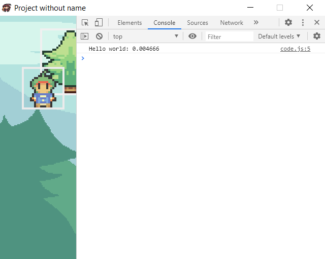

Great! It works!

## Inject extension

Let's see how to extend the System. Currently, We can use the Inject function:

> **WARNING: do not use arrow function syntax, arrow functions do not have "this" and therefor will not work when injecting, use function instead.**

### Function Syntax

> for the sake of simplicity, methods and fields will be referred to as functions and variables respectively.

The Inject function is designed to replace the prototyping that'd normally be required to alter existing classes, inject is more streamlined and doesn't require you to alias as it does this for you:

* classObject: The class or newable function that you want to inject/overwrite a variable/function into.
* prototypeName: The variable/function name you want to overwrite/inject code into.
* prototype: The new variable/function you want to inject/overwrite.
* staticType: Sets rather this is a static function/variable or a non static function/variable \(NOTE: Both a static and non static variable/function can exist at the same time with the same name.\) \(DEFAULT: false\)
* overwrite: \(FUNCTIONS ONLY\) Should call original function's code or overwrite original function. \(DEFAULT: false\)
* loadBefore \(FUNCTIONS ONLY\) Should original function's code be executed before or after your code \(NOTE: This is obviously disabled if param overwrite is set to true.\) \(DEFAULT: true\)

#### added 'this' content

due to the nature of inject there are two new values added to it's 'this'

* callResult: if loadBefore is set to true and the function is a return function this will give the result of the first function, this way you could alter/pass through it's value.
* super: this is for if you want the alias call to be conditional, or happen in the middle of your code, it's recommended you only call super if overwrite is set to true or you will call the alias twice.

```javascript
const inject = RPM.Manager.Plugins.inject;


class myClass {
 
 constructor(){}
 
  myFunction(){
  
  }
  
  isMyClass(){
  return true;
  }
  
  myFunction2(){
  return math.floor(math.random() * 26);
  }

}


inject(myClass, "myFunction", function() {
 if(this.isMyClass()){
  console.log("this is my class :)");
 } else {
 this.super();
 }    

}, false, true, false);

inject(myClass, "myFunction2", function() {
 if(this.callResult === 2){
  return 4;
 } else {
 return this.callResult;
 }
},false,false,true);

```

This way, you can edit an existing function prototype. As an example, let's try to display an icon in the title screen. What we will need to do is extend two functions:

* `load`: To load the icon to display
* `drawHUD`: To draw the icon loaded

```javascript
import { Datas } from "../../System/index.js";
import { RPM } from "../path.js"

const pluginName = "MyFirstPlugin";
const inject = RPM.Manager.Plugins.inject;

console.log("Hello world: " + RPM.Core.MapObject.SPEED_NORMAL);

// Load the icon
inject(RPM.Scene.TitleScreen,"load", async function() {
    this.pictureIcon = RPM.Datas.Pictures.getPictureCopy(RPM.Common.Enum.PictureKind.Icons, 1);
},false,false,true);

//this would be the old equivilant of inject:
/*
let alias_load = RPM.Scene.TitleScreen.prototype.load;
RPM.Scene.TitleScreen.prototype.load = async function() {
    await alias_load.apply(this);
    this.pictureIcon = RPM.Datas.Pictures.getPictureCopy(RPM.Common.Enum.PictureKind
        .Icons, 1);
}
*/

// Draw the icon
inject(RPM.Scene.TitleScreen,"drawHUD", function() {
        this.pictureIcon.draw(200, 200);
},false,false,true);

//this would be the old equivilant of inject:
/*
let alias_drawHUD = RPM.Scene.TitleScreen.prototype.drawHUD;
RPM.Scene.TitleScreen.prototype.drawHUD = function() {
    alias_drawHUD.apply(this);
    this.pictureIcon.draw(200, 200);
}
*/
```

And it works!

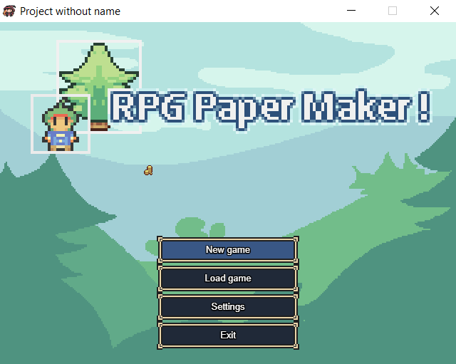

## Static Functions and Variables

Not every variable/function is part of the class instance, some are statically assigned to the class and can therefor be accessed without the need for a instance of that class.

```javascript
const inject = RPM.Manager.Plugins.inject;

class myClass {
    static myStaticFunction(){
        return 2;
    }
}

inject(myClass,"myStaticFunctions",function () {
    return 4
},true,true,false);
```

## Parameters

Now imagine that we want the user \(people that would use this plugin\) to be able to choose the icon ID to display. Here the parameters can be used!

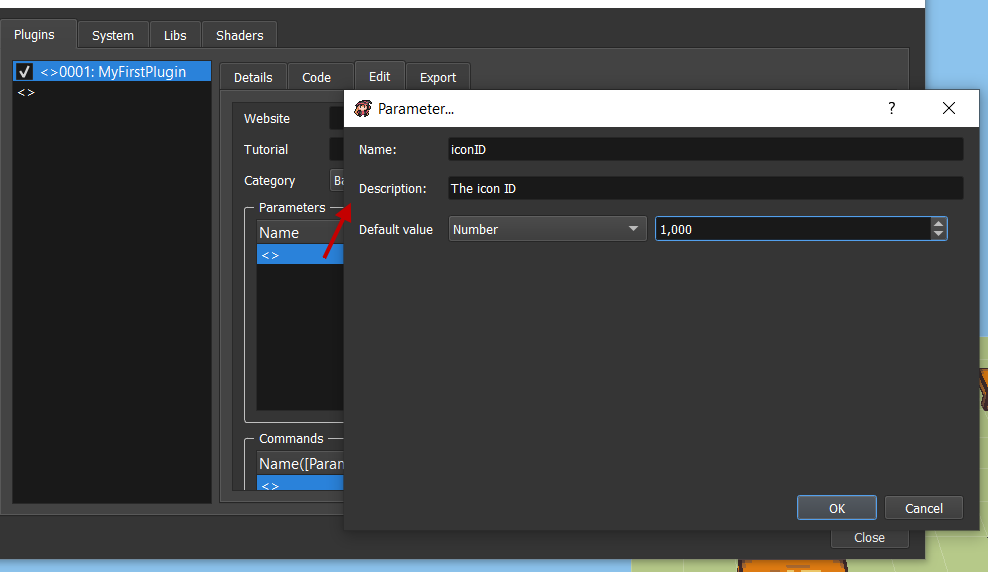

In the code side, you'll need to edit the load function to get the iconID parameter. To get a parameter value, use `getParameter(pluginName, parameterName)`.

```javascript
inject(RPM.Scene.TitleScreen,"load", async function() {
       this.pictureIcon = RPM.Datas.Pictures.getPictureCopy(RPM.Common.Enum.PictureKind
       .Icons, RPM.Manager.Plugins.getParameter(pluginName, "iconID"));
},false,false,true);
```

So now, the plugin users can change the parameter value like this:

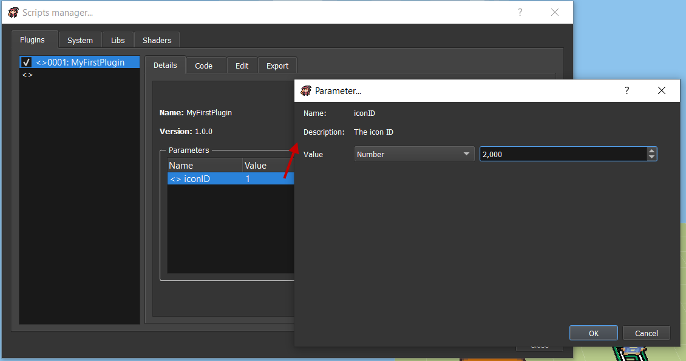

## Commands

You can also associate your plugin to a custom event command! Awesome! Let's create a very simple example. We'll create a command named `print` that will print the wanted text in console. Here we create on the editor side:

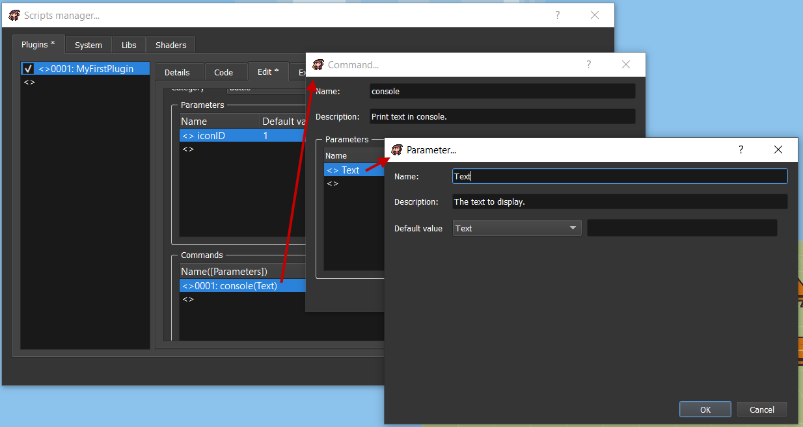

Now that it's created, let's edit the plugin code again to register the command action. We need to define it thanks to `registerCommand(pluginName, commandName, commandFunction)`.

```javascript
RPM.Manager.Plugins.registerCommand(pluginName, "console", (text) => {
    console.log(text);
});
```

To use this command, create an event command `Plugin...` and select your plugin and your command.

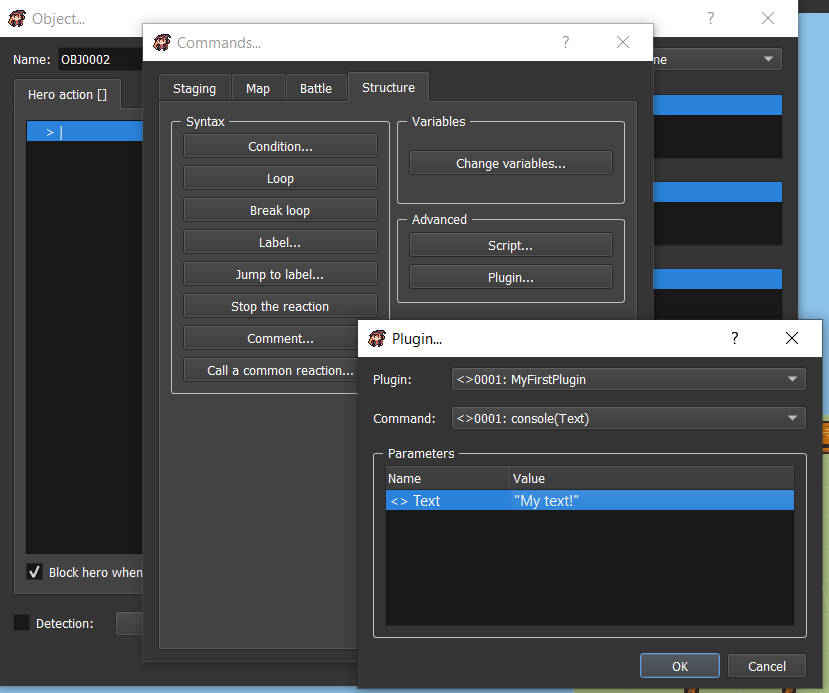

When triggering it, this will print your text to the console!

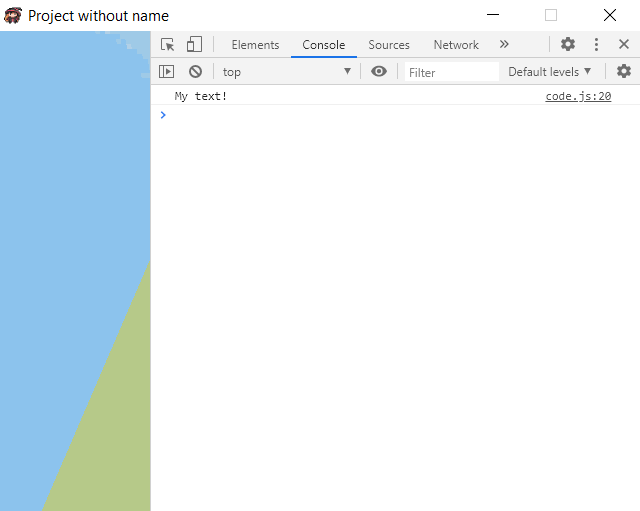

## Complex parameters

You can choose to specify more complex values for parameters. The first one is `Custom structure`, this is similar to an `Object` in JavaScript.

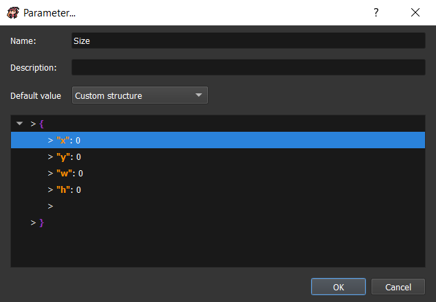


Don't forget that the returned parameters are `System.DynamicValue` after deep parameter searching. So if you want to get the `x` value, you'll need to do `RPM.Manager.Plugins.getParameter(pluginName, "Size").x.getValue()`.


The other one is `Custom list`. It's similar to an `Array` in JavaScript.

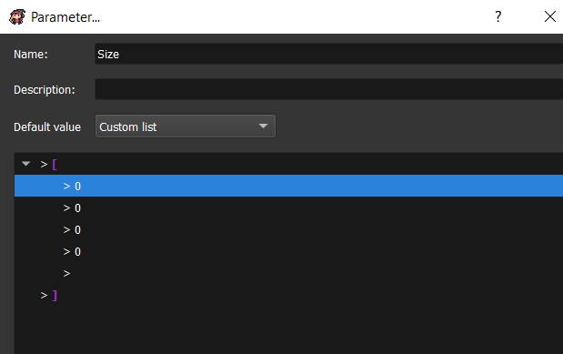


Same thing for custom lists, don't forget to get the dynamic value! In this example you can get the first list value with`RPM.Manager.Plugins.getParameter(pluginName, "Size")[0].getValue()`.


All the other values like `Hero`, `Monster`, `Weapon` will simply return the ID value.

## Export a plugin \(online submission\)

To submit an online plugin, please follow this github wiki guide: [https://github.com/RPG-Paper-Maker/RPG-Paper-Maker/wiki/Online-plugins-submission](https://github.com/RPG-Paper-Maker/RPG-Paper-Maker/wiki/Online-plugins-submission).

