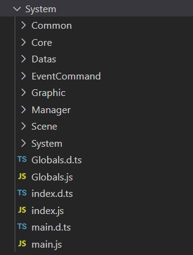
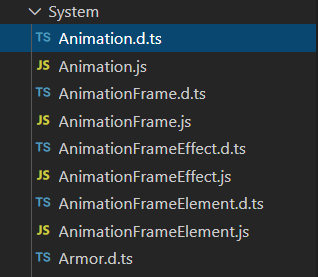
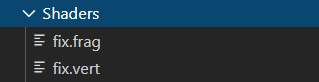
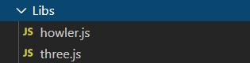
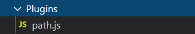

# Scripts organization

## System

The System code is using ECMAScript modules, so every modules are packed into a folder with the module name. Checkout the `System` folder:



Here are the following modules:

* `Common`: Every static classes mainly used to get static properties and methods \(Mathf, Paths...\)
* `Core`: Every core classes that will be directly used in the game run \(Autotiles, WindowBox...\)
* `Datas`: Every datas classes grouping every System classes that will read JSON game files

   \(Heroes, Systems...\)

* `EventCommand`: Every event commands that can be interpreted in reactions \(ShowText, Wait...\)
* `Graphic`: Every graphic classes that are used to be drawn inside WindowBox classes \(Text, Player...\)
* `Manager`: Every manager classes used to manage specific game events \(Collisions, Plugins...\)
* `Scene`: Every scenes classes where everything is drawn \(Map, Menu...\)
* `System`: Every systems classes that will read JSON from datas \(Color, Monster...\)

We will gradually see how these modules are used in this tutorial.

Each file `*.js` also comes with a `*.d.ts` :



You don't need to care about the `*.d.ts`. These files are just here to help Visual Studio Code to correctly type your auto completion.


In fact, the original RPG Paper Maker code is in TypeScript, which is JavaScript but with typing restrictions. The TypeScript code is compiled to JavaScript Standard code and also provide these `*.d.ts`.


## Shaders

The `Shaders` folder contains all the shaders used by for 3D. To keep it simple, shaders are small programs executed in the graphic card instead of CPU. We will see later how it's used.



## Libs

The `Libs` folder contains every external libraries used by RPG Paper Maker.



We are using he following:

* `howler.js`: It's a library managing every songs playing very easily.
* `three.js`: The most important library. It provides a lot of functions and classes to handle webGL \(3D\) very easily. We will see it a lot in our code. You can check out the doc here: [https://threejs.org/docs/](https://threejs.org/docs/) and easily understand the RPG Paper Maker use.

## Plugins

All your future plugins will be in this `Plugins` folder:



We'll see later how it's managed.

## Where does the code start?

Now the question is: where does all the code start? It's in `System/main.js`. Let's quickly see what's happening inside it.

```javascript
let loaded = false;
/**
 *  Initialize the game stack and datas.
 */
async function initialize() {
    await Manager.Plugins.load();
    Manager.Stack.loadingDelay = 0;
    Manager.Songs.initialize();
    Manager.Stack.clearHUD();
    await load();
}
```

First, we define the `initialize` function. The first thing it does is to load the plugins, and then it initialize some managers \(`Manager.Stack` and `Manager.Songs`\) and then load the datas \(that are inside the game JSON\) thanks to this `load` function:

```javascript
/**
 *  Load the game stack and datas.
 */
async function load() {
    await Datas.Settings.read();
    await Datas.Systems.read();
    await Datas.Variables.read();
    await Datas.Pictures.read();
    await Datas.Songs.read();
    await Datas.Videos.read();
    await Datas.Shapes.read();
    Manager.GL.load();
    Manager.GL.initialize();
    Manager.GL.resize();
    await Datas.SpecialElements.read();
    await Datas.Tilesets.read();
    await Datas.Items.read();
    await Datas.Skills.read();
    await Datas.Weapons.read();
    await Datas.Armors.read();
    await Datas.Classes.read();
    await Datas.Heroes.read();
    await Datas.Monsters.read();
    await Datas.Troops.read();
    await Datas.BattleSystems.read();
    await Datas.TitlescreenGameover.read();
    await Datas.Keyboards.read();
    await Datas.Animations.read();
    await Datas.CommonEvents.read();
    await Datas.Systems.getModelHero();
    await Datas.Systems.loadWindowSkins();
    Manager.Stack.pushTitleScreen();
    loaded = true;
    Manager.Stack.requestPaintHUD = true;
}
```

When everything is loaded, the title screen scene is initialized and we notify that the loading is finished. The game main loop is the `loop` function:

```javascript
/**
 *  Main loop of the game.
 */
function loop() {
    requestAnimationFrame(loop);
    // Update if everything is loaded
    if (loaded) {
        if (!Manager.Stack.isLoading()) {
            Manager.Stack.update();
        }
        if (!Manager.Stack.isLoading()) {
            Manager.Stack.draw3D();
        }
    }
    Manager.Stack.drawHUD();
    // Elapsed time
    Manager.Stack.elapsedTime = new Date().getTime() - Manager.Stack
        .lastUpdateTime;
    Manager.Stack.averageElapsedTime = (Manager.Stack.averageElapsedTime +
        Manager.Stack.elapsedTime) / 2;
    Manager.Stack.lastUpdateTime = new Date().getTime();
}
```

It is called thanks to:

```javascript
// -------------------------------------------------------
//
// START LOOP
//
// -------------------------------------------------------
requestAnimationFrame(loop);
```

It's basically updating and drawing the current scene \(when starting, it's `Scene.TitleScreen`\).

Finally, inputs are managed thanks to these lines:

```javascript
document.addEventListener('keydown', function (event) {
    if (loaded && !Manager.Stack.isLoading()) {
        let key = event.keyCode;
        // On pressing F12, quit game
        if (key === KeyEvent.DOM_VK_F12) {
            Platform.quit();
        }
        // If not repeat, call simple press RPM event
        if (!event.repeat) {
            if (KeyEvent.keysPressed.indexOf(key) === -1) {
                KeyEvent.keysPressed.push(key);
                Manager.Stack.onKeyPressed(key);
                // If is loading, that means a new scene was created, return
                if (Manager.Stack.isLoading()) {
                    return;
                }
            }
        }
        // Also always call pressed and repeat RPM event
        Manager.Stack.onKeyPressedAndRepeat(key);
    }
}, false);
// -------------------------------------------------------
document.addEventListener('keyup', function (event) {
    if (loaded && !Manager.Stack.isLoading()) {
        let key = event.keyCode;
        // Remove this key from pressed keys list
        KeyEvent.keysPressed.splice(KeyEvent.keysPressed.indexOf(key), 1);
        // Call release RPM event
        Manager.Stack.onKeyReleased(key);
    }
    else {
        KeyEvent.keysPressed = [];
    }
}, false);
```

We will see in the next tutorial how the `Manager.Stack` is handled.

