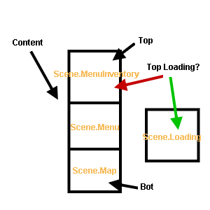

# Stack and scenes

## The stack

We've seen that the `main.js` was using a class named `Manager.Stack`. First, what's a stack? It's a simple array containing scenes.



The top of stack is the current scene that will be drawn. You can add a new scene on top of the stack by using `push` and remove the top scene by using `pop`. You can check the `Manager/Stack.js`.

## A base scene

Now open the `Scene/Base.js`. Every Scene class will extend this base. This will handle the reactions interpretation \(objects reactions in maps, common reactions\). Every scene will contain these functions:

```javascript
update() {
    ...
}
```

The `update` is for making every data update before drawing the scene.

```javascript
onKeyPressed(key) {
    ...
}

onKeyReleased(key) {
    ...
}

onKeyPressedRepeat(key) {
    ...
}

onKeyPressedAndRepeat(key) {
    ...
}
```

Every input handle. `onKeyPressed` is for when a key is pressed. `onKeyReleased` is for when a key is released. `onKeyPressedRepeat` is when a key is pressed repeatedly. `onKeyPressedAndRepeat` is when a key is pressed repeatedly but with a small wait after the first pressure \(generally used for menus\).

```javascript
draw3D() {
    ...
}

drawHUD() {
    ...
}
```

After updating datas, the draw functions are called. `draw3D` is for drawing 3D stuff, and `drawHUD` is for 2D one.

```javascript
close() {
    ...
}
```

And finally the `close` function contains all the things to do when the scene is removed from the stack.

