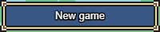
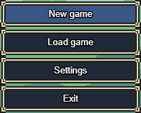

# WindowBox & WindowChoices

## WindowBox

You can use the `WindowBox` class in `Core` module to draw window boxes with specific content. You'll be able to draw stuff like that:



Here is an example of window box declaration in a scene:

```javascript
this.exampleWindow = new RPM.Core.WindowBox(x, y, w, h, { 
    // The following options are optional
    content: new Graphic.Text("myText"), // The content is a Graphic.Base
    padding: [0, 0, 0, 0], // [x, y, x, h] for box padding
    limitContent: true // If checked, the content will be cut according to padding
});
```

And then you can draw this window, in `drawHUD` of the scene:

```javascript
drawHUD() {
    this.exampleWindow.draw();
}
```

## WindowChoices

You can also use `WindowChoices` class in `Core` module for displaying several `WindowBox` as a choice.



Here is an example of window choice use in a scene:

```javascript
this.exampleChoices = new RPM.Core.WindowChoices(x, y, w, h, [new Graphic.Text("A"), new Graphic.Text("B")], { 
    // The following options are optional
    listCallbacks: [myfunction1, myFunction2], // List of all the callback functions to excecute when pressed.
    orientation: OrientationWindow.Vertical, // The orientation of the window (horizontal or vertical)
    nbItemsMax: 2, // Max number of items to display on the choice box
    padding: WindowBox.SMALL_SLOT_PADDING, // Padding of the box
    space: 0, // Space between each choice in the box
    currentSelectedIndex: 0, // The current selected index position in the choice box
    bordersInsideVisible: true // If checked, each choice will have an individual window box
});
```

Handle the inputs:

```javascript
onKeyPressed(key) {
    this.windowChoicesCommands.onKeyPressed(key, this);
}

onKeyPressedAndRepeat(key) {
    return this.exampleChoices.onKeyPressedAndRepeat(key);
}
```

`onKeyPressed` is for handling callbacks (functions) when pressing enter in a choice. The 2nd argument here is `this` but you can replace it by whatever you want to repalce the `this` inside the callback. `onKeyPressedAndRepeat` is for handling move keys to switch between choices.

And then you can draw the choices, in `drawHUD` of the scene:

```javascript
drawHUD() {
    this.exampleChoices.draw();
}
```

## Graphics

In the examples for `WindowBox` and `WindowChoices`, we are using `Graphic.Text` class. In fact there's a lot of classes in the `Graphic` module. Here are the most interesting.

### Graphic.Text

Display a simple text.

```javascript
new Graphic.Text('mytext', { 
    x: 0, 
    y: 0, 
    w: 0, 
    h: 0, 
    align: Align.Left, 
    fontSize: Utils.defaultValue(Datas.Systems.dbOptions.v_tSize, Constants.DEFAULT_FONT_SIZE), 
    fontName: Utils.defaultValue(Datas.Systems.dbOptions.v_tFont, Constants.DEFAULT_FONT_NAME), 
    verticalAlign: AlignVertical.Center, 
    color: Utils.defaultValue(Datas.Systems.dbOptions.v_tcText, System.Color.WHITE), 
    bold: false, 
    italic: false, 
    backColor: Utils.defaultValue(Datas.Systems.dbOptions.v_tcBackground, null), 
    strokeColor: Utils.defaultValue(Datas.Systems.dbOptions.tOutline, false) ? Utils.defaultValue(Datas.Systems.dbOptions.v_tcOutline, null) : null
});
```

### Graphic.TextIcon

Display a simple text with an icon.

```javascript
new Graphic.TextIcon("myText", iconID, { 
    side: Align.Left, 
    align: Align.Left, 
    space: Constants.MEDIUM_SPACE
});
```

### Graphic.Message

Display a complex text with tags. It's used in ShowText command.

```javascript
new Graphic.Message("<b>myText</b>", facesetID);
```

### Graphic.Player

Drawing the player in choice box like in the main menu or drawing the player informations like in battles.

```javascript
new Graphic.Player(player, reverse);
```

### Graphic.PlayerDescription

Drawing the player in choice box or drawing the player description.

```javascript
new Graphic.PlayerDescription(player);
```
