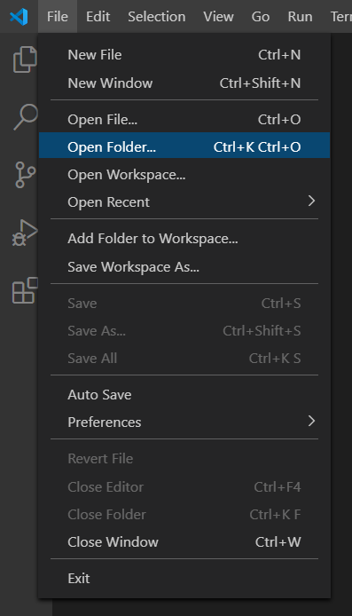
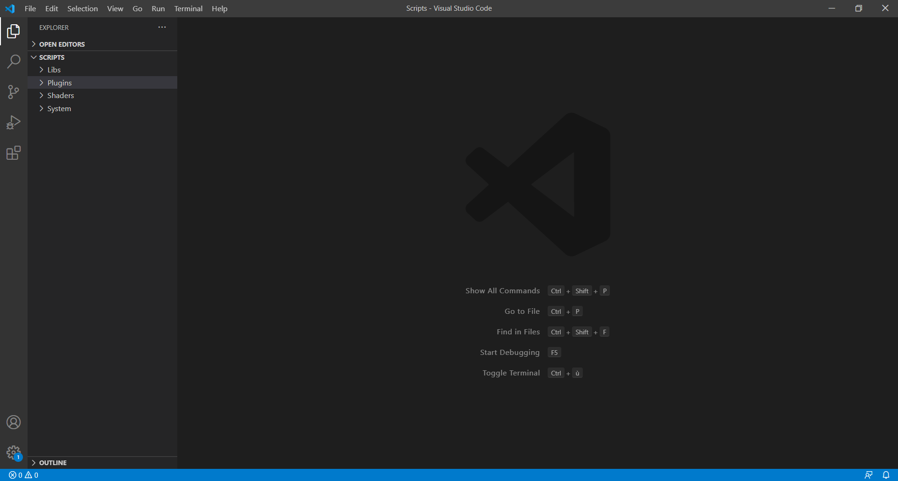

# Getting started

**This guide is not a guide to learn Javascript programming language. The following steps will suppose that you know the basics. You can check Javascripts tutorials here:**

_JavaScript Syntax and Constructs Overview:_



_Discovering JavaScript Talk:_



_First 3.5h of a video course about JS:_



_You Don't Know JS \(book\):_ 

[https://github.com/getify/You-Dont-Know-JS](https://github.com/getify/You-Dont-Know-JS) 


You know the JS basics? Now you can keep going! :\)


First of all, we strongly recommand you to use **Visual Studio Code** as your **IDE** \(**Integrated Development Environment**\). This will help a lot for auto-completion. You can download it here: [https://code.visualstudio.com/](https://code.visualstudio.com/).

Open it and go to `File > Open Folder` and select `YourProject/resources/app/Content/Datas/Scripts`

Now you'll be able to start your code learning!

You can keep an eye on the doc API here: [https://rpg-paper-maker.github.io/](https://rpg-paper-maker.github.io/)

